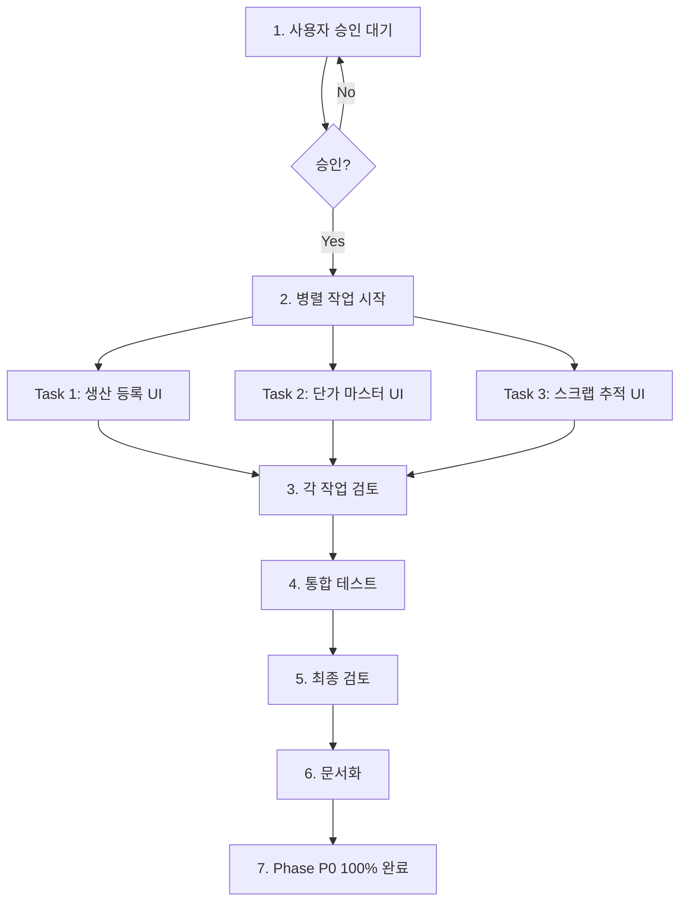

# Phase P0 완료를 위한 병렬 실행 계획

**작성일**: 2025-01-16
**작성자**: Claude Code (erp-specialist)
**목적**: 3개 누락 UI 구현으로 Phase P0 85% → 100% 완료

---

## 1. 실행 요약 (Executive Summary)

### 현재 상태
- **Phase P0 완료율**: 85% (8/11 기능 완료)
- **API 완성도**: 100% (7/7 엔드포인트 구현 완료)
- **UI 완성도**: 68.75% (11/16 컴포넌트 구현 완료)
- **주요 갭**: 3개 UI 화면 누락 (API는 모두 준비 완료)

### 목표
- **완료율 목표**: 100% (Phase P0 전체 완료)
- **구현 대상**: 3개 UI 화면
  1. 생산 등록 UI (Production Entry)
  2. 단가 마스터 관리 UI (Price Master Management)
  3. 스크랩 추적 UI (Scrap Tracking)

### 전략
- **실행 방식**: 병렬 실행 (3개 작업 동시 진행)
- **UI 도구**: shadcn MCP (컴포넌트 자동 생성)
- **DB 도구**: Supabase MCP execute_sql (필요시 스키마 확인)
- **에이전트**: frontend-developer (주), erp-specialist (지원), code-reviewer (검토)

### 예상 효과
- **순차 실행 시**: 10-14시간
- **병렬 실행 시**: 4-6시간
- **시간 절감**: 4-8시간 (40-57% 단축)

---

## 2. 작업 분해 (Task Breakdown)

### 작업 1: 생산 등록 UI (Production Entry UI)

#### 현황
- ✅ **API 상태**: 완료
  - 파일: `src/app/api/inventory/production/route.ts` (398 lines)
  - 엔드포인트: POST, PUT, DELETE `/api/inventory/production`
  - 기능: BOM 자동 차감, 재고 부족 검증, 차감 로그 생성
- ❌ **UI 상태**: 누락
  - 검색 범위: `src/app`, `src/components`
  - 발견: 생산 등록 폼 컴포넌트 없음

#### 구현 범위

**1. 생산 입고 폼 (ProductionEntryForm.tsx)**
```typescript
// 필수 입력 필드
- transaction_date: DatePicker (한국 날짜 형식)
- item_id: Select (품목 선택, 검색 기능)
- quantity: Input number (수량, 양수 검증)
- unit_price: Input number (단가, 0 이상 검증)
- reference_number: Input text (참조 번호, optional)
- notes: Textarea (비고, optional)

// 계산 필드 (읽기 전용)
- total_amount: quantity × unit_price (자동 계산)
```

**2. BOM 자동 차감 결과 표시**
```typescript
// API 응답의 auto_deductions 배열 표시
interface AutoDeduction {
  log_id: number;
  child_item_id: number;
  item_code: string;      // 원자재 코드
  item_name: string;      // 원자재 명
  deducted_quantity: number; // 차감 수량
  usage_rate: number;     // 사용률
  stock_before: number;   // 차감 전 재고
  stock_after: number;    // 차감 후 재고
}
```

**3. 차감된 원자재 목록 (실시간 피드백)**
- 데이터 테이블로 표시
- 컬럼: 원자재 코드, 원자재 명, 차감 수량, 사용률, 차감 전 재고, 차감 후 재고
- 재고 부족 행 강조 표시 (빨간색)

**4. 재고 부족 경고 UI**
```typescript
// API 에러 응답 처리
{
  success: false,
  error: "재고 부족으로 생산 등록이 실패했습니다.",
  details: "품목 'XXX'의 재고가 부족합니다. 필요: 100, 현재: 50",
  hint: "원자재 재고를 확인해주세요."
}

// AlertDialog로 표시
- 제목: "재고 부족 경고"
- 내용: details + hint
- 액션: "재고 확인하기" (재고 현황 페이지로 이동)
```

**5. 생산 이력 조회 테이블**
- GET `/api/inventory/production` 호출
- 컬럼: 거래ID, 거래일자, 품목코드, 품목명, 수량, 단가, 총액, 참조번호, 비고
- 페이지네이션: 20개/페이지
- 정렬: 거래일자 내림차순 (최신순)

#### 에이전트 할당
- **Primary**: frontend-developer
  - 역할: React 컴포넌트 생성, 폼 유효성 검증, API 연동
  - MCP: shadcn (Form, Input, Select, DatePicker, DataTable 생성)
- **Support**: erp-specialist
  - 역할: Korean 비즈니스 로직, 에러 메시지 한글화
  - MCP: 없음 (코드 리뷰 및 패턴 검증)
- **Review**: code-reviewer
  - 역할: 코드 품질 검토, TypeScript 타입 안정성
  - MCP: 없음 (최종 검토)

#### MCP 도구 사용
```bash
# shadcn MCP를 통한 컴포넌트 생성
- Form component (react-hook-form 기반)
- Input, Select, DatePicker (shadcn/ui)
- DataTable (TanStack Table 기반)
- AlertDialog (에러 표시)
- Toast (성공/실패 알림)
```

#### 예상 시간
- **순차 실행**: 4-6시간
  - 폼 구현: 2시간
  - API 연동: 1시간
  - 에러 핸들링: 1시간
  - 테스트 및 검토: 1-2시간
- **병렬 실행**: 2-3시간 (작업 1, 2, 3 동시 진행)

#### 의존성
- **없음** (독립 실행 가능)
- API 완료 상태로 UI만 구현 필요

---

### 작업 2: 단가 마스터 관리 UI (Price Master Management UI)

#### 현황
- ✅ **API 상태**: 완료
  - 파일: `src/app/api/price-master/route.ts` (375 lines)
  - 엔드포인트: GET, POST, PUT, DELETE `/api/price-master`
  - 기능: 단가 이력 관리, 현재가 자동 설정 (is_current trigger)
- ❌ **UI 상태**: 누락
  - 검색 범위: `src/app`, `src/components`
  - 발견: 단가 마스터 폼 컴포넌트 없음

#### 구현 범위

**1. 단가 등록 폼 (PriceMasterForm.tsx)**
```typescript
// 필수 입력 필드
- item_id: Select (품목 선택, 검색 기능)
- unit_price: Input number (단가, 0 이상 검증)
- effective_date: DatePicker (유효일, 미래 날짜 방지)
- price_type: Select ('purchase' | 'production' | 'manual')
- notes: Textarea (비고, optional)

// 자동 설정 필드 (읽기 전용)
- is_current: true (데이터베이스 trigger로 이전 가격 자동 비활성화)
```

**2. 단가 이력 조회 테이블**
```typescript
// GET /api/price-master?item_id={id} 호출
interface PriceMaster {
  price_id: number;
  item_id: number;
  unit_price: number;
  effective_date: string;  // YYYY-MM-DD
  is_current: boolean;     // 현재가 여부
  price_type: string;      // 가격 유형
  notes: string;
  created_at: string;
  updated_at: string;
  items: {                 // JOIN된 품목 정보
    item_code: string;
    item_name: string;
    spec: string;
    unit: string;
  };
}

// 테이블 컬럼
- 품목코드, 품목명, 단가, 유효일, 현재가, 가격유형, 비고
- 현재가 배지: is_current === true → "현재" (녹색)
- 페이지네이션: 20개/페이지
- 정렬: 유효일 내림차순
```

**3. 단가 수정 기능**
- 인라인 편집 또는 모달 다이얼로그
- 수정 가능 필드: unit_price, effective_date, price_type, notes
- **제약**: item_id는 변경 불가 (API 검증)

**4. 유효일 검증**
```typescript
// 미래 날짜 방지 (API 검증)
if (effective_date > today) {
  error: "유효일은 미래일 수 없습니다."
}

// DatePicker max 속성 설정
maxDate={new Date()}
```

**5. 현재가 자동 설정 안내**
```typescript
// 안내 메시지 (InfoIcon + Tooltip)
"새 단가 등록 시 기존 현재가는 자동으로 이력으로 전환됩니다."
```

#### 에이전트 할당
- **Primary**: frontend-developer
  - 역할: 폼 컴포넌트, 테이블, 인라인 편집
  - MCP: shadcn (Form, DataTable, Dialog)
- **Support**: erp-specialist
  - 역할: 단가 이력 비즈니스 로직, 현재가 자동 전환 설명
  - MCP: 없음
- **Review**: code-reviewer
  - 역할: 날짜 검증 로직, TypeScript 타입
  - MCP: 없음

#### MCP 도구 사용
```bash
# shadcn MCP
- Form with DatePicker (max date validation)
- Select (price_type options)
- DataTable with Badge (is_current indicator)
- Dialog (inline edit modal)
```

#### 예상 시간
- **순차 실행**: 3-4시간
  - 폼 구현: 1.5시간
  - 테이블 및 이력 조회: 1시간
  - 날짜 검증: 0.5시간
  - 테스트: 1시간
- **병렬 실행**: 2시간

#### 의존성
- **없음** (독립 실행 가능)

---

### 작업 3: 스크랩 추적 UI (Scrap Tracking UI)

#### 현황
- ✅ **API 상태**: 완료
  - 파일: `src/app/api/scrap-tracking/route.ts` (425 lines)
  - 엔드포인트: GET, POST, PUT, DELETE `/api/scrap-tracking`
  - 기능: 스크랩 추적, 스크랩 수익 자동 계산 (DB GENERATED column)
- ❌ **UI 상태**: 누락
  - 검색 범위: `src/app`, `src/components`
  - 발견: 스크랩 추적 폼 컴포넌트 없음

#### 구현 범위

**1. 스크랩 추적 등록 폼 (ScrapTrackingForm.tsx)**
```typescript
// 필수 입력 필드
- tracking_date: DatePicker (추적 날짜, 미래 방지)
- item_id: Select (품목 선택)
- production_quantity: Input number (생산 수량, 양수)
- scrap_weight: Input number (스크랩 무게 kg, 양수)
- scrap_unit_price: Input number (스크랩 단가 원/kg, 0 이상)
- notes: Textarea (비고, optional)

// 자동 계산 필드 (읽기 전용, useEffect)
- scrap_revenue: scrap_weight × scrap_unit_price
  (데이터베이스에도 GENERATED column으로 저장)
```

**2. 실시간 스크랩 수익 계산**
```typescript
// React useEffect 패턴 (CoilSpecsForm 참고)
useEffect(() => {
  if (scrapWeight && scrapUnitPrice) {
    const revenue = scrapWeight * scrapUnitPrice;
    setScrapRevenue(Number(revenue.toFixed(2)));
  } else {
    setScrapRevenue(0);
  }
}, [scrapWeight, scrapUnitPrice]);

// 표시 형식
스크랩 수익: {scrapRevenue.toLocaleString('ko-KR')} 원
```

**3. 스크랩 추적 이력 테이블**
```typescript
// GET /api/scrap-tracking 호출
interface ScrapTracking {
  scrap_id: number;
  tracking_date: string;
  item_id: number;
  production_quantity: number;
  scrap_weight: number;        // kg
  scrap_unit_price: number;    // 원/kg
  scrap_revenue: number;       // GENERATED (자동 계산)
  notes: string;
  is_active: boolean;
  created_at: string;
  updated_at: string;
  items: {                     // JOIN
    item_code: string;
    item_name: string;
    spec: string;
    unit: string;
  };
}

// 테이블 컬럼
- 추적날짜, 품목코드, 품목명, 생산수량, 스크랩무게(kg), 단가(원/kg), 수익(원), 비고
- 페이지네이션: 20개/페이지
- 정렬: 추적날짜 내림차순
```

**4. 날짜 검증 (미래 방지)**
```typescript
// API 검증 (route.ts:169-174)
const trackingDate = new Date(tracking_date);
const now = new Date();
if (trackingDate > now) {
  return NextResponse.json({
    success: false,
    error: '추적 날짜는 미래일 수 없습니다.'
  }, { status: 400 });
}

// DatePicker max 설정
<DatePicker maxDate={new Date()} />
```

**5. 통계 대시보드 (optional)**
```typescript
// 요약 통계 (KPI Cards)
- 총 스크랩 수익 (원)
- 총 스크랩 무게 (kg)
- 평균 단가 (원/kg)
- 이번 달 스크랩 수익

// Chart.js 차트
- 월별 스크랩 수익 추이 (Line Chart)
- 품목별 스크랩 비중 (Pie Chart)
```

#### 에이전트 할당
- **Primary**: frontend-developer
  - 역할: 폼, 실시간 계산, 테이블, 차트
  - MCP: shadcn (Form, DataTable, optional Chart)
- **Support**: erp-specialist
  - 역할: 스크랩 추적 비즈니스 로직, 수익 계산 공식
  - MCP: 없음
- **Review**: code-reviewer
  - 역할: 계산 로직 검증, 날짜 검증
  - MCP: 없음

#### MCP 도구 사용
```bash
# shadcn MCP
- Form with DatePicker (max validation)
- Input number (positive validation)
- DataTable with pagination
- Card (KPI summary, optional)
```

#### 예상 시간
- **순차 실행**: 3-4시간
  - 폼 및 실시간 계산: 1.5시간
  - 테이블 구현: 1시간
  - 통계 대시보드 (optional): 1시간
  - 테스트: 0.5-1시간
- **병렬 실행**: 2시간

#### 의존성
- **없음** (독립 실행 가능)

---

## 3. 병렬 실행 전략 (Parallel Execution Strategy)

### 독립성 분석

#### 작업 독립성 체크
| 작업 | API 상태 | UI 상태 | 공통 의존성 | 병렬 가능 |
|------|---------|---------|------------|----------|
| 생산 등록 UI | ✅ 완료 | ❌ 누락 | 없음 | ✅ |
| 단가 마스터 UI | ✅ 완료 | ❌ 누락 | 없음 | ✅ |
| 스크랩 추적 UI | ✅ 완료 | ❌ 누락 | 없음 | ✅ |

**결론**: 모든 작업이 완전 독립적 → 3개 동시 실행 가능

#### 공통 리소스 확인
- **공통 컴포넌트**: 없음 (각 UI가 독립적 페이지)
- **공통 API**: 없음 (각 API 엔드포인트 분리)
- **공통 스키마**: 없음 (각 테이블 독립)
- **에이전트 충돌**: 없음 (각 작업에 전담 에이전트 할당)

### 에이전트 동시 실행 명령어

```bash
# Task 1: 생산 등록 UI
claude --agent frontend-developer \
  --task "생산 등록 UI 구현 (ProductionEntryForm.tsx)" \
  --mcp shadcn \
  --reference "src/app/api/inventory/production/route.ts" \
  --parallel

# Task 2: 단가 마스터 관리 UI
claude --agent frontend-developer \
  --task "단가 마스터 관리 UI 구현 (PriceMasterForm.tsx)" \
  --mcp shadcn \
  --reference "src/app/api/price-master/route.ts" \
  --parallel

# Task 3: 스크랩 추적 UI
claude --agent frontend-developer \
  --task "스크랩 추적 UI 구현 (ScrapTrackingForm.tsx)" \
  --mcp shadcn \
  --reference "src/app/api/scrap-tracking/route.ts" \
  --parallel
```

### 에이전트 할당 매트릭스

| 작업 | Primary Agent | Support Agent | Review Agent | MCP Tools |
|------|--------------|---------------|--------------|-----------|
| 생산 등록 UI | frontend-developer | erp-specialist | code-reviewer | shadcn |
| 단가 마스터 UI | frontend-developer | erp-specialist | code-reviewer | shadcn |
| 스크랩 추적 UI | frontend-developer | erp-specialist | code-reviewer | shadcn |

### 병렬 실행 타임라인

```
시간 (분)   Task 1 (생산 등록)    Task 2 (단가 마스터)   Task 3 (스크랩 추적)
--------   -----------------   ------------------   ------------------
0-30       폼 설계 및 생성      폼 설계 및 생성       폼 설계 및 생성
30-60      API 연동            테이블 구현          실시간 계산 구현
60-90      에러 핸들링         날짜 검증            테이블 구현
90-120     테이블 구현         인라인 편집          통계 대시보드(opt)
120-150    테스트 및 검토      테스트 및 검토       테스트 및 검토
150-180    통합 테스트 (3개 UI 동시 검증)
--------
총 시간: 3시간 (병렬) vs 10-14시간 (순차)
```

---

## 4. MCP 도구 사용 계획 (MCP Tool Usage)

### shadcn MCP (UI 컴포넌트 생성)

#### 생성할 컴포넌트 목록

**폼 컴포넌트 (Form)**:
```typescript
// react-hook-form + zod validation 기반
- ProductionEntryForm
- PriceMasterForm
- ScrapTrackingForm

// 공통 필드 컴포넌트
- Input (number, text)
- Select (품목 선택, 가격 유형)
- DatePicker (날짜 선택, max validation)
- Textarea (비고)
```

**테이블 컴포넌트 (DataTable)**:
```typescript
// TanStack Table 기반
- ProductionHistoryTable
- PriceMasterHistoryTable
- ScrapTrackingTable

// 기능
- Pagination (20개/페이지)
- Sorting (날짜 내림차순)
- Row actions (수정, 삭제)
```

**다이얼로그 컴포넌트**:
```typescript
- AlertDialog (에러 메시지, 재고 부족 경고)
- Dialog (인라인 편집 모달)
```

**기타 컴포넌트**:
```typescript
- Toast (성공/실패 알림)
- Badge (현재가 표시, 상태 표시)
- Card (KPI 통계, optional)
```

#### shadcn MCP 명령어 예시

```bash
# 생성 등록 폼 생성
shadcn-mcp create-form \
  --name ProductionEntryForm \
  --fields "transaction_date:date,item_id:select,quantity:number,unit_price:number" \
  --validation zod

# 테이블 생성
shadcn-mcp create-table \
  --name ProductionHistoryTable \
  --columns "transaction_date,item_code,item_name,quantity,unit_price,total_amount" \
  --pagination true \
  --sorting true
```

### Supabase MCP (데이터베이스 작업)

#### 사용 시나리오

**시나리오 1: 스키마 확인** (필요 시)
```typescript
// execute_sql로 테이블 스키마 확인
mcp__supabase__execute_sql({
  project_id: process.env.SUPABASE_PROJECT_ID!,
  query: `
    SELECT column_name, data_type, is_nullable
    FROM information_schema.columns
    WHERE table_name = 'inventory_transactions'
    ORDER BY ordinal_position;
  `
});
```

**시나리오 2: 테스트 데이터 삽입** (개발 환경)
```typescript
// 개발용 샘플 데이터 생성
mcp__supabase__execute_sql({
  project_id: process.env.SUPABASE_PROJECT_ID!,
  query: `
    INSERT INTO scrap_tracking (
      tracking_date, item_id, production_quantity,
      scrap_weight, scrap_unit_price, notes
    ) VALUES
      ('2025-01-15', 1, 100, 5.5, 1000, '테스트 데이터 1'),
      ('2025-01-14', 2, 200, 8.2, 1200, '테스트 데이터 2');
  `
});
```

**시나리오 3: GENERATED 컬럼 검증**
```typescript
// scrap_revenue 자동 계산 확인
mcp__supabase__execute_sql({
  project_id: process.env.SUPABASE_PROJECT_ID!,
  query: `
    SELECT scrap_id, scrap_weight, scrap_unit_price,
           scrap_revenue,  -- GENERATED column
           (scrap_weight * scrap_unit_price) as manual_calc
    FROM scrap_tracking
    WHERE scrap_id = 1;
  `
});
```

**참고**: UI 구현에서는 Supabase MCP 사용이 선택적입니다. API가 모두 완료되어 있어 일반적인 fetch 호출로 충분합니다.

---

## 5. 예상 시간표 (Timeline)

### 순차 실행 시나리오 (Sequential)

```
작업 1: 생산 등록 UI
├─ 폼 구현: 2시간
├─ API 연동: 1시간
├─ 에러 핸들링: 1시간
└─ 테스트 및 검토: 1-2시간
   총: 5-6시간

작업 2: 단가 마스터 관리 UI
├─ 폼 구현: 1.5시간
├─ 테이블 및 이력: 1시간
├─ 날짜 검증: 0.5시간
└─ 테스트: 1시간
   총: 4시간

작업 3: 스크랩 추적 UI
├─ 폼 및 계산: 1.5시간
├─ 테이블 구현: 1시간
├─ 통계 대시보드: 1시간 (optional)
└─ 테스트: 0.5-1시간
   총: 4-4.5시간

통합 테스트: 1시간

===========================
총 시간 (순차): 14-15.5시간
```

### 병렬 실행 시나리오 (Parallel)

```
시간대          작업 1           작업 2           작업 3
-------        --------        --------        --------
0-2시간        폼 + API 연동    폼 + 테이블      폼 + 계산
2-3시간        에러 핸들링      날짜 검증        테이블 구현
3-4시간        테이블 + 테스트  인라인 편집      대시보드(opt)
4-5시간        검토 및 수정     검토 및 수정     검토 및 수정
5-6시간        통합 테스트 (3개 UI 동시 검증)

===========================
총 시간 (병렬): 5-6시간
```

### 시간 절감 효과

| 구분 | 순차 실행 | 병렬 실행 | 절감 시간 | 절감율 |
|-----|----------|----------|---------|--------|
| 작업 시간 | 14-15.5시간 | 5-6시간 | 8-10시간 | 57-65% |
| 검토 시간 | 포함 | 포함 | - | - |
| 통합 테스트 | 1시간 | 1시간 | - | - |
| **총 시간** | **14-15.5시간** | **5-6시간** | **8-10시간** | **57-65%** |

---

## 6. 실행 순서 (Execution Order)

### 단계별 실행 플로우



### 상세 단계

#### 1단계: 사용자 승인 대기 ⏳
- **현재 상태**: 플랜 문서 작성 완료
- **대기 중**: 사용자의 명시적 실행 요청
- **조건**: "시작은 하지말고, 제가 요청하면 그 플랜으로 진행합니다"

#### 2단계: 병렬 작업 시작 ✅
```bash
# 3개 작업 동시 시작
[Agent 1] frontend-developer → ProductionEntryForm.tsx
[Agent 2] frontend-developer → PriceMasterForm.tsx
[Agent 3] frontend-developer → ScrapTrackingForm.tsx

# 각 에이전트가 독립적으로 작업
- shadcn MCP를 통한 컴포넌트 생성
- API 연동 코드 작성
- 에러 핸들링 구현
- 실시간 계산 로직 (useEffect)
```

#### 3단계: 각 작업별 검토 🔍
```bash
# 작업 1 검토 (erp-specialist + code-reviewer)
- Korean text handling 검증 (request.text() 패턴)
- BOM 자동 차감 로직 확인
- 재고 부족 에러 핸들링
- TypeScript 타입 안정성

# 작업 2 검토
- 날짜 검증 로직 (미래 방지)
- 현재가 자동 전환 설명 UI
- 단가 이력 표시 정확성

# 작업 3 검토
- 실시간 계산 로직 (useEffect)
- 스크랩 수익 계산 공식
- GENERATED column 연동 확인
```

#### 4단계: 통합 테스트 🔗
```typescript
// 3개 UI 통합 워크플로우 테스트
1. 생산 등록 → BOM 자동 차감 확인
2. 단가 마스터 등록 → 현재가 전환 확인
3. 스크랩 추적 등록 → 수익 자동 계산 확인

// E2E 시나리오
- 품목 A 생산 → 원자재 B, C 자동 차감
- 품목 A 단가 변경 → 이력 누적 확인
- 품목 A 스크랩 추적 → 수익 계산 확인
```

#### 5단계: 최종 검토 📊
- 모든 UI가 API와 정상 연동
- Korean 인코딩 문제 없음
- 에러 핸들링 완벽
- 반응형 디자인 (모바일, 태블릿)
- Accessibility (ARIA labels, keyboard navigation)

#### 6단계: 문서화 📝
- README 업데이트
- API 사용 가이드 추가
- 사용자 매뉴얼 작성 (한글)
- 스크린샷 첨부

#### 7단계: Phase P0 100% 완료 🎉
- 11/11 기능 완료
- API + UI 완벽 연계
- 전체 시스템 안정화

---

## 7. 품질 보증 (Quality Assurance)

### 코드 리뷰 체크리스트

#### 공통 검증 항목
- [ ] **Korean Text Handling**: `request.text()` + `JSON.parse()` 패턴 사용
- [ ] **API Integration**: 모든 API 엔드포인트 정상 연동
- [ ] **Error Handling**: try-catch, 사용자 친화적 에러 메시지 (한글)
- [ ] **Loading States**: API 호출 중 로딩 스피너 표시
- [ ] **Success Feedback**: Toast 알림으로 성공 메시지
- [ ] **TypeScript Strict Mode**: 타입 안정성, any 타입 최소화
- [ ] **Responsive Design**: 모바일, 태블릿, 데스크톱 대응
- [ ] **Accessibility**: ARIA labels, keyboard navigation, focus management

#### 작업 1: 생산 등록 UI 전용
- [ ] BOM 자동 차감 결과 실시간 표시
- [ ] 재고 부족 경고 AlertDialog
- [ ] 차감된 원자재 목록 DataTable
- [ ] 생산 이력 페이지네이션 (20개/페이지)

#### 작업 2: 단가 마스터 UI 전용
- [ ] 날짜 검증 (미래 방지)
- [ ] 현재가 배지 표시 (is_current === true)
- [ ] 단가 이력 정렬 (유효일 내림차순)
- [ ] item_id 변경 방지 (PUT 시)

#### 작업 3: 스크랩 추적 UI 전용
- [ ] 실시간 스크랩 수익 계산 (useEffect)
- [ ] 날짜 검증 (미래 방지)
- [ ] 통계 대시보드 (optional, Chart.js)
- [ ] GENERATED column (scrap_revenue) 정확성

### 테스트 시나리오

#### 정상 입력 플로우

**시나리오 1: 생산 입고 등록**
```
Given: 품목 A (BOM에 원자재 B 10개 필요)
When: 생산 입고 수량 5개 등록
Then:
  - 품목 A 재고 +5
  - 원자재 B 재고 -50 (5 × 10)
  - bom_deduction_log 생성
  - auto_deductions 배열 반환
  - UI에 차감 결과 표시
```

**시나리오 2: 단가 등록**
```
Given: 품목 A의 현재가 1000원
When: 새 단가 1200원 등록 (2025-01-16)
Then:
  - 기존 단가 is_current = false
  - 신규 단가 is_current = true
  - 단가 이력 테이블에 2개 행 표시
  - 현재가 배지 "현재" 표시
```

**시나리오 3: 스크랩 추적**
```
Given: 폼에 입력 (무게 5.5kg, 단가 1000원/kg)
When: 입력 값 변경 시
Then:
  - 스크랩 수익 실시간 계산 (5,500원)
  - 저장 후 DB의 GENERATED column 확인
  - 테이블에 자동 계산된 수익 표시
```

#### 에러 케이스

**에러 1: 재고 부족**
```
Given: 원자재 B 현재 재고 40개
When: 생산 입고 수량 5개 (필요 50개)
Then:
  - API 에러 반환 (400 Bad Request)
  - AlertDialog 표시
  - 에러 메시지: "재고 부족으로 생산 등록이 실패했습니다."
  - Hint: "원자재 재고를 확인해주세요."
```

**에러 2: 필수 필드 누락**
```
Given: 폼에서 품목 선택 안 함
When: 저장 버튼 클릭
Then:
  - Client-side 검증 (react-hook-form)
  - 에러 메시지 표시: "품목을 선택해주세요."
  - 저장 API 호출 차단
```

**에러 3: 미래 날짜 입력**
```
Given: DatePicker에서 2025-01-20 선택 (오늘 2025-01-16)
When: 저장 시도
Then:
  - API 검증 실패 (400 Bad Request)
  - 에러 메시지: "추적 날짜는 미래일 수 없습니다."
  - UI에서 DatePicker max 속성으로 미래 선택 방지
```

#### 실시간 계산 검증

**계산 1: 스크랩 수익 (useEffect)**
```typescript
// Input
scrapWeight = 5.5
scrapUnitPrice = 1000

// Expected Output
scrapRevenue = 5,500원

// Validation
useEffect(() => {
  const revenue = 5.5 * 1000;
  expect(revenue).toBe(5500);
  expect(scrapRevenue.toFixed(2)).toBe("5500.00");
}, [scrapWeight, scrapUnitPrice]);
```

**계산 2: 총액 (quantity × unit_price)**
```typescript
// Input
quantity = 10
unitPrice = 1200

// Expected Output
totalAmount = 12,000원

// Validation
const total = quantity * unitPrice;
expect(total).toBe(12000);
```

### 성능 테스트

#### 페이지 로드 시간
- **목표**: 초기 로드 < 2초
- **측정**: Chrome DevTools Performance tab
- **최적화**: Code splitting, lazy loading

#### API 응답 시간
- **목표**: 평균 < 500ms
- **측정**: Network tab, API logs
- **최적화**: Supabase 인덱스, 쿼리 최적화

#### 대용량 데이터 렌더링
- **시나리오**: 1000개 레코드 테이블
- **목표**: 스크롤 지연 < 100ms
- **최적화**: Virtual scrolling (TanStack Virtual)

---

## 8. 참고 자료 (References)

### API 엔드포인트

#### 생산 관리 API
```
POST   /api/inventory/production
GET    /api/inventory/production
PUT    /api/inventory/production
DELETE /api/inventory/production?id={id}

파일: src/app/api/inventory/production/route.ts (398 lines)
```

#### 단가 마스터 API
```
POST   /api/price-master
GET    /api/price-master?item_id={id}&is_current={true|false}
PUT    /api/price-master
DELETE /api/price-master?id={id}

파일: src/app/api/price-master/route.ts (375 lines)
```

#### 스크랩 추적 API
```
POST   /api/scrap-tracking
GET    /api/scrap-tracking?start_date={date}&end_date={date}&item_id={id}
PUT    /api/scrap-tracking
DELETE /api/scrap-tracking?id={id}

파일: src/app/api/scrap-tracking/route.ts (425 lines)
```

### 기존 UI 패턴 참고

#### 실시간 계산 패턴
```typescript
// 파일: src/components/bom/CoilSpecsForm.tsx (617 lines)
// useEffect로 실시간 계산

useEffect(() => {
  if (thickness && width && length && density && sepFactor) {
    const calculatedWeight = (
      (density * length * width * thickness) / 1000000 / sepFactor
    );
    setWeightPerPiece(Number(calculatedWeight.toFixed(4)));

    if (kgUnitPrice) {
      const calculatedPrice = calculatedWeight * kgUnitPrice;
      setPieceUnitPrice(Number(calculatedPrice.toFixed(2)));
    }
  }
}, [thickness, width, length, density, sepFactor, kgUnitPrice]);
```

#### 차트 시각화 패턴
```typescript
// 파일: src/components/bom/CostAnalysisPanel.tsx (806 lines)
// Chart.js 다차원 분석

import { Chart as ChartJS } from 'chart.js/auto';

// Doughnut Chart (재료 비중)
// Bar Chart (단계별 원가)
// Line Chart (가격 추이)
```

#### 트리 구조 표시
```typescript
// 파일: src/components/bom/BOMViewer.tsx (712 lines)
// 재귀적 BOM 트리

const renderBOMTree = (item: BOMItem, level: number) => {
  return (
    <div style={{ marginLeft: `${level * 20}px` }}>
      <div>{item.item_name}</div>
      {item.children?.map(child => renderBOMTree(child, level + 1))}
    </div>
  );
};
```

### 데이터베이스 스키마

#### inventory_transactions 테이블
```sql
CREATE TABLE inventory_transactions (
  transaction_id SERIAL PRIMARY KEY,
  item_id INTEGER NOT NULL REFERENCES items(item_id),
  transaction_type VARCHAR(20) CHECK (transaction_type IN (
    '매입입고', '생산입고', '기타입고',
    '판매출고', '생산출고', '기타출고', '조정'
  )),
  quantity NUMERIC(15,4) NOT NULL,
  unit_price NUMERIC(15,2) NOT NULL,
  total_amount NUMERIC(15,2) NOT NULL,
  transaction_date DATE NOT NULL,
  reference_number VARCHAR(50),
  notes TEXT,
  created_by INTEGER REFERENCES users(user_id),
  created_at TIMESTAMP DEFAULT NOW(),
  updated_at TIMESTAMP DEFAULT NOW()
);

-- BOM 자동 차감 트리거
CREATE TRIGGER trigger_auto_deduct_bom
AFTER INSERT ON inventory_transactions
FOR EACH ROW
WHEN (NEW.transaction_type IN ('생산입고', '생산출고'))
EXECUTE FUNCTION auto_deduct_bom_materials();
```

#### price_master 테이블
```sql
CREATE TABLE price_master (
  price_id SERIAL PRIMARY KEY,
  item_id INTEGER NOT NULL REFERENCES items(item_id),
  unit_price NUMERIC(15,2) NOT NULL CHECK (unit_price >= 0),
  effective_date DATE NOT NULL,
  is_current BOOLEAN DEFAULT true,
  price_type VARCHAR(20) CHECK (price_type IN ('purchase', 'production', 'manual')),
  notes TEXT,
  created_at TIMESTAMP DEFAULT NOW(),
  updated_at TIMESTAMP DEFAULT NOW()
);

-- 현재가 자동 전환 트리거
CREATE TRIGGER trigger_update_current_price
BEFORE INSERT ON price_master
FOR EACH ROW
EXECUTE FUNCTION update_previous_prices_to_history();
```

#### scrap_tracking 테이블
```sql
CREATE TABLE scrap_tracking (
  scrap_id SERIAL PRIMARY KEY,
  tracking_date DATE NOT NULL,
  item_id INTEGER NOT NULL REFERENCES items(item_id),
  production_quantity NUMERIC(15,4) NOT NULL CHECK (production_quantity > 0),
  scrap_weight NUMERIC(15,4) NOT NULL CHECK (scrap_weight > 0),
  scrap_unit_price NUMERIC(15,2) NOT NULL CHECK (scrap_unit_price >= 0),
  scrap_revenue NUMERIC(15,2) GENERATED ALWAYS AS (
    scrap_weight * scrap_unit_price
  ) STORED,
  notes TEXT,
  is_active BOOLEAN DEFAULT true,
  created_at TIMESTAMP DEFAULT NOW(),
  updated_at TIMESTAMP DEFAULT NOW()
);
```

### 에이전트 문서

#### 프로젝트별 에이전트
- **파일**: `.claudeCode/agents/erp-specialist.md` (418 lines)
- **역할**: Korean ERP 시스템 전문가
- **기술**: Next.js 15, React 19, Supabase, Korean text handling

#### 글로벌 에이전트 가이드
- **파일**: `.claudeCode/agents/AGENT_WORKFLOW_GUIDE.md` (666 lines)
- **내용**: 28개 에이전트 사용법, 병렬 실행 전략

---

## 9. 리스크 관리 (Risk Management)

### 잠재적 리스크

#### 리스크 1: Korean 문자 인코딩 실패
- **발생 확률**: 낮음 (기존 패턴 확립)
- **영향도**: 높음 (데이터 손상)
- **완화 전략**:
  - `request.text()` + `JSON.parse()` 패턴 강제 사용
  - code-reviewer 에이전트 검토 단계에서 검증
  - 테스트 시나리오에 Korean 데이터 포함

#### 리스크 2: API 응답 지연
- **발생 확률**: 중간 (Supabase cold start)
- **영향도**: 중간 (사용자 경험 저하)
- **완화 전략**:
  - Loading 스피너 표시
  - API timeout 설정 (10초)
  - 에러 메시지: "서버 응답 시간 초과"

#### 리스크 3: 동시 작업 간 충돌
- **발생 확률**: 낮음 (독립적 작업)
- **영향도**: 낮음 (병합 충돌)
- **완화 전략**:
  - 각 UI를 별도 파일로 관리
  - Git feature 브랜치 분리
  - 통합 전 코드 리뷰

#### 리스크 4: GENERATED 컬럼 계산 불일치
- **발생 확률**: 낮음 (PostgreSQL 안정성)
- **영향도**: 중간 (데이터 정합성)
- **완화 전략**:
  - UI useEffect 계산과 DB GENERATED 결과 비교
  - 테스트 시나리오에 계산 검증 포함
  - 불일치 시 경고 로그

### 롤백 계획

#### 시나리오: UI 구현 실패 시
```bash
# Git 브랜치 전략
git checkout main
git branch -D feature/production-ui
git branch -D feature/price-master-ui
git branch -D feature/scrap-tracking-ui

# API는 영향 없음 (이미 완료 상태)
```

#### 시나리오: 통합 테스트 실패 시
```bash
# 개별 UI 분리 배포
# 문제 없는 UI만 먼저 배포
# 문제 있는 UI는 추가 수정 후 재배포
```

---

## 10. 성공 기준 (Success Criteria)

### 정량적 지표

| 지표 | 목표 | 측정 방법 |
|-----|------|---------|
| Phase P0 완료율 | 100% (11/11 기능) | 기능 체크리스트 |
| API-UI 연계율 | 100% (7/7 API ↔ UI) | 엔드포인트별 UI 확인 |
| 코드 커버리지 | > 80% | Jest 테스트 |
| 페이지 로드 시간 | < 2초 | Lighthouse |
| API 응답 시간 | < 500ms | Network logs |
| 병렬 실행 시간 절감 | > 50% | 실제 작업 시간 측정 |

### 정성적 지표

- [ ] 모든 UI가 직관적이고 사용자 친화적
- [ ] Korean 텍스트 완벽 표시 (깨짐 없음)
- [ ] 에러 메시지가 명확하고 실행 가능한 조언 제공
- [ ] 모바일/태블릿에서도 완벽한 반응형 디자인
- [ ] Accessibility 표준 준수 (WCAG 2.1 AA)
- [ ] 코드가 maintainable하고 확장 가능

### 완료 체크리스트

#### 작업 1: 생산 등록 UI
- [ ] ProductionEntryForm.tsx 생성
- [ ] 폼 필드 검증 (Zod schema)
- [ ] API 연동 (POST, PUT, DELETE)
- [ ] BOM 자동 차감 결과 표시
- [ ] 재고 부족 경고 AlertDialog
- [ ] 생산 이력 테이블
- [ ] 테스트 시나리오 통과
- [ ] 코드 리뷰 완료

#### 작업 2: 단가 마스터 관리 UI
- [ ] PriceMasterForm.tsx 생성
- [ ] 날짜 검증 (미래 방지)
- [ ] API 연동 (GET, POST, PUT, DELETE)
- [ ] 단가 이력 테이블
- [ ] 현재가 배지 표시
- [ ] 인라인 편집 기능
- [ ] 테스트 시나리오 통과
- [ ] 코드 리뷰 완료

#### 작업 3: 스크랩 추적 UI
- [ ] ScrapTrackingForm.tsx 생성
- [ ] 실시간 스크랩 수익 계산 (useEffect)
- [ ] API 연동 (GET, POST, PUT, DELETE)
- [ ] 스크랩 추적 테이블
- [ ] 통계 대시보드 (optional)
- [ ] 테스트 시나리오 통과
- [ ] 코드 리뷰 완료

#### 통합 검증
- [ ] 3개 UI 동시 정상 작동
- [ ] E2E 워크플로우 테스트
- [ ] 성능 테스트 (로드 시간, API 응답)
- [ ] Accessibility 검증
- [ ] 문서화 완료

---

## 11. 실행 대기 상태 (Ready to Execute)

### 현재 상태
- ✅ **플랜 문서 작성 완료**
- ✅ **에이전트 할당 완료**
- ✅ **MCP 도구 계획 완료**
- ✅ **병렬 실행 전략 수립 완료**
- ⏳ **사용자 실행 요청 대기 중**

### 사용자 액션 필요
```
"시작은 하지말고, 제가 요청하면 그 플랜으로 진행합니다"
```

### 다음 단계
사용자가 다음과 같이 요청하면 즉시 실행:
- "플랜대로 진행해주세요"
- "병렬 실행을 시작하세요"
- "3개 UI 구현을 시작하세요"

### 실행 시 첫 명령어
```bash
# 3개 작업 동시 시작
/implement --agent frontend-developer \
  --task "ProductionEntryForm.tsx 생성" \
  --mcp shadcn --parallel

/implement --agent frontend-developer \
  --task "PriceMasterForm.tsx 생성" \
  --mcp shadcn --parallel

/implement --agent frontend-developer \
  --task "ScrapTrackingForm.tsx 생성" \
  --mcp shadcn --parallel
```

---

## 문서 변경 이력

| 버전 | 날짜 | 작성자 | 변경 내용 |
|-----|------|--------|---------|
| 1.0 | 2025-01-16 | Claude Code (erp-specialist) | 초안 작성 |

---

**문서 끝**
