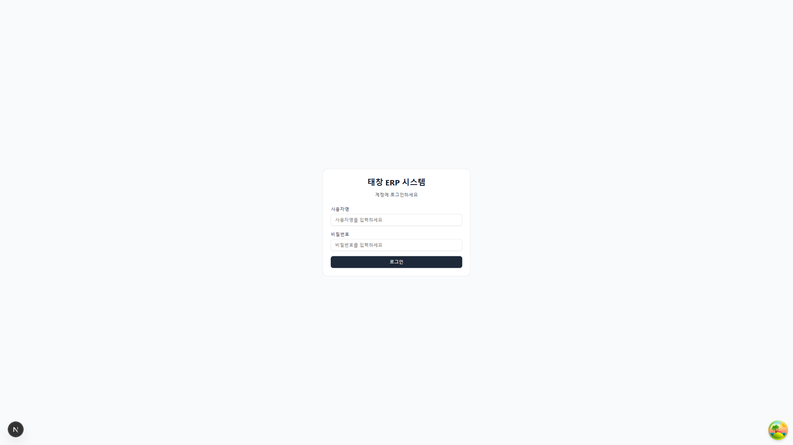
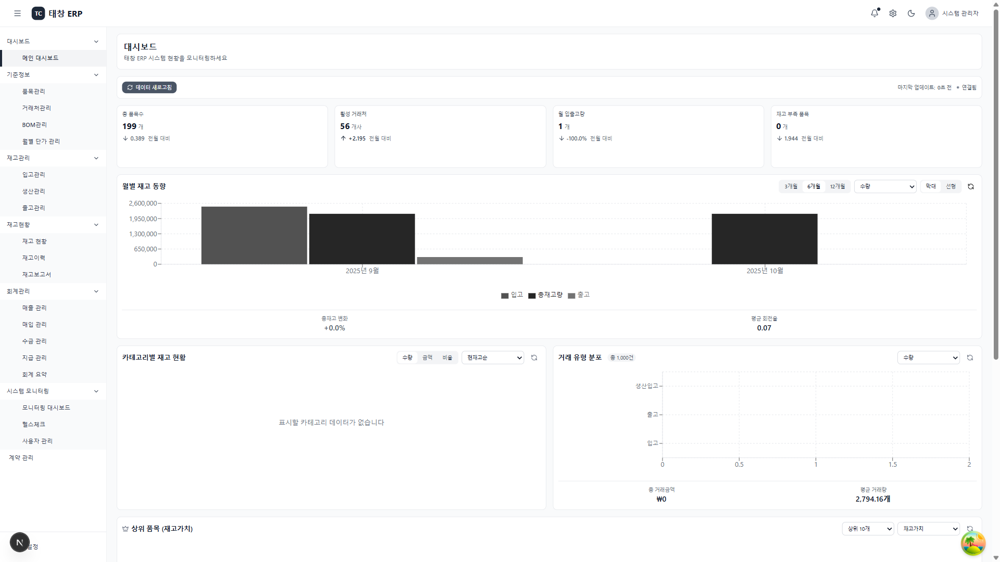
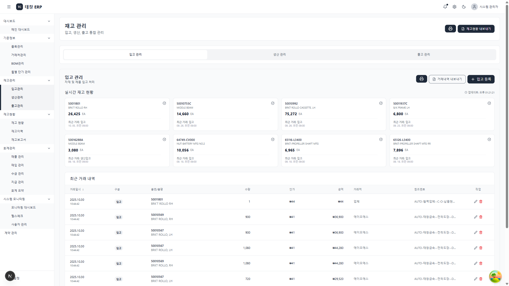
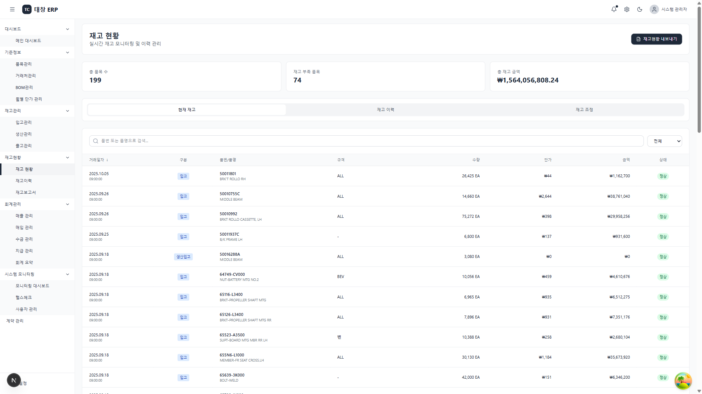
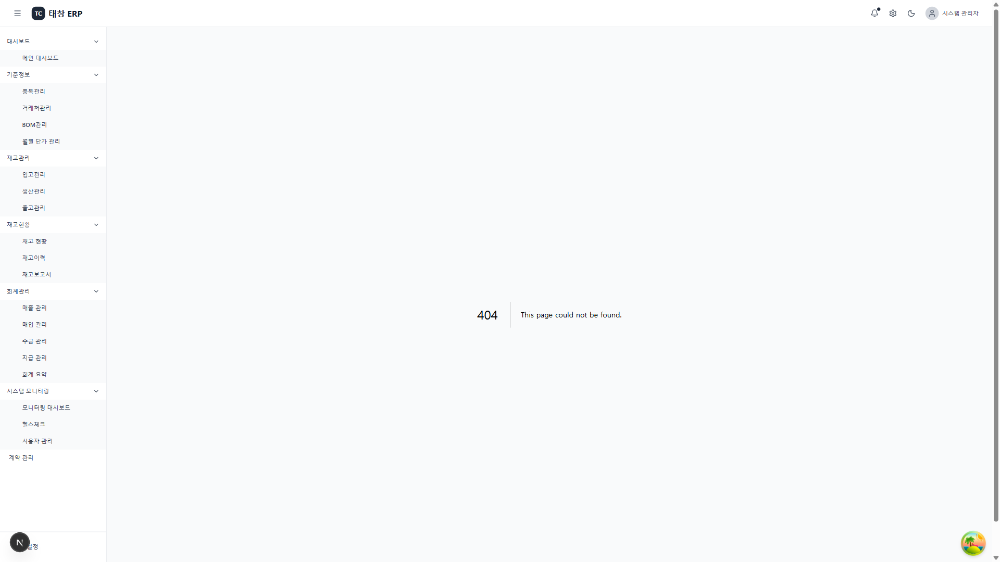

# 태창 ERP 시스템 실무 사용 가이드

**버전**: 1.0
**최종 업데이트**: 2025년 1월
**대상**: 태창 ERP 사용자 (관리자, 회계 담당자, 일반 사용자)

---

# 목차

1. [로그인 및 계정 정보](#1-로그인-및-계정-정보)
2. [메인 대시보드 사용법](#2-메인-대시보드-사용법)
3. [품목 관리](#3-품목-관리)
4. [입고 처리](#4-입고-처리)
5. [출고 처리](#5-출고-처리)
6. [생산 처리](#6-생산-처리)
7. [재고 현황 확인](#7-재고-현황-확인)
8. [거래처 관리](#8-거래처-관리)
9. [BOM (자재 명세서) 관리](#9-bom-자재-명세서-관리)
10. [매출 및 수금 처리](#10-매출-및-수금-처리)
11. [매입 및 지급 처리](#11-매입-및-지급-처리)
12. [월별 단가 관리](#12-월별-단가-관리)
13. [회계 보고서](#13-회계-보고서)
14. [Excel 활용법](#14-excel-활용법)
15. [자주 묻는 질문](#15-자주-묻는-질문)

---

# 1. 로그인 및 계정 정보

## 1.1 시스템 접속

**웹사이트 주소**: `http://localhost:5000` (개발 환경)



## 1.2 계정 종류 및 권한

태창 ERP는 3가지 계정 유형이 있습니다:

### 📌 관리자 계정 (Admin)
```
사용자명: admin
비밀번호: password123
```

**권한 범위:**
- ✅ 모든 기능 접근 및 수정 가능
- ✅ 사용자 관리 (계정 생성/삭제)
- ✅ 품목, 거래처, BOM 등록/수정/삭제
- ✅ 입고/출고/생산 처리
- ✅ 매출/매입/수금/지급 등록
- ✅ 시스템 설정 변경
- ✅ 모든 보고서 조회 및 다운로드

**주요 업무:**
- 시스템 전반 관리
- 마스터 데이터 관리
- 사용자 권한 관리
- 시스템 모니터링

---

### 📊 CEO 계정 (경영진)
```
사용자명: ceo
비밀번호: password123
```

**권한 범위:**
- ✅ 관리자 권한 + 경영진 대시보드
- ✅ 모든 기능 접근 가능
- ✅ 재무 보고서 및 통계 조회
- ✅ 회계 요약 및 분석
- ✅ 거래처별 통계 조회

**주요 업무:**
- 경영 현황 모니터링
- 재무 보고서 검토
- 의사결정 지원 자료 확인

---

### 📋 회계 담당자 계정 (Accountant)
```
사용자명: accountant
비밀번호: password123
```

**권한 범위:**
- ✅ 매출/매입/수금/지급 **조회만** 가능
- ✅ 회계 보고서 조회 및 다운로드
- ✅ 거래 내역 Excel 내보내기
- ❌ 데이터 등록/수정/삭제 **불가**
- ❌ 마스터 데이터 접근 **제한**

**주요 업무:**
- 회계 거래 내역 확인
- 수금/지급 현황 모니터링
- 회계 보고서 작성
- 세무 자료 준비

---

## 1.3 로그인 절차

### 따라하기

① **웹브라우저 열기** (Chrome, Edge 권장)

② **주소 입력**: `http://localhost:5000`

③ **로그인 정보 입력**
   - 사용자명: 위 계정 중 하나 선택
   - 비밀번호: `password123`

④ **"로그인" 버튼 클릭**

⑤ **메인 대시보드 표시 확인**



---

## 1.4 로그아웃 방법

### 따라하기

① **우측 상단 사용자 아이콘 클릭**

② **"로그아웃" 메뉴 선택**

③ **로그인 화면으로 자동 이동 확인**

---

## 1.5 비밀번호 변경 (관리자만)

### 따라하기

① **관리자 계정으로 로그인**

② **좌측 메뉴 → "관리" → "사용자 관리" 클릭**

③ **변경할 사용자 선택**

④ **"비밀번호 재설정" 버튼 클릭**

⑤ **새 비밀번호 입력 (2회)**

⑥ **"저장" 버튼 클릭**

---

### ⚠️ 주의사항

- **비밀번호는 절대 타인에게 공유하지 마세요**
- **로그인 정보를 메모해두세요** (안전한 곳에 보관)
- **공용 PC에서는 반드시 로그아웃하세요**
- **비밀번호 변경은 관리자만 가능합니다**

---

# 2. 메인 대시보드 사용법

## 2.1 대시보드 화면 구성

메인 대시보드(`/`)는 시스템 전체 현황을 한눈에 볼 수 있는 화면입니다.

[스크린샷: 전체 대시보드 화면]

### 화면 구성 요소

**A. KPI 카드 (상단)**
- 총 재고 가치
- 금일 입고 건수
- 금일 출고 건수
- 재고 부족 경고 건수
- 활성 거래처 수

**B. 차트 영역 (중앙)**
- 월별 재고 추이 (선 그래프)
- 카테고리별 재고 분포 (파이 차트)
- 최근 거래 내역 (막대 그래프)

**C. 빠른 작업 버튼 (우측)**
- 입고 등록
- 출고 등록
- 재고 조회

**D. 최근 활동 (하단)**
- 최근 8개 거래 목록
- 실시간 업데이트

---

## 2.2 KPI 카드 읽는 법

### 총 재고 가치
```
예시: ₩125,480,000
```
- **의미**: 현재 보유 중인 모든 재고의 금액
- **계산**: 품목별 (현재고 × 단가) 합계

### 금일 입고 건수
```
예시: 15건
```
- **의미**: 오늘 등록된 입고 거래 건수
- **클릭**: 입고 내역 상세 페이지로 이동

### 금일 출고 건수
```
예시: 8건
```
- **의미**: 오늘 등록된 출고 거래 건수
- **클릭**: 출고 내역 상세 페이지로 이동

### 재고 부족 경고
```
예시: 3건 ⚠️
```
- **의미**: 현재고 < 안전재고인 품목 수
- **색상**: 빨간색 경고 표시
- **클릭**: 재고 부족 품목 목록 확인

### 활성 거래처 수
```
예시: 24개
```
- **의미**: is_active = true인 거래처 수
- **클릭**: 거래처 관리 페이지로 이동

---

## 2.3 자동 새로고침 설정

대시보드는 실시간으로 데이터를 업데이트할 수 있습니다.

### 따라하기

① **우측 상단 "⚙️ 설정" 버튼 클릭**

② **"자동 새로고침" 드롭다운 선택**

③ **원하는 간격 선택**
   - 1분
   - 5분 (권장)
   - 10분
   - 15분
   - 30분
   - 끄기

④ **설정 즉시 적용됨**

⑤ **수동 새로고침**: "🔄 새로고침" 버튼 클릭

[스크린샷: 자동 새로고침 설정 드롭다운]

---

## 2.4 빠른 작업 실행

### 입고 등록 바로가기

① **대시보드에서 "입고 등록" 버튼 클릭**

② **입고 등록 페이지로 자동 이동**

③ **입고 정보 입력 후 저장**

④ **완료 후 대시보드로 자동 복귀**

### 출고 등록 바로가기

① **대시보드에서 "출고 등록" 버튼 클릭**

② **출고 등록 페이지로 자동 이동**

③ **출고 정보 입력 후 저장**

### 재고 조회 바로가기

① **대시보드에서 "재고 조회" 버튼 클릭**

② **재고 현황 페이지로 이동**

③ **전체 품목 재고 확인**

---

## 2.5 차트 활용법

### 월별 재고 추이 (선 그래프)

[스크린샷: 월별 재고 추이 차트]

**보는 법:**
- X축: 월 (예: 2024-10, 2024-11)
- Y축: 재고 가치 (원)
- 선: 월별 재고 가치 변화 추이

**활용:**
- 마우스 오버 → 정확한 수치 표시
- 재고 증감 패턴 파악
- 계절별 재고 변동 확인

### 카테고리별 재고 분포 (파이 차트)

[스크린샷: 카테고리별 재고 분포 차트]

**보는 법:**
- 색상별 영역: 카테고리 (원자재/부자재/반제품/완제품)
- 비율: 전체 재고 대비 카테고리 비중
- 수치: 각 카테고리 재고 가치

**활용:**
- 재고 구성 비율 한눈에 파악
- 과다/과소 재고 카테고리 식별
- 재고 전략 수립 참고

### 최근 거래 내역 (막대 그래프)

[스크린샷: 최근 거래 내역 차트]

**보는 법:**
- X축: 날짜 (최근 7일)
- Y축: 거래 건수
- 막대 색상: 입고(파란색), 출고(빨간색)

**활용:**
- 일별 거래량 추이 확인
- 바쁜 날짜 파악
- 입출고 균형 모니터링

---

## 2.6 최근 활동 영역

### 표시 내용

대시보드 하단에 최근 거래 8건이 카드 형식으로 표시됩니다.

[스크린샷: 최근 활동 카드]

**각 카드 정보:**
- 품목코드
- 품목명
- 거래 유형 (입고/출고/생산)
- 수량
- 거래일시
- 현재 재고
- 재고 상태 아이콘

**재고 상태 아이콘:**
- ✅ 녹색 체크: 정상 (현재고 ≥ 안전재고)
- ⏰ 노란색 시계: 부족 (현재고 < 안전재고)
- ⚠️ 빨간색 경고: 없음 (현재고 = 0)

### 자동 업데이트

- **업데이트 주기**: 5초마다 자동 갱신
- **표시 개수**: 최신 8건만 표시
- **실시간성**: 입고/출고 즉시 반영

---

### 💡 팁

- **대시보드를 시작 페이지로 설정**하세요
- **자동 새로고침은 5분**이 적절합니다 (배터리/성능 고려)
- **재고 부족 경고**는 매일 아침 확인하세요
- **KPI 카드 클릭**으로 상세 페이지 빠르게 이동

---

### ⚠️ 주의사항

- 차트는 **최근 6개월** 데이터만 표시됩니다
- 데이터가 많으면 차트 로딩에 **2-3초** 소요됩니다
- **인터넷 연결**이 끊기면 자동 새로고침이 중단됩니다

---

# 3. 품목 관리

## 3.1 품목이란?

품목은 회사에서 취급하는 **모든 제품과 부품**을 의미합니다.

**품목 종류:**
- 원자재 (RAW): 철강, 코일, 원재료
- 부자재 (SUB): 나사, 볼트, 부속품
- 반제품 (WIP): 중간 가공품
- 완제품 (FINISHED): 최종 제품
- 상품 (GOODS): 구매 후 재판매 상품

---

## 3.2 품목 목록 조회

### 접근 방법

① **좌측 메뉴 → "기준정보" → "품목 관리" 클릭**

② **품목 목록 화면 표시**

[스크린샷: 품목 목록 화면]

### 화면 구성

**A. 상단 버튼 영역**
- "품목 등록" 버튼
- "템플릿 다운로드" 버튼
- "일괄 업로드" 버튼
- "Excel 내보내기" 버튼

**B. 검색 및 필터 영역**
- 검색창 (품목코드, 품목명, 규격, 소재)
- 분류 필터 (원자재/부자재/반제품/완제품/상품)
- 타입 필터 (RAW/SUB/WIP/FINISHED/GOODS)
- 초기화 버튼

**C. 품목 테이블**
- 품목코드, 품목명, 분류, 타입
- 규격, 소재, 두께, 너비, 높이
- 현재고, 안전재고, 위치
- 기준단가
- 작업 버튼 (수정/삭제/이미지)

---

## 3.3 품목 검색하기

### 실시간 검색

① **검색창에 키워드 입력**
   - 예: "철강", "ST-001", "코일"

② **Enter 키 또는 🔍 아이콘 클릭**

③ **검색 결과 즉시 표시**

[스크린샷: 품목 검색 결과]

### 필터로 찾기

① **"분류" 드롭다운 클릭**

② **원하는 분류 선택**
   - 전체
   - 원자재
   - 부자재
   - 반제품
   - 완제품
   - 상품

③ **"타입" 드롭다운 클릭**

④ **원하는 타입 선택**
   - 전체
   - RAW
   - SUB
   - WIP
   - FINISHED
   - GOODS

⑤ **필터 적용된 결과 표시**

### 필터 초기화

① **"초기화" 버튼 클릭**

② **모든 필터 해제 및 전체 품목 표시**

---

## 3.4 품목 1개 등록하기

### 언제 사용하나요?

- 새로운 부품이 입고되었을 때
- 신규 제품을 등록할 때
- 거래처로부터 새 품목 정보를 받았을 때

### 따라하기

① **"품목 등록" 버튼 클릭**

② **품목 등록 폼 표시**

[스크린샷: 품목 등록 폼]

③ **필수 정보 입력**

**기본 정보 (필수)**
```
품목코드: ST-001          (중복 불가)
품목명: 철강 코일 10mm     (명확한 이름)
분류: 원자재              (드롭다운 선택)
타입: RAW                (드롭다운 선택)
단위: EA                 (개, KG, M 등)
```

**물리 정보 (선택)**
```
규격: 1000x2000mm
소재: SPCC
두께: 10.0 (mm)
너비: 1000.0 (mm)
높이: 2000.0 (mm)
비중: 7.85
단위중량: 157.0 (kg)
```

**재고 정보 (선택)**
```
현재고: 100             (초기 재고)
안전재고: 50            (최소 유지 재고)
위치: A-101             (창고 위치)
```

**가격 정보 (필수)**
```
기준단가: 50000         (원)
```

**기타 정보 (선택)**
```
도장상태: 미도장/도장 전/도장 후
차종: 소나타, 아반떼 등
설명: 자유 입력
```

④ **"저장" 버튼 클릭**

⑤ **성공 메시지 확인**
```
✅ 품목이 성공적으로 등록되었습니다.
```

⑥ **품목 목록에서 새 품목 확인**

---

## 3.5 품목 수정하기

### 따라하기

① **품목 목록에서 수정할 품목 찾기**

② **해당 품목 행의 "✏️ 수정" 아이콘 클릭**

③ **수정 폼 표시**

④ **변경할 내용 수정**
   - 품목코드는 **수정 불가** (중요)
   - 다른 항목은 자유롭게 수정 가능

⑤ **"저장" 버튼 클릭**

⑥ **수정 완료 확인**

[스크린샷: 품목 수정 폼]

---

## 3.6 품목 삭제하기

### ⚠️ 중요 주의사항

- 품목 삭제는 **소프트 삭제**입니다
- 실제로 데이터가 지워지지 않고 **is_active = false**로 변경됩니다
- 삭제된 품목은 목록에 표시되지 않지만 **데이터베이스에 보존**됩니다
- 복구가 필요하면 **관리자에게 요청**하세요

### 따라하기

① **품목 목록에서 삭제할 품목 찾기**

② **해당 품목 행의 "🗑️ 삭제" 아이콘 클릭**

③ **삭제 확인 대화상자 표시**
```
이 품목을 삭제하시겠습니까?
품목코드: ST-001
품목명: 철강 코일 10mm

[취소]  [삭제]
```

④ **"삭제" 버튼 클릭**

⑤ **삭제 완료 메시지 확인**
```
✅ 품목이 삭제되었습니다.
```

⑥ **품목 목록에서 해당 품목 사라짐 확인**

---

## 3.7 품목 이미지 등록하기

각 품목에 최대 **5장의 이미지**를 첨부할 수 있습니다.

### 따라하기

① **품목 목록에서 이미지를 추가할 품목 찾기**

② **해당 품목 행의 "📷 이미지" 아이콘 클릭**

③ **이미지 관리 모달 표시**

[스크린샷: 이미지 업로드 모달]

④ **이미지 업로드 방법 (2가지)**

**방법 1: 파일 선택**
- "파일 선택" 버튼 클릭
- 이미지 파일 선택 (JPG, PNG만 가능)
- 최대 5MB

**방법 2: 드래그 앤 드롭**
- 파일 탐색기에서 이미지 파일 선택
- 업로드 영역으로 드래그
- 마우스 놓기

⑤ **대표 이미지 설정 (선택)**
   - 체크박스 선택: "대표 이미지로 설정"

⑥ **"업로드" 버튼 클릭**

⑦ **업로드 완료 확인**
```
✅ 이미지가 업로드되었습니다.
```

⑧ **업로드된 이미지 목록 확인**
   - 썸네일 표시
   - 파일명
   - 업로드 일시
   - 삭제 버튼

⑨ **이미지 삭제 (필요시)**
   - 삭제할 이미지의 "🗑️" 버튼 클릭
   - 확인 대화상자에서 "삭제" 클릭

⑩ **"닫기" 버튼으로 모달 닫기**

---

## 3.8 Excel로 품목 한번에 등록하기

### 언제 사용하나요?

- 새로운 거래처로부터 품목 목록을 받았을 때
- 신규 프로젝트로 여러 품목을 한번에 등록할 때
- 기존 Excel 자료를 시스템에 입력할 때

### 따라하기

#### Step 1: 템플릿 다운로드

① **"템플릿 다운로드" 버튼 클릭**

② **Excel 파일 저장**
   - 파일명: `품목_템플릿_YYYYMMDD_HHMMSS.xlsx`

③ **템플릿 열기**

[스크린샷: Excel 템플릿 구조]

**템플릿 구조:**
```
Sheet 1: 품목 데이터
┌──────────┬──────────┬────────┬──────┬──────┬───────┬─────┬─────┐
│품목코드   │품목명     │분류     │타입   │단위   │현재고  │안전재고│기준단가│
├──────────┼──────────┼────────┼──────┼──────┼───────┼─────┼─────┤
│ST-001    │철강 코일   │원자재   │RAW   │EA    │100    │50   │50000│
│ST-002    │알루미늄판  │원자재   │RAW   │KG    │200    │100  │30000│
└──────────┴──────────┴────────┴──────┴──────┴───────┴─────┴─────┘
```

**한글 컬럼명:**
- 품목코드 (필수)
- 품목명 (필수)
- 분류 (필수): 원자재/부자재/반제품/완제품/상품
- 타입 (필수): RAW/SUB/WIP/FINISHED/GOODS
- 단위 (필수): EA/KG/M/BOX 등
- 규격
- 소재
- 두께
- 너비
- 높이
- 비중
- 단위중량
- 현재고
- 안전재고
- 위치
- 기준단가 (필수)
- 도장상태: 미도장/도장 전/도장 후
- 차종
- 설명

#### Step 2: 데이터 입력

④ **템플릿에 품목 정보 입력**

**예시:**
```
품목코드  품목명         분류    타입      단위  현재고  안전재고  기준단가
ST-001   철강 코일 10mm  원자재  RAW      EA    100    50      50000
ST-002   철강 코일 15mm  원자재  RAW      EA    80     40      65000
ST-003   알루미늄판 5mm  원자재  RAW      KG    200    100     30000
BT-001   볼트 M8        부자재  SUB      EA    500    200     500
FN-001   브라켓 A형     완제품  FINISHED EA    50     20      120000
```

**입력 규칙:**
- 품목코드: 중복 불가 (시스템에서 자동 검증)
- 분류: 정확히 "원자재", "부자재", "반제품", "완제품", "상품" 중 하나
- 타입: 정확히 "RAW", "SUB", "WIP", "FINISHED", "GOODS" 중 하나
- 숫자: 천단위 쉼표 없이 입력 (50000, 3.14)
- 날짜: 불필요 (자동 생성)

#### Step 3: 파일 업로드

⑤ **Excel 파일 저장**

⑥ **ERP 시스템으로 돌아가기**

⑦ **"일괄 업로드" 버튼 클릭**

⑧ **파일 선택 대화상자 표시**

⑨ **작성한 Excel 파일 선택**

⑩ **"열기" 버튼 클릭**

⑪ **업로드 진행 중 표시**
```
⏳ 파일을 업로드하는 중입니다...
```

#### Step 4: 결과 확인

⑫ **업로드 결과 모달 표시**

[스크린샷: 업로드 결과 모달]

**성공 케이스:**
```
✅ 업로드 완료
- 총 품목 수: 50개
- 성공: 48개
- 실패: 2개

실패 목록:
- 행 15: 품목코드 중복 (ST-001)
- 행 32: 분류가 올바르지 않음 (필수: 원자재/부자재/반제품/완제품/상품)
```

**전체 성공 케이스:**
```
✅ 업로드 완료
- 총 품목 수: 50개
- 성공: 50개
- 실패: 0개

모든 품목이 성공적으로 등록되었습니다.
```

⑬ **"확인" 버튼 클릭**

⑭ **품목 목록에서 새로 등록된 품목 확인**

---

## 3.9 품목 목록 Excel로 내보내기

### 언제 사용하나요?

- 품목 목록을 Excel로 관리할 때
- 외부 업체에 품목 정보를 전달할 때
- 품목 현황 보고서를 작성할 때
- 재고 감사 자료를 준비할 때

### 따라하기

① **품목 목록 화면에서 필터 적용 (선택)**
   - 예: "원자재"만 내보내기
   - 예: "현재고 > 0"인 품목만

② **"Excel 내보내기" 버튼 클릭**

③ **다운로드 진행 중 표시**
```
⏳ Excel 파일을 생성하는 중입니다...
```

④ **Excel 파일 자동 다운로드**
   - 파일명: `품목목록_YYYYMMDD_HHMMSS.xlsx`
   - 위치: 다운로드 폴더

⑤ **Excel 파일 열기**

[스크린샷: 내보낸 Excel 파일]

**Excel 파일 구조 (3개 Sheet):**

**Sheet 1: 내보내기 정보**
```
┌─────────────────┬──────────────────────────┐
│ 내보내기 정보    │                          │
├─────────────────┼──────────────────────────┤
│ 내보낸 날짜      │ 2025-01-15 14:30:25      │
│ 총 레코드 수     │ 125개                    │
│ 필터 적용        │ 분류: 원자재              │
└─────────────────┴──────────────────────────┘
```

**Sheet 2: 통계**
```
┌─────────────────┬──────────────┐
│ 통계 항목        │ 값           │
├─────────────────┼──────────────┤
│ 총 품목 수       │ 125개        │
│ 총 재고 가치     │ ₩125,480,000 │
│ 평균 단가        │ ₩55,240      │
│ 재고 부족 품목   │ 8개          │
└─────────────────┴──────────────┘
```

**Sheet 3: 품목 데이터**
```
┌──────────┬──────────┬────────┬──────┬───────┬─────┬─────────┐
│품목코드   │품목명     │분류     │현재고  │안전재고│기준단가  │재고가치  │
├──────────┼──────────┼────────┼──────┼───────┼─────┼─────────┤
│ST-001    │철강 코일   │원자재   │100   │50     │50000│5,000,000│
│ST-002    │알루미늄판  │원자재   │200   │100    │30000│6,000,000│
└──────────┴──────────┴────────┴──────┴───────┴─────┴─────────┘
```

⑥ **Excel에서 데이터 활용**
   - 정렬, 필터, 차트 생성 가능
   - 인쇄 가능
   - 다른 시스템으로 import 가능

---

### 💡 팁

**품목코드 작성 규칙 (권장):**
```
원자재: RAW-001, RAW-002, ...
부자재: SUB-001, SUB-002, ...
완제품: FIN-001, FIN-002, ...
철강: ST-001, ST-002, ... (Steel)
알루미늄: AL-001, AL-002, ... (Aluminum)
```

**분류와 타입 차이:**
- **분류**: 한글 카테고리 (원자재/부자재/반제품/완제품/상품)
- **타입**: 영문 코드 (RAW/SUB/WIP/FINISHED/GOODS)
- **둘 다 일치**해야 합니다

**재고 정보 입력 팁:**
- **현재고**: 초기 등록 시 실제 재고 수량
- **안전재고**: 보통 월 평균 사용량의 10-20%
- **위치**: 창고 코드 또는 선반 번호 (예: A-101, B-205)

**Excel 업로드 주의사항:**
- 한글 컬럼명을 **정확히** 사용하세요
- 빈 행은 자동으로 건너뜁니다
- 오류 발생 시 오류 행만 수정 후 재업로드 가능

---

### ⚠️ 주의사항

**품목코드 관리:**
- 품목코드는 **한번 등록하면 수정 불가**
- 신중하게 작성하세요
- 중복 시 등록 실패

**이미지 관리:**
- 지원 형식: **JPG, PNG만**
- 최대 크기: **5MB**
- 최대 개수: **품목당 5장**
- 대표 이미지는 **1개만** 설정 가능

**삭제 주의:**
- 삭제된 품목은 **거래 이력에 남아있음**
- BOM에 사용 중인 품목은 삭제 불가
- 재고가 있는 품목 삭제 시 경고 표시

**Excel 업로드 제한:**
- 한번에 최대 **1,000개** 품목
- 파일 크기 최대 **10MB**
- 업로드 시간: 품목 100개당 약 **5-10초**

---

# 4. 입고 처리

## 4.1 입고란?

입고는 **공급사로부터 부품이나 자재를 받아서 창고에 보관**하는 작업입니다.

**입고 시 자동 처리:**
- ✅ 품목 재고 자동 증가
- ✅ 재고 이력 자동 기록
- ✅ 입고 금액 자동 계산 (수량 × 단가)

---

## 4.2 입고 목록 조회

### 접근 방법

① **좌측 메뉴 → "재고관리" → "재고 거래" 클릭**

② **"입고" 탭 선택**

[스크린샷: 입고 목록 화면]

### 화면 구성

**A. 탭 영역**
- 입고 (현재)
- 생산
- 출고

**B. 상단 버튼**
- "입고 등록" 버튼
- "Excel 내보내기" 버튼

**C. 검색 및 필터**
- 날짜 범위 선택
- 공급사 검색
- 품목 검색
- 거래번호 검색

**D. 입고 내역 테이블**
- 거래번호, 거래일자
- 공급사명
- 품목 정보
- 수량, 단가, 총액
- LOT번호, 유효기간
- 등록일시
- 작업 버튼 (수정/삭제)

---

## 4.3 단일 품목 입고 등록

### 언제 사용하나요?

- 공급사로부터 부품 1종을 받았을 때
- 긴급 입고 처리가 필요할 때

### 따라하기

① **"입고 등록" 버튼 클릭**

② **입고 등록 폼 표시**



③ **기본 정보 입력**

**필수 항목:**
```
거래일자: 2025-01-15        (날짜 선택기 사용)
공급사: 태광철강              (드롭다운에서 선택)
참조번호: PO-2025-001       (발주서 번호 등, 선택사항)
```

④ **품목 정보 입력**

**품목 선택:**
- "품목 선택" 드롭다운 클릭
- 품목코드 또는 품목명 검색
- 원하는 품목 선택

**자동 로드 확인:** ✨
```
품목 선택 시 자동 로드:
- 품목명
- 단위
- 월별 단가 (거래일자 기준)
```

[스크린샷: 월별 단가 자동 적용 배지]

**월별 단가 자동 적용:**
- 거래일자가 **2025-01**이면
- **2025-01월** 단가 자동 조회
- 단가가 있으면: **"✅ 월별 단가 적용"** 배지 표시
- 단가가 없으면: 품목 마스터의 **기준단가** 사용

**수량 및 단가 입력:**
```
수량: 100                   (필수)
단가: 50,000                (자동 입력되지만 수정 가능)
총액: 5,000,000             (자동 계산: 수량 × 단가)
```

**추가 정보 (선택):**
```
LOT번호: LOT-2025-0115-001  (제조 로트 번호)
유효기간: 2026-01-15        (식품, 화학 제품 등)
비고: 품질 검사 완료         (메모)
```

⑤ **"등록" 버튼 클릭**

⑥ **입고 처리 진행**
```
⏳ 입고를 처리하는 중입니다...
```

⑦ **성공 메시지 확인**
```
✅ 입고가 성공적으로 등록되었습니다.
- 품목: ST-001 철강 코일 10mm
- 수량: 100 EA
- 현재 재고: 200 EA (기존 100 + 입고 100)
```

⑧ **입고 목록에서 새 거래 확인**

---

## 4.4 여러 품목 동시 입고 등록

### 언제 사용하나요?

- 한 공급사로부터 여러 품목을 동시에 받았을 때
- 발주서에 여러 품목이 포함되어 있을 때

### 따라하기

① **"입고 등록" 버튼 클릭**

② **기본 정보 입력**
```
거래일자: 2025-01-15
공급사: 태광철강
참조번호: PO-2025-001
```

③ **첫 번째 품목 정보 입력**
```
품목: ST-001 철강 코일 10mm
수량: 100
단가: 50,000 (자동)
```

④ **"품목 추가 +" 버튼 클릭**

[스크린샷: 품목 추가 버튼]

⑤ **두 번째 품목 입력 행 표시**

⑥ **두 번째 품목 정보 입력**
```
품목: ST-002 철강 코일 15mm
수량: 80
단가: 65,000 (자동)
```

⑦ **필요한 만큼 품목 추가 반복**

⑧ **전체 총액 자동 계산 확인**
```
품목 1: 100 × 50,000 = 5,000,000원
품목 2: 80 × 65,000 = 5,200,000원
-----------------------------------------
전체 총액: 10,200,000원
```

⑨ **"등록" 버튼 클릭**

⑩ **다중 품목 입고 처리**
```
⏳ 2개 품목 입고를 처리하는 중입니다...
```

⑪ **성공 메시지 확인**
```
✅ 2개 품목 입고가 성공적으로 등록되었습니다.

품목 1: ST-001 철강 코일 10mm
- 입고 수량: 100 EA
- 현재 재고: 200 EA

품목 2: ST-002 철강 코일 15mm
- 입고 수량: 80 EA
- 현재 재고: 180 EA
```

⑫ **입고 목록에서 거래 2건 확인**

---

## 4.5 월별 단가 자동 적용 확인

### 월별 단가 시스템이란?

품목마다 **월별로 다른 단가**를 적용할 수 있는 시스템입니다.

**예시:**
```
철강 코일 10mm (ST-001):
- 2024-12월: 48,000원
- 2025-01월: 50,000원
- 2025-02월: 52,000원
```

### 자동 적용 원리

① **거래일자 입력**: 2025-01-15

② **시스템이 월 추출**: 2025-01

③ **월별 단가 조회**: `price_master` 테이블 검색
   - 품목ID = ST-001
   - 적용월 = 2025-01

④ **결과 처리**:
   - **단가가 있으면**: 해당 단가 자동 입력 + **"✅ 월별 단가 적용"** 배지 표시
   - **단가가 없으면**: 품목 마스터의 **기준단가** 사용

### 확인 방법

**단가가 자동 적용되었는지 확인:**

[스크린샷: 월별 단가 적용 배지]

```
단가: 50,000원  [✅ 월별 단가 적용]
```

- **녹색 배지**가 표시되면 월별 단가가 적용된 것
- 배지가 없으면 기준단가 사용

**수동 수정 가능:**
- 자동 입력된 단가도 수정 가능
- 특별 할인, 프로모션 가격 등 적용 시

---

## 4.6 공급사 정보 자동 입력

### 자동 입력되는 정보

공급사 선택 시 **저장된 거래처 정보**가 자동으로 채워집니다:

- 담당자명
- 연락처
- 이메일
- 배송 주소
- 결제 조건

[스크린샷: 공급사 정보 자동 입력]

### 활용 방법

① **공급사 선택**

② **자동 입력 확인**

③ **필요 시 수정**
   - 예: 이번 입고만 다른 주소로 배송
   - 예: 담당자가 변경됨

④ **저장**

---

## 4.7 입고 내역 수정하기

### 언제 수정하나요?

- 수량을 잘못 입력했을 때
- 단가가 변경되었을 때
- LOT번호를 추가해야 할 때

### ⚠️ 주의사항

- 입고 수정 시 **재고가 재계산**됩니다
- 다른 거래(출고, 생산)에 영향을 줄 수 있습니다

### 따라하기

① **입고 목록에서 수정할 거래 찾기**

② **해당 행의 "✏️ 수정" 버튼 클릭**

③ **수정 폼 표시**

④ **변경할 내용 수정**
   - 수량 변경: 100 → 120
   - 단가 변경: 50,000 → 48,000
   - 총액 자동 재계산

⑤ **"저장" 버튼 클릭**

⑥ **수정 확인 대화상자**
```
입고 수정 시 재고가 재계산됩니다.
계속하시겠습니까?

[취소]  [확인]
```

⑦ **"확인" 클릭**

⑧ **재고 재계산 처리**
```
기존 입고 수량: 100 EA
새로운 입고 수량: 120 EA
차이: +20 EA

현재 재고: 200 EA → 220 EA (20 EA 증가)
```

⑨ **수정 완료 메시지**
```
✅ 입고 내역이 수정되었습니다.
재고가 재계산되었습니다.
```

---

## 4.8 입고 내역 삭제하기

### 언제 삭제하나요?

- 잘못 등록된 입고를 취소할 때
- 반품 처리할 때

### ⚠️ 중요 주의사항

- 입고 삭제 시 **재고가 감소**합니다
- 현재 재고보다 많은 수량 삭제 시 **마이너스 재고** 발생 가능
- 삭제된 데이터는 **복구 불가** (데이터베이스에서 완전 삭제)

### 따라하기

① **입고 목록에서 삭제할 거래 찾기**

② **해당 행의 "🗑️ 삭제" 버튼 클릭**

③ **삭제 확인 대화상자**
```
이 입고 내역을 삭제하시겠습니까?

거래번호: RCV-2025-0115-001
품목: ST-001 철강 코일 10mm
수량: 100 EA

⚠️ 재고가 100 EA 감소합니다.
현재 재고: 220 EA → 120 EA

삭제된 데이터는 복구할 수 없습니다.

[취소]  [삭제]
```

④ **"삭제" 버튼 클릭**

⑤ **재고 차감 처리**

⑥ **삭제 완료 메시지**
```
✅ 입고 내역이 삭제되었습니다.
재고가 차감되었습니다.
```

---

## 4.9 입고 현황 조회 및 검색

### 날짜 범위로 조회

① **"시작일" 선택기 클릭**

② **시작 날짜 선택** (예: 2025-01-01)

③ **"종료일" 선택기 클릭**

④ **종료 날짜 선택** (예: 2025-01-31)

⑤ **"조회" 버튼 클릭**

⑥ **해당 기간 입고 내역 표시**

### 공급사로 검색

① **"공급사" 검색창에 키워드 입력**
   - 예: "태광"

② **Enter 또는 🔍 클릭**

③ **해당 공급사 입고만 표시**

### 품목으로 검색

① **"품목" 검색창에 키워드 입력**
   - 예: "철강", "ST-001"

② **Enter 또는 🔍 클릭**

③ **해당 품목 입고만 표시**

### 거래번호로 검색

① **"거래번호" 검색창에 입력**
   - 예: "RCV-2025-0115-001"

② **Enter 또는 🔍 클릭**

③ **해당 거래 1건 표시**

### 필터 초기화

① **"초기화" 버튼 클릭**

② **모든 필터 해제 및 전체 입고 표시**

---

## 4.10 입고 내역 Excel 내보내기

### 따라하기

① **필터 적용 (선택)**
   - 예: 2025-01월 입고만
   - 예: 특정 공급사만

② **"Excel 내보내기" 버튼 클릭**

③ **Excel 파일 생성 및 다운로드**
   - 파일명: `입고내역_YYYYMMDD_HHMMSS.xlsx`

④ **Excel 파일 열기**

[스크린샷: 입고 내역 Excel]

**Excel 파일 구조 (3개 Sheet):**

**Sheet 1: 내보내기 정보**
```
내보낸 날짜: 2025-01-15 14:30:25
총 레코드 수: 45건
필터 적용: 2025-01-01 ~ 2025-01-31
```

**Sheet 2: 통계**
```
통계 항목              값
총 입고 건수          45건
총 입고 금액          ₩125,480,000
평균 입고 금액        ₩2,788,444
공급사 수            8개
```

**Sheet 3: 입고 데이터**
```
거래번호          거래일자      공급사명    품목코드  품목명        수량  단가    총액
RCV-2025-0115-001 2025-01-15   태광철강    ST-001   철강 코일 10mm 100  50000  5000000
RCV-2025-0115-002 2025-01-15   한국알루미늄 AL-001   알루미늄판 5mm  200  30000  6000000
```

---

### 💡 팁

**입고 등록 전 체크리스트:**
- [ ] 공급사 정보 확인 (거래처 관리에 등록되어 있는지)
- [ ] 품목 정보 확인 (품목 관리에 등록되어 있는지)
- [ ] 월별 단가 확인 (단가가 자동 적용되는지)
- [ ] 수량 정확히 카운트
- [ ] LOT번호 있으면 기록 (추적성)

**거래번호 규칙:**
```
RCV-YYYY-MMDD-### (자동 생성)
- RCV: Receiving (입고)
- YYYY: 연도
- MMDD: 월일
- ###: 일련번호 (001, 002, ...)
```

**월별 단가가 없을 때:**
- 기준단가가 자동 입력됨
- 거래 후 월별 단가 등록 권장 (/price-management)
- 다음 달부터 자동 적용됨

**공급사 정보 자동 입력 활용:**
- 거래처 등록 시 **모든 정보**를 정확히 입력
- 배송 주소, 결제 조건 등 자주 쓰는 정보
- 입고 등록 시간 단축

---

### ⚠️ 주의사항

**재고 계산 원리:**
```
입고 전 재고: 100 EA
입고 수량: +50 EA
---------------
입고 후 재고: 150 EA
```

**중복 입고 방지:**
- 같은 발주서로 두 번 입고하지 않도록 주의
- 참조번호(PO 번호)를 반드시 기록
- 입고 전 목록에서 확인

**LOT번호 관리:**
- 식품, 화학 제품 등은 LOT번호 필수
- 추적성 확보 (품질 문제 발생 시)
- 유효기간 함께 입력

**단가 수동 수정 시:**
- 특별 할인 등 이유 비고란에 기록
- 월별 단가와 다를 경우 향후 혼란 방지

**삭제 주의:**
- 삭제는 **완전 삭제** (복구 불가)
- 반품은 삭제보다 **마이너스 입고** 또는 **출고 등록** 권장
- 삭제 전 관리자 승인 권장

---

# 5. 출고 처리

## 5.1 출고란?

출고는 **창고에서 고객사에게 제품을 보내는** 작업입니다.

**출고 시 자동 처리:**
- ✅ 품목 재고 자동 감소
- ✅ 재고 이력 자동 기록
- ✅ 출고 금액 자동 계산 (수량 × 단가)
- ⚠️ 재고 부족 시 경고 표시 (강제 출고 가능)

---

## 5.2 출고 목록 조회

### 접근 방법

① **좌측 메뉴 → "재고관리" → "재고 거래" 클릭**

② **"출고" 탭 선택**

[스크린샷: 출고 목록 화면]

### 화면 구성

**A. 탭 영역**
- 입고
- 생산
- 출고 (현재)

**B. 상단 버튼**
- "출고 등록" 버튼
- "Excel 내보내기" 버튼

**C. 검색 및 필터**
- 날짜 범위 선택
- 고객사 검색
- 품목 검색
- 거래번호 검색

**D. 출고 내역 테이블**
- 거래번호, 거래일자, 배송일자
- 고객사명
- 품목 정보
- 수량, 단가, 총액
- 배송 정보
- 등록일시
- 작업 버튼 (수정/삭제)

---

## 5.3 단일 품목 출고 등록

### 언제 사용하나요?

- 고객사에게 제품 1종을 출고할 때
- 긴급 출고가 필요할 때

### 따라하기

① **"출고 등록" 버튼 클릭**

② **출고 등록 폼 표시**


③ **기본 정보 입력**

**필수 항목:**
```
거래일자: 2025-01-15        (날짜 선택기 사용)
고객사: 현대자동차            (드롭다운에서 선택)
참조번호: SO-2025-001       (판매 주문서 번호 등)
배송일자: 2025-01-17        (선택사항)
```

**고객사 선택 시 자동 입력:** ✨
```
배송 주소: 서울시 강남구 테헤란로 123
담당자: 김철수
연락처: 02-1234-5678
```

[스크린샷: 고객사 정보 자동 입력]

④ **품목 정보 입력**

**품목 선택:**
- "품목 선택" 드롭다운 클릭
- 품목코드 또는 품목명 검색
- 원하는 품목 선택

**자동 로드 확인:** ✨
```
품목 선택 시 자동 로드:
- 품목명
- 단위
- 현재 재고 표시 ← 중요!
- 월별 단가 (거래일자 기준)
```

**재고 확인:**
```
현재 재고: 150 EA

재고 상태 표시:
✅ 녹색: 재고 충분
⚠️ 노란색: 재고 부족 (안전재고 미달)
🔴 빨간색: 재고 없음
```

**수량 및 단가 입력:**
```
수량: 50                    (필수)
단가: 120,000               (자동 입력, 월별 단가 적용)
총액: 6,000,000             (자동 계산: 50 × 120,000)
```

**재고 부족 경고:**

[스크린샷: 재고 부족 경고]

```
⚠️ 재고 부족 경고
출고 수량: 50 EA
현재 재고: 30 EA
부족 수량: 20 EA

강제 출고 시 재고가 -20 EA가 됩니다.
계속하시겠습니까?

[취소]  [강제 출고]
```

- **재고 부족 시**에도 출고 가능 (마이너스 재고)
- 긴급 출고 후 입고 예정인 경우 유용
- 단, 재고 관리에 주의 필요

**배송 정보 입력 (선택):**
```
배송 주소: 서울시 강남구...   (고객사 정보에서 자동)
배송 담당자: 홍길동
배송 차량: 25버1234
비고: 오후 3시 이전 배송 요청
```

⑤ **"등록" 버튼 클릭**

⑥ **출고 처리 진행**
```
⏳ 출고를 처리하는 중입니다...
```

⑦ **성공 메시지 확인**
```
✅ 출고가 성공적으로 등록되었습니다.
- 품목: FN-001 브라켓 A형
- 수량: 50 EA
- 출고 전 재고: 150 EA
- 출고 후 재고: 100 EA
```

⑧ **출고 목록에서 새 거래 확인**

---

## 5.4 여러 품목 동시 출고 등록

### 언제 사용하나요?

- 한 고객사에게 여러 품목을 동시에 출고할 때
- 판매 주문서에 여러 품목이 포함되어 있을 때

### 따라하기

① **"출고 등록" 버튼 클릭**

② **기본 정보 입력**
```
거래일자: 2025-01-15
고객사: 현대자동차
참조번호: SO-2025-001
배송일자: 2025-01-17
```

③ **첫 번째 품목 정보 입력**
```
품목: FN-001 브라켓 A형
수량: 50
현재 재고: 150 EA (✅ 충분)
단가: 120,000 (자동)
```

④ **"품목 추가 +" 버튼 클릭**

⑤ **두 번째 품목 입력 행 표시**

⑥ **두 번째 품목 정보 입력**
```
품목: FN-002 브라켓 B형
수량: 30
현재 재고: 80 EA (✅ 충분)
단가: 150,000 (자동)
```

⑦ **필요한 만큼 품목 추가**

⑧ **전체 총액 자동 계산 확인**
```
품목 1: 50 × 120,000 = 6,000,000원
품목 2: 30 × 150,000 = 4,500,000원
-----------------------------------------
전체 총액: 10,500,000원
```

⑨ **"등록" 버튼 클릭**

⑩ **다중 품목 출고 처리**
```
⏳ 2개 품목 출고를 처리하는 중입니다...
```

⑪ **성공 메시지 확인**
```
✅ 2개 품목 출고가 성공적으로 등록되었습니다.

품목 1: FN-001 브라켓 A형
- 출고 수량: 50 EA
- 출고 후 재고: 100 EA

품목 2: FN-002 브라켓 B형
- 출고 수량: 30 EA
- 출고 후 재고: 50 EA
```

---

## 5.5 재고 부족 시 대처법

### 시나리오 1: 재고 충분 (정상 출고)

```
출고 수량: 50 EA
현재 재고: 150 EA
→ ✅ 정상 출고 가능
```

**처리:**
- 그냥 등록하면 됨
- 재고: 150 → 100

---

### 시나리오 2: 재고 부족 (안전재고 미달)

```
출고 수량: 50 EA
현재 재고: 60 EA (안전재고: 50 EA)
→ ⚠️ 출고 후 안전재고 미달
```

**경고 메시지:**
```
⚠️ 안전재고 경고
출고 후 재고: 10 EA
안전재고: 50 EA

재고 부족 상태가 됩니다.
계속하시겠습니까?

[취소]  [출고]
```

**대처 방법:**
1. **출고 진행**: "출고" 클릭 → 정상 처리
2. **입고 우선**: 취소 → 입고 후 출고
3. **수량 조정**: 취소 → 출고 수량 감소

---

### 시나리오 3: 재고 없음 (마이너스 재고)

```
출고 수량: 50 EA
현재 재고: 30 EA
→ 🔴 부족 수량: 20 EA
```

**경고 메시지:**
```
🔴 재고 부족
출고 수량: 50 EA
현재 재고: 30 EA
부족 수량: 20 EA

강제 출고 시 재고가 -20 EA가 됩니다.
긴급 출고 후 입고 예정인가요?

[취소]  [강제 출고]
```

**강제 출고 시:**
```
출고 전 재고: 30 EA
출고 수량: 50 EA
출고 후 재고: -20 EA (마이너스)
```

**대처 방법:**
1. **강제 출고 진행**:
   - "강제 출고" 클릭
   - 입고 예정 확인
   - 빠른 시일 내 입고 필요

2. **출고 취소**:
   - "취소" 클릭
   - 입고 대기
   - 고객사에 지연 통보

3. **부분 출고**:
   - 취소 → 수량 30으로 변경
   - 나머지 20은 나중에 출고

---

## 5.6 고객사 정보 자동 입력 활용

### 자동 입력되는 정보

고객사 선택 시 **저장된 거래처 정보**가 자동으로 채워집니다:

[스크린샷: 고객사 정보 자동 입력]

```
고객사 선택: 현대자동차

자동 입력:
└─ 배송 주소: 서울시 강남구 테헤란로 123, 현대빌딩 3층
└─ 담당자: 김철수 과장
└─ 연락처: 02-1234-5678
└─ 이메일: kim.cs@hyundai.com
└─ 결제 조건: 월말 결제
```

### 수정 방법

자동 입력된 정보도 **수정 가능**합니다:

① **배송 주소 클릭**

② **다른 주소 입력**
   - 예: 이번만 공장 직배송
   - 예: 지점 주소

③ **담당자 변경**
   - 예: 담당자 변경됨
   - 예: 프로젝트별 다른 담당자

④ **저장**

---

## 5.7 월별 단가 자동 적용 (출고)

입고와 동일하게 **월별 단가 자동 적용**이 작동합니다.

### 적용 원리

```
거래일자: 2025-01-15
└─ 월 추출: 2025-01
└─ 월별 단가 조회: price_master 테이블
    └─ 품목ID = FN-001
    └─ 적용월 = 2025-01
    └─ 결과: 120,000원

단가 필드 자동 입력: 120,000원
배지 표시: [✅ 월별 단가 적용]
```

[스크린샷: 출고 시 월별 단가 적용]

### 판매 단가 관리

**중요:**
- 입고 단가 ≠ 출고 단가
- 같은 품목이어도 **다른 단가** 사용 가능
- 월별 단가 관리에서 **구매/판매 단가 분리** 관리 권장

**예시:**
```
철강 코일 10mm (ST-001):
- 구매 단가 (입고): 50,000원
- 판매 단가 (출고): 65,000원
- 마진: 15,000원 (30%)
```

---

## 5.8 출고 내역 수정 및 삭제

### 출고 수정

① **출고 목록에서 "✏️ 수정" 클릭**

② **수정 폼 표시**

③ **변경 사항 입력**
   - 수량, 단가, 배송 정보 등

④ **"저장" 클릭**

⑤ **재고 재계산**
```
기존 출고 수량: 50 EA
새로운 출고 수량: 60 EA
차이: +10 EA

현재 재고: 100 EA → 90 EA (10 EA 추가 감소)
```

### 출고 삭제

① **출고 목록에서 "🗑️ 삭제" 클릭**

② **삭제 확인 대화상자**
```
이 출고 내역을 삭제하시겠습니까?

거래번호: SHP-2025-0115-001
품목: FN-001 브라켓 A형
수량: 50 EA

⚠️ 재고가 50 EA 증가합니다.
현재 재고: 100 EA → 150 EA

삭제된 데이터는 복구할 수 없습니다.

[취소]  [삭제]
```

③ **"삭제" 클릭**

④ **재고 복원 처리**

⑤ **삭제 완료**

---

## 5.9 출고 현황 조회 및 검색

입고와 동일한 방식으로 조회 및 검색이 가능합니다.

### 날짜 범위 조회

① **시작일/종료일 선택**

② **"조회" 버튼 클릭**

### 고객사로 검색

① **"고객사" 검색창에 키워드 입력**

② **Enter 또는 🔍 클릭**

### 품목으로 검색

① **"품목" 검색창에 키워드 입력**

② **Enter 또는 🔍 클릭**

### 거래번호로 검색

① **"거래번호" 검색창에 입력**

② **Enter 또는 🔍 클릭**

---

## 5.10 출고 내역 Excel 내보내기

① **필터 적용 (선택)**

② **"Excel 내보내기" 버튼 클릭**

③ **Excel 파일 다운로드**
   - 파일명: `출고내역_YYYYMMDD_HHMMSS.xlsx`

④ **3-Sheet 구조 확인**
   - Sheet 1: 내보내기 정보
   - Sheet 2: 통계 (총 출고 건수, 총 출고 금액 등)
   - Sheet 3: 출고 데이터

---

### 💡 팁

**출고 전 체크리스트:**
- [ ] 고객사 정보 확인
- [ ] 품목 재고 확인 (충분한지)
- [ ] 월별 단가 확인 (판매 단가 맞는지)
- [ ] 배송 일자 및 주소 확인
- [ ] 긴급 출고인지 확인

**거래번호 규칙:**
```
SHP-YYYY-MMDD-### (자동 생성)
- SHP: Shipping (출고)
- YYYY: 연도
- MMDD: 월일
- ###: 일련번호
```

**마이너스 재고 관리:**
- 마이너스 재고는 **임시 조치**
- 빠른 시일 내 입고 필요
- 재고 현황 페이지에서 **빨간색 경고** 표시됨
- 관리자에게 보고 권장

**배송 정보 활용:**
- 배송 담당자, 차량 번호 기록
- 배송 추적에 유용
- 고객 클레임 발생 시 참고 자료

---

### ⚠️ 주의사항

**재고 계산 원리:**
```
출고 전 재고: 150 EA
출고 수량: -50 EA
---------------
출고 후 재고: 100 EA
```

**마이너스 재고 주의:**
- 마이너스 재고 가능하지만 권장하지 않음
- 재고 관리 혼란 초래
- 생산 계획에 영향
- 가능하면 입고 후 출고

**배송 일자 vs 거래 일자:**
- **거래일자**: 출고 승인 날짜 (회계 기준)
- **배송일자**: 실제 배송 예정일 (물류 기준)
- 둘이 다를 수 있음

**판매 단가 관리:**
- 월별 단가에 **판매 단가** 등록 필수
- 구매 단가와 혼동 주의
- 가격 정책 변경 시 즉시 업데이트

**출고 취소 vs 반품:**
- **출고 삭제**: 출고 자체가 잘못됨
- **반품**: 출고 후 돌아옴 → 별도 입고 등록 권장

---

# 6. 생산 처리

## 6.1 생산이란?

생산은 **BOM(자재 명세서)을 기반으로 원자재/부자재를 소비하여 완제품을 만드는** 작업입니다.

**생산 시 자동 처리:**
- ✅ 완제품 재고 자동 증가
- ✅ BOM에 등록된 원자재/부자재 재고 자동 감소
- ✅ 생산 이력 자동 기록
- ✅ 자재 소비 내역 추적 가능

---

## 6.2 생산 등록 전 준비사항

### BOM 등록 필수

생산하려는 완제품의 **BOM이 먼저 등록**되어 있어야 합니다.

① **좌측 메뉴 → "기준정보" → "BOM 관리" 클릭**

② **BOM 목록 확인**

③ **생산할 완제품의 BOM이 있는지 확인**

[스크린샷: BOM 목록 화면]

**BOM이 없으면:**
- 생산 등록 불가
- 먼저 [9. BOM 관리](#9-bom-자재-명세서-관리) 참조하여 BOM 등록 필요

---

## 6.3 생산 목록 조회

### 접근 방법

① **좌측 메뉴 → "재고관리" → "재고 거래" 클릭**

② **"생산" 탭 선택**

[스크린샷: 생산 목록 화면]

### 화면 구성

**A. 탭 영역**
- 입고
- 생산 (현재)
- 출고

**B. 상단 버튼**
- "생산 등록" 버튼
- "Excel 내보내기" 버튼

**C. 검색 및 필터**
- 날짜 범위 선택
- 품목 검색 (완제품)
- 생산 번호 검색

**D. 생산 내역 테이블**
- 생산번호, 생산일자
- 완제품 정보
- 생산 수량
- 소비 자재 목록
- 등록일시
- 작업 버튼 (수정/삭제)

---

## 6.4 생산 등록하기

### 언제 사용하나요?

- 조립/가공 작업이 완료되었을 때
- 반제품을 완제품으로 전환할 때
- 생산 계획에 따라 제품을 생산할 때

### 따라하기

① **"생산 등록" 버튼 클릭**

② **생산 등록 폼 표시**

[스크린샷: 생산 등록 폼]

③ **기본 정보 입력**

**필수 항목:**
```
생산일자: 2025-01-15        (날짜 선택기 사용)
생산 품목: FN-001 브라켓 A형  (완제품만 선택 가능)
생산 수량: 10                (필수)
```

④ **BOM 자동 로드 확인** ✨

완제품 선택 시 **등록된 BOM 자동 표시**:

[스크린샷: BOM 자동 로드]

```
BOM 정보:
└─ 브라켓 A형 (FN-001) 1개 생산에 필요한 자재:
    ├─ ST-001 철강 코일 10mm: 2 EA
    ├─ BT-001 볼트 M8: 4 EA
    └─ NT-001 너트 M8: 4 EA

생산 수량: 10개
→ 자동 계산된 소비량:
    ├─ ST-001: 20 EA (2 × 10)
    ├─ BT-001: 40 EA (4 × 10)
    └─ NT-001: 40 EA (4 × 10)
```

⑤ **재고 충분 여부 확인**

시스템이 자동으로 재고 확인:

```
자재 재고 확인:
├─ ST-001 철강 코일 10mm
│   ├─ 필요: 20 EA
│   ├─ 현재고: 100 EA
│   └─ 상태: ✅ 충분

├─ BT-001 볼트 M8
│   ├─ 필요: 40 EA
│   ├─ 현재고: 500 EA
│   └─ 상태: ✅ 충분

└─ NT-001 너트 M8
    ├─ 필요: 40 EA
    ├─ 현재고: 30 EA ⚠️
    └─ 상태: 🔴 부족 (10 EA 부족)
```

⑥ **재고 부족 시 경고 처리**

[스크린샷: 재고 부족 경고]

```
🔴 자재 재고 부족

NT-001 너트 M8
- 필요 수량: 40 EA
- 현재 재고: 30 EA
- 부족 수량: 10 EA

강제 생산 시 해당 자재가 -10 EA가 됩니다.
계속하시겠습니까?

[취소]  [강제 생산]
```

**대처 방법:**
1. **강제 생산**: 긴급 생산, 입고 예정 시
2. **생산 취소**: 자재 입고 대기
3. **수량 조정**: 재고 범위 내에서 생산 (예: 10 → 7)

⑦ **추가 정보 입력 (선택)**

```
작업자: 홍길동
생산 라인: A-라인
비고: 긴급 주문 생산
```

⑧ **"등록" 버튼 클릭**

⑨ **생산 처리 진행**

```
⏳ 생산을 처리하는 중입니다...

자재 소비 처리:
├─ ST-001 철강 코일 10mm: 100 EA → 80 EA (-20)
├─ BT-001 볼트 M8: 500 EA → 460 EA (-40)
└─ NT-001 너트 M8: 30 EA → -10 EA (-40) ⚠️

완제품 생산:
└─ FN-001 브라켓 A형: 50 EA → 60 EA (+10)
```

⑩ **성공 메시지 확인**

```
✅ 생산이 성공적으로 등록되었습니다.

완제품:
- 품목: FN-001 브라켓 A형
- 생산 수량: 10 EA
- 생산 후 재고: 60 EA

소비 자재:
- ST-001 철강 코일 10mm: 20 EA 소비 (잔량: 80 EA)
- BT-001 볼트 M8: 40 EA 소비 (잔량: 460 EA)
- NT-001 너트 M8: 40 EA 소비 (잔량: -10 EA) ⚠️
```

⑪ **생산 목록에서 새 거래 확인**

---

## 6.5 BOM 기반 자동 계산 원리

### BOM 구조 예시

```
브라켓 A형 (FN-001) 1개 생산:
├─ 철강 코일 10mm (ST-001): 2 EA
├─ 볼트 M8 (BT-001): 4 EA
└─ 너트 M8 (NT-001): 4 EA
```

### 자동 계산 로직

```
생산 수량 입력: 10개

시스템 자동 계산:
├─ ST-001 소비량 = 2 × 10 = 20 EA
├─ BT-001 소비량 = 4 × 10 = 40 EA
└─ NT-001 소비량 = 4 × 10 = 40 EA

재고 차감 처리:
├─ ST-001: 100 EA - 20 EA = 80 EA
├─ BT-001: 500 EA - 40 EA = 460 EA
└─ NT-001: 30 EA - 40 EA = -10 EA (마이너스)

완제품 증가:
└─ FN-001: 50 EA + 10 EA = 60 EA
```

---

## 6.6 생산 수정 및 삭제

### 생산 수정

⚠️ **주의**: 생산 수정 시 **모든 자재 재고가 재계산**됩니다.

① **생산 목록에서 "✏️ 수정" 클릭**

② **수정 폼 표시**

③ **생산 수량 변경**
   - 예: 10 → 12

④ **자동 재계산 확인**
```
기존 소비량:
- ST-001: 20 EA (2 × 10)

새로운 소비량:
- ST-001: 24 EA (2 × 12)

차이: +4 EA 추가 차감
```

⑤ **"저장" 클릭**

⑥ **재고 재계산 처리**

### 생산 삭제

⚠️ **주의**: 생산 삭제 시 **완제품 감소, 자재 복원**됩니다.

① **생산 목록에서 "🗑️ 삭제" 클릭**

② **삭제 확인 대화상자**

```
이 생산 내역을 삭제하시겠습니까?

생산번호: PRD-2025-0115-001
완제품: FN-001 브라켓 A형
생산 수량: 10 EA

⚠️ 다음과 같이 재고가 변경됩니다:
- FN-001 브라켓 A형: -10 EA (60 → 50)
- ST-001 철강 코일: +20 EA (80 → 100)
- BT-001 볼트: +40 EA (460 → 500)
- NT-001 너트: +40 EA (-10 → 30)

삭제된 데이터는 복구할 수 없습니다.

[취소]  [삭제]
```

③ **"삭제" 클릭**

④ **재고 복원 처리**

---

## 6.7 생산 현황 조회

### 날짜 범위 조회

① **시작일/종료일 선택**

② **"조회" 버튼 클릭**

### 품목으로 검색

① **"완제품" 검색창에 키워드 입력**

② **Enter 또는 🔍 클릭**

### 생산번호로 검색

① **"생산번호" 검색창에 입력**

② **Enter 또는 🔍 클릭**

---

## 6.8 생산 내역 Excel 내보내기

① **필터 적용 (선택)**

② **"Excel 내보내기" 버튼 클릭**

③ **Excel 파일 다운로드**
   - 파일명: `생산내역_YYYYMMDD_HHMMSS.xlsx`

④ **3-Sheet 구조**
   - Sheet 1: 내보내기 정보
   - Sheet 2: 통계 (총 생산 건수, 완제품별 통계)
   - Sheet 3: 생산 데이터 (완제품, 소비 자재 상세)

---

### 💡 팁

**생산 등록 전 체크리스트:**
- [ ] BOM이 등록되어 있는지 확인
- [ ] 모든 자재 재고가 충분한지 확인
- [ ] 생산 수량이 정확한지 확인
- [ ] 작업자 및 생산 라인 정보 기록

**생산번호 규칙:**
```
PRD-YYYY-MMDD-### (자동 생성)
- PRD: Production (생산)
- YYYY: 연도
- MMDD: 월일
- ###: 일련번호
```

**BOM 변경 시 주의:**
- BOM을 변경하면 **다음 생산부터** 적용됨
- 기존 생산 내역은 **과거 BOM 기준**으로 유지
- BOM 변경 전후 비교 필요 시 이력 관리 권장

**자재 부족 대처:**
- 긴급 생산: 강제 생산 → 빠른 자재 입고
- 계획 생산: 자재 입고 대기 → 생산
- 부분 생산: 재고 범위 내에서만 생산

---

### ⚠️ 주의사항

**재고 계산 원리:**
```
생산 수량: 10개

자재 소비 (BOM 기준):
├─ 원자재 A: 2개/제품 → 20개 소비
├─ 부자재 B: 4개/제품 → 40개 소비
└─ 부자재 C: 4개/제품 → 40개 소비

완제품 증가:
└─ 완제품 X: +10개
```

**마이너스 재고 주의:**
- 자재 마이너스 재고 가능하지만 권장하지 않음
- 생산 계획 수립 시 자재 재고 먼저 확인
- 자재 입고 후 생산하는 것이 안전

**BOM 정확성:**
- BOM이 정확하지 않으면 **재고 오차** 발생
- 정기적으로 BOM 검증 필요
- 실제 소비량과 BOM 비교 분석 권장

**생산 취소 vs 불량품:**
- **생산 삭제**: 생산 자체가 잘못 등록됨
- **불량품 처리**: 생산은 맞지만 품질 문제 → 재고 조정 또는 별도 출고 처리

---

# 7. 재고 현황 확인

## 7.1 재고 현황이란?

현재 **모든 품목의 실시간 재고 수량**을 한눈에 볼 수 있는 화면입니다.

**재고 현황에서 확인 가능:**
- 현재고
- 안전재고
- 재고 가치
- 재고 상태 (정상/부족/없음)
- 최근 거래 이력

---

## 7.2 재고 현황 조회

### 접근 방법

① **좌측 메뉴 → "재고관리" → "재고 현황" 클릭**

② **재고 현황 화면 표시**



### 화면 구성

**A. 상단 KPI 카드**
- 총 재고 품목 수
- 총 재고 가치
- 재고 부족 품목 수
- 재고 없음 품목 수

**B. 필터 및 검색**
- 분류 필터 (원자재/부자재/반제품/완제품/상품)
- 재고 상태 필터 (정상/부족/없음)
- 품목 검색

**C. 재고 테이블**
- 품목코드, 품목명
- 분류, 타입
- 현재고, 안전재고
- 단위
- 기준단가, 재고 가치
- 재고 상태
- 최근 거래 일시
- 작업 버튼 (상세/조정)

---

## 7.3 재고 상태 이해하기

### 재고 상태 표시

시스템은 3가지 재고 상태를 표시합니다:

**✅ 정상 (녹색)**
```
현재고 ≥ 안전재고

예시:
- 현재고: 100 EA
- 안전재고: 50 EA
→ 상태: ✅ 정상
```

**⚠️ 부족 (노란색)**
```
0 < 현재고 < 안전재고

예시:
- 현재고: 30 EA
- 안전재고: 50 EA
→ 상태: ⚠️ 부족 (20 EA 부족)
```

**🔴 없음 (빨간색)**
```
현재고 ≤ 0

예시:
- 현재고: 0 EA 또는 -10 EA
→ 상태: 🔴 없음
```

---

## 7.4 재고 검색 및 필터링

### 분류로 필터링

① **"분류" 드롭다운 클릭**

② **원하는 분류 선택**
   - 전체
   - 원자재
   - 부자재
   - 반제품
   - 완제품
   - 상품

③ **해당 분류 품목만 표시**

### 재고 상태로 필터링

① **"재고 상태" 드롭다운 클릭**

② **상태 선택**
   - 전체
   - 정상 (✅)
   - 부족 (⚠️)
   - 없음 (🔴)

③ **해당 상태 품목만 표시**

**활용 예시:**
- **"부족" 선택** → 발주 필요 품목 파악
- **"없음" 선택** → 긴급 입고 필요 품목 확인

### 품목 검색

① **검색창에 키워드 입력**
   - 품목코드, 품목명, 규격 등

② **Enter 또는 🔍 클릭**

③ **검색 결과 표시**

---

## 7.5 재고 상세 보기

### 따라하기

① **재고 테이블에서 원하는 품목 행 클릭**

② **재고 상세 모달 표시**

[스크린샷: 재고 상세 모달]

**표시 정보:**

**기본 정보**
```
품목코드: ST-001
품목명: 철강 코일 10mm
분류: 원자재
타입: RAW
단위: EA
```

**재고 정보**
```
현재고: 80 EA
안전재고: 50 EA
재고 상태: ✅ 정상
창고 위치: A-101
```

**가격 정보**
```
기준단가: ₩50,000
재고 가치: ₩4,000,000 (80 × 50,000)
```

**최근 거래 이력 (최신 10건)**
```
┌────────────┬──────┬────────┬────────┬────────┐
│ 거래일자    │ 유형  │ 수량    │ 단가    │ 잔량    │
├────────────┼──────┼────────┼────────┼────────┤
│ 2025-01-15 │ 입고  │ +100   │ 50,000 │ 180    │
│ 2025-01-16 │ 생산  │ -20    │ -      │ 160    │
│ 2025-01-17 │ 출고  │ -50    │ -      │ 110    │
│ 2025-01-18 │ 조정  │ -30    │ -      │ 80     │
└────────────┴──────┴────────┴────────┴────────┘
```

③ **"닫기" 버튼으로 모달 닫기**

---

## 7.6 재고 조정하기

### 재고 조정이란?

실사 결과, 오차 발생, 불량품 처리 등으로 **시스템 재고와 실제 재고가 다를 때** 수동으로 재고를 조정하는 기능입니다.

### 언제 사용하나요?

- 정기 재고 실사 후 오차 발견 시
- 불량품 폐기 처리 시
- 분실, 파손 등으로 재고 손실 발생 시
- 초기 재고 입력 오류 수정 시

### 따라하기

① **재고 현황 화면에서 조정할 품목 찾기**

② **해당 품목 행의 "⚙️ 조정" 버튼 클릭**

③ **재고 조정 폼 표시**

[스크린샷: 재고 조정 폼]

④ **조정 정보 입력**

**필수 항목:**
```
조정일자: 2025-01-20
조정 유형: 증가 / 감소 (라디오 버튼 선택)
조정 수량: 10 (절대값 입력)
조정 사유: 실사 후 오차 발견 (필수)
```

**예시 1: 재고 증가 (실사 결과 더 많음)**
```
현재 시스템 재고: 80 EA
실제 재고: 90 EA
→ 조정 유형: 증가
→ 조정 수량: 10 EA
→ 조정 사유: "실사 결과 10 EA 추가 발견"
```

**예시 2: 재고 감소 (불량품 폐기)**
```
현재 시스템 재고: 80 EA
폐기 수량: 15 EA
→ 조정 유형: 감소
→ 조정 수량: 15 EA
→ 조정 사유: "품질 검사 불합격 15 EA 폐기"
```

⑤ **"저장" 버튼 클릭**

⑥ **조정 확인 대화상자**

```
재고를 조정하시겠습니까?

품목: ST-001 철강 코일 10mm
조정 유형: 감소
조정 수량: 15 EA

현재 재고: 80 EA
조정 후 재고: 65 EA

조정 사유: 품질 검사 불합격 15 EA 폐기

[취소]  [확인]
```

⑦ **"확인" 클릭**

⑧ **재고 조정 처리**

⑨ **완료 메시지 확인**

```
✅ 재고가 조정되었습니다.
- 품목: ST-001 철강 코일 10mm
- 조정 전: 80 EA
- 조정 후: 65 EA
```

⑩ **재고 현황에서 변경 확인**

---

## 7.7 재고 조정 이력 조회

모든 재고 조정 내역은 **감사 추적**을 위해 기록됩니다.

### 조회 방법

① **재고 상세 모달 열기**

② **"조정 이력" 탭 클릭**

③ **조정 이력 목록 표시**

[스크린샷: 재고 조정 이력]

```
┌────────────┬──────┬────────┬────────────────────┬─────────┐
│ 조정일자    │ 유형  │ 수량    │ 조정 사유           │ 담당자   │
├────────────┼──────┼────────┼────────────────────┼─────────┤
│ 2025-01-20 │ 감소  │ -15    │ 품질 검사 불합격... │ admin   │
│ 2025-01-10 │ 증가  │ +5     │ 실사 후 오차 발견   │ admin   │
│ 2024-12-31 │ 감소  │ -3     │ 파손 처리          │ admin   │
└────────────┴──────┴────────┴────────────────────┴─────────┘
```

---

## 7.8 재고 회전율 분석 (참고)

### 재고 회전율이란?

**일정 기간 동안 재고가 몇 번 소진되고 보충되었는지**를 나타내는 지표입니다.

**계산 공식:**
```
재고 회전율 = 연간 출고량 / 평균 재고
```

**해석:**
- 회전율이 높음 (예: 12) → 빠르게 소진, 재고 관리 효율적
- 회전율이 낮음 (예: 2) → 느리게 소진, 과다 재고 가능성

### 활용 방법

① **재고 현황에서 특정 품목 선택**

② **최근 거래 이력 확인**

③ **월평균 출고량 계산**

④ **평균 재고 계산**

⑤ **회전율 계산**

**예시:**
```
품목: 철강 코일 10mm
- 월평균 출고량: 200 EA
- 평균 재고: 100 EA
→ 월 재고 회전율 = 200 / 100 = 2회/월
→ 연 재고 회전율 = 2 × 12 = 24회/년

해석: 약 15일마다 재고가 한 번 회전함 (효율적)
```

---

## 7.9 재고 현황 Excel 내보내기

① **필터 적용 (선택)**
   - 예: "재고 부족" 품목만

② **"Excel 내보내기" 버튼 클릭**

③ **Excel 파일 다운로드**
   - 파일명: `재고현황_YYYYMMDD_HHMMSS.xlsx`

④ **3-Sheet 구조**
   - Sheet 1: 내보내기 정보
   - Sheet 2: 통계 (총 재고 가치, 분류별 통계)
   - Sheet 3: 재고 데이터

[스크린샷: 재고 현황 Excel]

---

### 💡 팁

**정기 재고 관리 체크리스트:**
- [ ] **매일 아침**: 재고 부족/없음 품목 확인 → 발주
- [ ] **매주**: 재고 회전율 분석 → 과다 재고 식별
- [ ] **매월**: 전체 재고 실사 → 조정 처리
- [ ] **분기별**: 재고 가치 분석 → 경영 보고

**안전재고 설정 가이드:**
```
안전재고 = 일평균 사용량 × 리드타임 × 안전계수

예시:
- 일평균 사용량: 10 EA/일
- 리드타임: 7일 (주문부터 입고까지)
- 안전계수: 1.5 (여유분)
→ 안전재고 = 10 × 7 × 1.5 = 105 EA
```

**재고 부족 알림 활용:**
- 대시보드에서 "재고 부족 경고" KPI 카드 확인
- 부족 품목 클릭 → 상세 내역 확인
- 즉시 발주 또는 생산 계획 수립

**재고 조정 시 주의:**
- 조정 사유 **구체적으로** 작성 (감사 추적)
- 조정 전 **실사 결과 문서화** (사진, 서명)
- 대량 조정은 **관리자 승인** 권장

---

### ⚠️ 주의사항

**재고 계산 원리:**
```
재고 증감 자동 계산:
- 입고: +수량
- 출고: -수량
- 생산(완제품): +수량
- 생산(자재): -수량
- 조정: ±수량
```

**마이너스 재고 주의:**
- 마이너스 재고 발생 시 🔴 빨간색 경고
- 빠른 시일 내 입고 필요
- 마이너스 재고 품목 목록은 재고 현황에서 필터링 가능

**재고 실사 주기:**
- **A등급 품목** (고가, 중요): 월 1회
- **B등급 품목** (중간): 분기 1회
- **C등급 품목** (저가, 소량): 반기 1회

**재고 조정과 거래의 차이:**
- **조정**: 실사, 폐기 등 **비정상 사유**
- **입고/출고**: **정상 거래**
- 혼동하지 않도록 주의

---

# 8. 거래처 관리

## 8.1 거래처란?

거래처는 **회사와 거래하는 모든 외부 업체**를 의미합니다.

**거래처 종류:**
- **고객사** (CUSTOMER): 제품을 구매하는 업체
- **공급사** (SUPPLIER): 자재를 공급하는 업체
- **협력사** (PARTNER): 외주 가공, 물류 등
- **기타** (OTHER): 기타 협력 업체

---

## 8.2 거래처 목록 조회

### 접근 방법

① **좌측 메뉴 → "기준정보" → "거래처 관리" 클릭**

② **거래처 목록 화면 표시**

[스크린샷: 거래처 목록 화면]

### 화면 구성

**A. 상단 버튼**
- "거래처 등록" 버튼
- "템플릿 다운로드" 버튼
- "일괄 업로드" 버튼
- "Excel 내보내기" 버튼

**B. 검색 및 필터**
- 검색창 (거래처코드, 거래처명, 사업자번호)
- 거래처 타입 필터 (고객사/공급사/협력사/기타)
- 초기화 버튼

**C. 거래처 테이블**
- 거래처코드, 거래처명
- 거래처 타입
- 사업자번호, 대표자명
- 연락처, 이메일
- 주소
- 담당자 정보
- 작업 버튼 (수정/삭제)

---

## 8.3 거래처 1개 등록하기

### 따라하기

① **"거래처 등록" 버튼 클릭**

② **거래처 등록 폼 표시**



③ **기본 정보 입력 (자동 생성)**

**자동 생성 거래처코드:** ✨
```
거래처 타입 선택 시 자동 생성:
- 고객사 선택 → CUS001, CUS002, ...
- 공급사 선택 → SUP001, SUP002, ...
- 협력사 선택 → PAR001, PAR002, ...
- 기타 선택 → OTH001, OTH002, ...
```

[스크린샷: 거래처코드 자동 생성]

④ **회사 정보 입력**

**필수 항목:**
```
거래처명: 태창금속산업 주식회사    (필수)
거래처 타입: 공급사               (드롭다운 선택)
거래처코드: SUP001              (자동 생성)
```

**사업자 정보:**
```
대표자명: 노진영
설립일: 2006-07-20
업종: 자동차·조선·철강·항공 (선택)
업태: 제조업 (선택)
```

**연락처 정보:**
```
담당자명: 조성원 (구매영업팀/팀장)
전화번호: 041-356-9961 (필수)
휴대전화: 010-2144-7769 (선택)
이메일: jo24645@naver.com (선택)
```

**주소 정보:**
```
우편번호: 31700
기본주소: 충남 당진시 면천면 옥수로 268 (필수)
상세주소: 문봉리 (선택)
```

**결제 조건 (선택사항):**
```
결제 조건: 월말결제 익월 15일
신용 한도: 100,000,000원
```

**추가 정보 (선택사항):**
```
주요 취급 품목: 자동차 부품, 조선 자재, 철강 제품
메모: 2006년 설립. 자동차·조선·철강·항공 분야 전문 공급사.
```

⑤ **저장 버튼 클릭**

모든 필수 항목을 입력한 후 화면 하단의 "등록" 버튼을 클릭합니다.

⑥ **등록 확인**

성공 메시지가 표시되고, 새로 등록된 거래처가 거래처 목록에 나타납니다.

```
✅ 거래처가 성공적으로 등록되었습니다.
거래처코드: SUP001
거래처명: 태광철강 주식회사
```

[스크린샷: 거래처 등록 성공 메시지]

### 💡 팁

- **거래처코드 자동 생성 규칙:**
  - 고객사(CUSTOMER): CUS001, CUS002, CUS003...
  - 공급사(SUPPLIER): SUP001, SUP002, SUP003...
  - 협력사(PARTNER): PAR001, PAR002, PAR003...
  - 기타(OTHER): OTH001, OTH002, OTH003...
  - 숫자는 타입별로 자동 증가합니다.

- **전화번호 형식:** 자동으로 하이픈(-)이 추가됩니다. "021234567"로 입력해도 "02-1234-5678"로 저장됩니다.

- **사업자번호 검증:** 사업자번호 형식(###-##-#####)이 자동으로 확인됩니다.

- **이메일 검증:** 올바른 이메일 형식이 자동으로 확인됩니다.

### ⚠️ 주의사항

- 거래처명과 전화번호는 **필수 입력 항목**입니다.
- 거래처 타입을 잘못 선택하면 거래처코드가 잘못된 접두사로 생성됩니다. (변경 불가)
- 사업자번호는 중복 등록이 불가능합니다.
- 거래처코드는 자동 생성되며 수정할 수 없습니다.

---

## 8.4 거래처 정보 수정하기

기존 거래처의 정보를 수정하는 방법입니다.

### 따라하기

① **거래처 관리 메뉴로 이동**

왼쪽 메뉴에서 "거래처 관리" 클릭

② **수정할 거래처 찾기**

검색 기능이나 목록에서 수정할 거래처를 찾습니다.

③ **상세 보기 또는 수정 버튼 클릭**

거래처 행의 "수정" 버튼 또는 거래처명을 클릭합니다.

④ **정보 수정**

수정할 정보를 변경합니다. 예시:
```
연락처 정보 변경:
- 담당자명: 박영희 → 김철수
- 전화번호: 02-1234-5678 → 02-1234-9999
- 이메일: sales@tksteel.co.kr → purchase@tksteel.co.kr

결제 조건 변경:
- 결제 조건: 월말결제 익월 15일 → 월말결제 익월 말일
- 신용 한도: 100,000,000원 → 150,000,000원

메모 추가:
- 2025년 1월부터 결제 조건 변경 협의 완료
```

⑤ **저장 버튼 클릭**

"저장" 버튼을 클릭하여 변경사항을 저장합니다.

⑥ **수정 확인**

```
✅ 거래처 정보가 성공적으로 수정되었습니다.
```

[스크린샷: 거래처 수정 성공 메시지]

### 💡 팁

- **거래처코드는 수정 불가:** 한 번 생성된 거래처코드는 변경할 수 없습니다.
- **거래처 타입 변경 제한:** 거래처 타입 변경은 신중하게 해야 합니다. 타입을 변경해도 거래처코드는 변경되지 않습니다.
- **변경 이력:** 모든 수정 내역은 시스템에 자동으로 기록됩니다.

### ⚠️ 주의사항

- 거래 내역이 있는 거래처의 중요 정보(거래처명, 타입 등)를 변경하면 기존 거래 내역에도 영향을 미칩니다.
- 결제 조건을 변경할 때는 기존 미결제 거래의 결제 조건은 자동으로 변경되지 않습니다.

---

## 8.5 거래처 삭제하기

더 이상 사용하지 않는 거래처를 삭제(비활성화)하는 방법입니다.

### 따라하기

① **거래처 관리 메뉴로 이동**

왼쪽 메뉴에서 "거래처 관리" 클릭

② **삭제할 거래처 찾기**

검색 기능이나 목록에서 삭제할 거래처를 찾습니다.

③ **삭제 버튼 클릭**

거래처 행의 "삭제" 버튼을 클릭합니다.

④ **삭제 확인 대화상자**

```
⚠️ 정말 이 거래처를 삭제하시겠습니까?

거래처코드: SUP001
거래처명: 태광철강 주식회사

이 거래처와 관련된 거래 내역: 15건

[취소] [확인]
```

⑤ **확인 버튼 클릭**

삭제를 진행하려면 "확인" 버튼을 클릭합니다.

⑥ **삭제 완료**

```
✅ 거래처가 성공적으로 삭제(비활성화)되었습니다.
```

거래처가 목록에서 사라지고, "비활성 포함" 필터를 켜야만 볼 수 있습니다.

[스크린샷: 거래처 삭제 완료]

### 💡 팁

- **소프트 삭제 방식:** 거래처 데이터는 실제로 삭제되지 않고 "비활성화" 상태로 변경됩니다. (`is_active = false`)
- **삭제된 거래처 보기:** "비활성 포함" 필터를 체크하면 삭제된 거래처도 함께 표시됩니다.
- **거래처 복원:** 관리자는 비활성화된 거래처를 다시 활성화할 수 있습니다.

### ⚠️ 주의사항

- **거래 내역이 있는 거래처:** 거래 내역이 있는 거래처도 삭제할 수 있지만, 기존 거래 내역은 그대로 유지됩니다.
- **입고/출고 불가:** 비활성화된 거래처로는 새로운 입고/출고를 진행할 수 없습니다.
- **복원 가능:** 실수로 삭제한 경우 관리자에게 요청하여 복원할 수 있습니다.

---

## 8.6 거래처 검색 및 필터링

다양한 조건으로 거래처를 검색하고 필터링하는 방법입니다.

### 따라하기

#### 8.6.1 거래처 검색

① **검색창 사용**

화면 상단의 검색창에 검색어를 입력합니다.

```
검색 가능 항목:
- 거래처명: "태광"
- 거래처코드: "SUP001"
- 담당자명: "김철수"
- 전화번호: "02-1234"
- 이메일: "sales@"
```

② **검색 결과 확인**

입력한 검색어가 포함된 거래처만 목록에 표시됩니다.

[스크린샷: 거래처 검색 결과]

#### 8.6.2 거래처 타입별 필터링

① **타입 필터 선택**

화면 상단의 "거래처 타입" 드롭다운을 클릭합니다.

```
필터 옵션:
- 전체 (기본값)
- 고객사 (CUSTOMER)
- 공급사 (SUPPLIER)
- 협력사 (PARTNER)
- 기타 (OTHER)
```

② **타입 선택**

예: "공급사"를 선택하면 SUP001, SUP002 등 공급사만 표시됩니다.

[스크린샷: 타입별 필터링 결과]

#### 8.6.3 활성/비활성 필터링

① **활성 상태 필터**

```
☑ 활성 거래처만 표시 (기본값)
☐ 비활성 거래처 포함
```

② **비활성 포함 체크**

"비활성 거래처 포함"을 체크하면 삭제된 거래처도 함께 표시됩니다.

비활성 거래처는 회색으로 표시되며 "비활성" 배지가 붙습니다.

[스크린샷: 비활성 거래처 포함 표시]

#### 8.6.4 정렬

① **정렬 기준 선택**

테이블 헤더를 클릭하여 정렬 기준을 변경합니다.

```
정렬 가능 항목:
- 거래처코드 (기본값: 오름차순)
- 거래처명 (가나다순)
- 거래처 타입
- 등록일
- 수정일
```

② **정렬 방향 변경**

같은 헤더를 다시 클릭하면 오름차순 ↔ 내림차순으로 전환됩니다.

[스크린샷: 정렬 기능]

### 💡 팁

- **복합 검색:** 타입 필터 + 검색어를 함께 사용하면 더 정확한 결과를 얻을 수 있습니다.
  - 예: 타입="공급사" + 검색어="철강" → 철강 관련 공급사만 표시
- **빠른 검색:** 거래처코드를 알고 있다면 코드로 검색하는 것이 가장 빠릅니다.

### ⚠️ 주의사항

- 검색어는 대소문자를 구분하지 않습니다.
- 부분 일치로 검색되므로 "태"만 입력해도 "태광철강"이 검색됩니다.

---

## 8.7 Excel로 거래처 대량 등록하기

Excel 파일을 사용하여 여러 거래처를 한 번에 등록하는 방법입니다.

### 따라하기

① **거래처 관리 메뉴로 이동**

왼쪽 메뉴에서 "거래처 관리" 클릭

② **Excel 템플릿 다운로드**

"Excel 템플릿 다운로드" 버튼을 클릭하여 표준 양식을 받습니다.

[스크린샷: Excel 템플릿 다운로드 버튼]

③ **Excel 파일 작성**

다운로드한 템플릿을 열어 거래처 정보를 입력합니다.

**템플릿 구조:**
```
A열: 거래처명 (필수)
B열: 거래처 타입 (필수) - 고객사/공급사/협력사/기타
C열: 사업자번호 (선택)
D열: 대표자명 (선택)
E열: 법인번호 (선택)
F열: 업종 (선택)
G열: 업태 (선택)
H열: 담당자명 (선택)
I열: 전화번호 (필수)
J열: 휴대전화 (선택)
K열: 팩스 (선택)
L열: 이메일 (선택)
M열: 웹사이트 (선택)
N열: 우편번호 (선택)
O열: 기본주소 (선택)
P열: 상세주소 (선택)
Q열: 결제 조건 (선택)
R열: 신용 한도 (선택)
S열: 주요 취급 품목 (선택)
T열: 메모 (선택)
```

**입력 예시:**
| 거래처명 | 거래처 타입 | 사업자번호 | 대표자명 | 전화번호 | 이메일 | 기본주소 |
|---------|----------|----------|---------|---------|--------|---------|
| 태광철강 주식회사 | 공급사 | 123-45-67890 | 김태광 | 02-1234-5678 | sales@tksteel.co.kr | 서울시 구로구 디지털로 300 |
| 현대부품 | 고객사 | 234-56-78901 | 이현대 | 031-1234-5678 | order@hdparts.co.kr | 경기도 성남시 분당구 판교역로 100 |
| 동양외주 | 협력사 | 345-67-89012 | 박동양 | 032-1234-5678 | info@dyoutsource.co.kr | 인천시 남동구 남동대로 200 |

④ **Excel 파일 업로드**

"Excel 업로드" 버튼을 클릭하고 작성한 Excel 파일을 선택합니다.

[스크린샷: Excel 파일 업로드 다이얼로그]

⑤ **데이터 검증 확인**

시스템이 자동으로 데이터를 검증합니다.

```
✅ 검증 성공: 3개 항목
⚠️ 경고: 0개 항목
❌ 오류: 0개 항목

검증 성공 항목:
1. 태광철강 주식회사 (SUP001로 등록 예정)
2. 현대부품 (CUS001로 등록 예정)
3. 동양외주 (PAR001로 등록 예정)
```

⑥ **업로드 확인**

"업로드" 버튼을 클릭하여 최종 등록합니다.

```
✅ 3개 거래처가 성공적으로 등록되었습니다.

등록된 거래처:
- SUP001: 태광철강 주식회사
- CUS001: 현대부품
- PAR001: 동양외주
```

[스크린샷: Excel 대량 등록 성공 메시지]

### 💡 팁

- **거래처 타입 입력:** "고객사", "CUSTOMER", "Customer" 모두 같은 의미로 인식됩니다.
- **전화번호 형식:** "021234567", "02-1234-5678" 모두 허용됩니다.
- **사업자번호 형식:** "1234567890", "123-45-67890" 모두 허용됩니다.
- **대량 등록 제한:** 한 번에 최대 1,000개까지 등록 가능합니다.

### ⚠️ 주의사항

- **필수 항목:** 거래처명, 거래처 타입, 전화번호는 반드시 입력해야 합니다.
- **중복 확인:** 같은 사업자번호가 이미 등록되어 있으면 해당 행은 건너뜁니다.
- **오류 행 처리:** 오류가 있는 행은 등록되지 않으며, 오류 목록이 표시됩니다.
- **거래처코드 자동 생성:** 타입별로 자동으로 순차적인 코드가 부여됩니다.

---

## 8.8 거래처 목록 Excel로 내보내기

현재 표시된 거래처 목록을 Excel 파일로 다운로드하는 방법입니다.

### 따라하기

① **거래처 관리 메뉴로 이동**

왼쪽 메뉴에서 "거래처 관리" 클릭

② **필터/검색 적용 (선택사항)**

내보내고 싶은 거래처만 표시되도록 필터나 검색을 적용합니다.

예:
- 타입 필터: "공급사"만 선택
- 검색어: "철강"

③ **Excel 내보내기 버튼 클릭**

화면 상단의 "Excel 내보내기" 버튼을 클릭합니다.

[스크린샷: Excel 내보내기 버튼]

④ **파일 다운로드**

브라우저에서 자동으로 파일이 다운로드됩니다.

```
파일명: 거래처목록_2025-01-15.xlsx
```

⑤ **Excel 파일 확인**

다운로드한 파일을 열어 데이터를 확인합니다.

**Sheet 1: 내보내기 정보**
```
내보낸 날짜: 2025-01-15 14:30:00
총 레코드 수: 25개
필터 조건: 거래처 타입 = 공급사
```

**Sheet 2: 통계**
```
거래처 타입별 통계:
- 고객사: 10개
- 공급사: 8개
- 협력사: 5개
- 기타: 2개

활성 상태:
- 활성: 23개
- 비활성: 2개
```

**Sheet 3: 거래처 목록**

한글 헤더로 된 전체 거래처 데이터가 포함됩니다.

| 거래처코드 | 거래처명 | 거래처 타입 | 사업자번호 | 대표자명 | 담당자명 | 전화번호 | ... |
|----------|---------|----------|----------|---------|---------|---------|-----|
| SUP001 | 태광철강 주식회사 | 공급사 | 123-45-67890 | 김태광 | 박영희 | 02-1234-5678 | ... |
| SUP002 | 한국철강 | 공급사 | 234-56-78901 | 이철강 | 최민수 | 031-2345-6789 | ... |

[스크린샷: 내보낸 Excel 파일 내용]

### 💡 팁

- **필터 적용 후 내보내기:** 필터나 검색을 적용한 상태에서 내보내면 해당 조건에 맞는 거래처만 Excel에 포함됩니다.
- **전체 내보내기:** 모든 필터를 해제하고 내보내면 전체 거래처 목록을 받을 수 있습니다.
- **3-Sheet 구조:** 모든 내보내기는 정보/통계/데이터 3개 시트로 구성됩니다.

### ⚠️ 주의사항

- 대량 데이터(1,000개 이상)를 내보낼 경우 시간이 걸릴 수 있습니다.
- 비활성 거래처를 포함하려면 "비활성 포함" 필터를 체크해야 합니다.

---
## 9. BOM (자재 명세서) 관리

### 9.1 BOM 개요

**BOM이란?**
- Bill of Materials (자재 명세서)
- 제품 1개를 생산하는데 필요한 원자재와 수량을 정의
- 생산 시 BOM에 정의된 재료가 자동으로 재고에서 차감됨

**BOM 구조 예시:**
```
완제품: 브레이크 패드 1세트
└─ 원자재 1: 마찰재 2개
└─ 원자재 2: 백플레이트 2개
└─ 원자재 3: 스프링 4개
```

**BOM 페이지 접속:**
① 좌측 메뉴에서 **"BOM 관리"** 클릭
② BOM 목록 화면이 표시됨

[스크린샷: BOM 관리 메인 화면]

### 💡 팁
- BOM은 완제품 품목에만 등록 가능합니다
- 하나의 완제품에 여러 개의 원자재를 등록할 수 있습니다
- BOM 등록 후에도 수정 가능합니다

### ⚠️ 주의사항
- BOM에 등록된 원자재의 재고가 부족하면 생산이 불가능합니다
- 생산 시 BOM 수량에 따라 자동으로 재고가 차감되므로 정확히 등록해야 합니다

---

### 9.2 BOM 등록하기

**따라하기:**

① BOM 관리 화면 우측 상단 **"+ 새 BOM"** 버튼 클릭
② BOM 등록 폼이 표시됨

[스크린샷: BOM 등록 폼]

③ **완제품 선택:**
```
완제품: "브레이크 패드 세트" 선택 (드롭다운)
BOM 코드: BOM-BPAD-001 (자동 생성)
```

④ **원자재 추가 - 첫 번째 재료:**
```
"+ 원자재 추가" 버튼 클릭
원자재: "마찰재" 선택
필요 수량: 2 입력
단위: "개" (품목에서 자동 가져옴)
```

⑤ **원자재 추가 - 두 번째 재료:**
```
다시 "+ 원자재 추가" 버튼 클릭
원자재: "백플레이트" 선택
필요 수량: 2 입력
```

⑥ **원자재 추가 - 세 번째 재료:**
```
다시 "+ 원자재 추가" 버튼 클릭
원자재: "스프링" 선택
필요 수량: 4 입력
```

⑦ **메모 입력 (선택사항):**
```
메모: "브레이크 패드 표준 BOM. 고온용 마찰재 사용."
```

⑧ **"저장" 버튼 클릭**

⑨ 성공 메시지 확인:
```
✅ "BOM이 성공적으로 등록되었습니다."
```

[스크린샷: BOM 등록 완료 후 목록]

### 💡 팁
- 원자재는 최대 50개까지 추가 가능합니다
- 같은 원자재를 중복 추가할 수 없습니다
- 원자재 목록에서 "✕" 버튼으로 항목 제거 가능합니다
- 수량은 소수점 가능합니다 (예: 0.5개, 1.25kg)

### ⚠️ 주의사항
- 완제품으로 이미 BOM이 등록된 품목은 다시 선택할 수 없습니다 (1품목 = 1 BOM)
- 원자재 품목은 재고가 관리되는 품목만 선택 가능합니다
- 필요 수량은 반드시 0보다 커야 합니다

---

### 9.3 BOM 조회 및 상세보기

**BOM 목록에서 조회:**

① BOM 관리 화면에서 목록 확인

**목록 표시 정보:**
```
┌──────────────┬─────────────────────┬──────────┬──────────────┬────────────┐
│ BOM 코드     │ 완제품명            │ 원자재 수│ 등록일       │ 활성 상태  │
├──────────────┼─────────────────────┼──────────┼──────────────┼────────────┤
│ BOM-BPAD-001 │ 브레이크 패드 세트  │ 3개      │ 2025-01-28   │ ✅ 활성    │
│ BOM-CUSH-001 │ 쿠션 어셈블리       │ 5개      │ 2025-01-25   │ ✅ 활성    │
│ BOM-FRAM-001 │ 프레임 어셈블리     │ 8개      │ 2025-01-20   │ ❌ 비활성  │
└──────────────┴─────────────────────┴──────────┴──────────────┴────────────┘
```

[스크린샷: BOM 목록]

② **BOM 행 클릭** → 상세 정보 모달 표시

**상세 정보 내용:**
```
━━━━━━━━━━━━━━━━━━━━━━━━━━━━━━━━━━━━━━
BOM 상세 정보
━━━━━━━━━━━━━━━━━━━━━━━━━━━━━━━━━━━━━━

BOM 코드: BOM-BPAD-001
완제품: 브레이크 패드 세트 (PART-BPAD-001)
등록일: 2025-01-28 14:30
활성 상태: ✅ 활성

━━━━━━━━━━━━━━━━━━━━━━━━━━━━━━━━━━━━━━
원자재 구성 (3개)
━━━━━━━━━━━━━━━━━━━━━━━━━━━━━━━━━━━━━━

1. 마찰재 (MAT-FRIC-001)
   필요 수량: 2개
   현재 재고: 150개 ✅

2. 백플레이트 (MAT-BACK-001)
   필요 수량: 2개
   현재 재고: 200개 ✅

3. 스프링 (MAT-SPRG-001)
   필요 수량: 4개
   현재 재고: 5개 ⚠️ 부족

━━━━━━━━━━━━━━━━━━━━━━━━━━━━━━━━━━━━━━
생산 가능 수량
━━━━━━━━━━━━━━━━━━━━━━━━━━━━━━━━━━━━━━

현재 재고로 생산 가능: 1세트
(스프링 재고 부족으로 제한됨)

━━━━━━━━━━━━━━━━━━━━━━━━━━━━━━━━━━━━━━

메모: 브레이크 패드 표준 BOM. 고온용 마찰재 사용.
```

[스크린샷: BOM 상세 정보 모달]

### 💡 팁
- 원자재별 현재 재고가 실시간으로 표시됩니다
- 재고 부족 항목은 ⚠️ 경고 표시됩니다
- "생산 가능 수량"은 가장 부족한 원자재 기준으로 계산됩니다
- 상세 모달에서 바로 "수정" 또는 "삭제" 가능합니다

### ⚠️ 주의사항
- 비활성 BOM은 생산에 사용할 수 없습니다
- 재고 정보는 페이지 로드 시점 기준이므로 최신 정보는 새로고침 필요

---

### 9.4 BOM 수정하기

**따라하기:**

① BOM 목록에서 수정할 BOM 행 클릭
② 상세 정보 모달 우측 상단 **"수정"** 버튼 클릭
③ BOM 수정 폼이 표시됨

[스크린샷: BOM 수정 폼]

**수정 가능 항목:**

④ **원자재 수량 변경:**
```
기존: 마찰재 2개
변경: 마찰재 3개로 수정
```

⑤ **원자재 추가:**
```
"+ 원자재 추가" 버튼 클릭
새 원자재: "고정핀" 선택
필요 수량: 2개 입력
```

⑥ **원자재 제거:**
```
제거할 원자재 행의 "✕" 버튼 클릭
확인 메시지: "정말 이 원자재를 제거하시겠습니까?"
"확인" 클릭
```

⑦ **메모 수정:**
```
기존 메모: "브레이크 패드 표준 BOM. 고온용 마찰재 사용."
추가: "2025년 1월 개선: 마찰재 수량 증가"
```

⑧ **"저장" 버튼 클릭**

⑨ 성공 메시지 확인:
```
✅ "BOM이 성공적으로 수정되었습니다."
```

[스크린샷: BOM 수정 완료 후 상세보기]

### 💡 팁
- 완제품 품목은 수정할 수 없습니다 (변경 필요 시 삭제 후 재등록)
- BOM 코드도 자동 생성되어 수정 불가능합니다
- 원자재 추가/제거는 자유롭게 가능합니다
- 수정 시 변경 이력은 별도 로그에 기록됩니다

### ⚠️ 주의사항
- 이미 이 BOM으로 생산한 이력이 있는 경우, 수정 시 이전 생산 기록에는 영향 없음
- 원자재를 제거하면 복구할 수 없으니 신중히 선택하세요
- 수량 변경 시 기존 생산 계획에 영향을 줄 수 있습니다

---

### 9.5 BOM 삭제하기 (비활성화)

**따라하기:**

① BOM 목록에서 삭제할 BOM 행 클릭
② 상세 정보 모달 우측 상단 **"삭제"** 버튼 클릭

③ 확인 대화상자 표시:
```
━━━━━━━━━━━━━━━━━━━━━━━━━━━━━━━━━━━━━━
⚠️ BOM 삭제 확인
━━━━━━━━━━━━━━━━━━━━━━━━━━━━━━━━━━━━━━

BOM 코드: BOM-BPAD-001
완제품: 브레이크 패드 세트

이 BOM을 삭제하시겠습니까?

※ 삭제된 BOM은 비활성 상태로 전환되며,
  생산에 사용할 수 없습니다.
※ 데이터는 보관되며 필요시 복구 가능합니다.

[취소]  [삭제]
━━━━━━━━━━━━━━━━━━━━━━━━━━━━━━━━━━━━━━
```

④ **"삭제" 버튼 클릭**

⑤ 성공 메시지 확인:
```
✅ "BOM이 비활성 상태로 전환되었습니다."
```

⑥ 목록에서 상태 확인:
```
BOM-BPAD-001 │ 브레이크 패드 세트 │ 3개 │ 2025-01-28 │ ❌ 비활성
```

[스크린샷: BOM 삭제 후 목록]

**비활성 BOM 복구하기:**

① 비활성 BOM 행 클릭
② 상세 정보 모달에서 **"활성화"** 버튼 클릭
③ 성공 메시지:
```
✅ "BOM이 활성 상태로 복구되었습니다."
```

### 💡 팁
- BOM 삭제는 "소프트 삭제"로 데이터가 완전히 삭제되지 않습니다
- 비활성 BOM은 목록에서 회색으로 표시됩니다
- 비활성 BOM도 이력 조회는 가능합니다
- 언제든지 활성화하여 재사용 가능합니다

### ⚠️ 주의사항
- 비활성 BOM은 생산 시 선택할 수 없습니다
- 이미 생산에 사용 중인 BOM을 삭제하면 향후 생산 계획에 영향을 줄 수 있습니다
- 실수로 삭제한 경우 즉시 활성화하세요

---

### 9.6 Excel로 BOM 템플릿 다운로드 및 대량 등록

**Step 1: BOM 템플릿 다운로드**

① BOM 관리 화면 우측 상단 **"Excel 템플릿 다운로드"** 버튼 클릭
② `BOM_Template.xlsx` 파일 다운로드

**템플릿 파일 구조:**
```
┌──────────────┬──────────────┬──────────────┬────────┬────────┐
│ 완제품코드   │ 원자재코드   │ 원자재명     │ 수량   │ 메모   │
├──────────────┼──────────────┼──────────────┼────────┼────────┤
│ (필수)       │ (필수)       │ (자동 매칭)  │ (필수) │ (선택) │
└──────────────┴──────────────┴──────────────┴────────┴────────┘
```

[스크린샷: BOM Excel 템플릿]

**Step 2: Excel 파일 작성**

③ Excel 파일 열기
④ 데이터 입력 예시:

```
┌──────────────────┬──────────────────┬──────────────┬────────┬──────────────────────┐
│ 완제품코드       │ 원자재코드       │ 원자재명     │ 수량   │ 메모                 │
├──────────────────┼──────────────────┼──────────────┼────────┼──────────────────────┤
│ PART-BPAD-001    │ MAT-FRIC-001     │ 마찰재       │ 2      │                      │
│ PART-BPAD-001    │ MAT-BACK-001     │ 백플레이트   │ 2      │                      │
│ PART-BPAD-001    │ MAT-SPRG-001     │ 스프링       │ 4      │                      │
│ PART-CUSH-001    │ MAT-FOAM-001     │ 폼재         │ 1      │ 고밀도 폼            │
│ PART-CUSH-001    │ MAT-FABR-001     │ 원단         │ 0.5    │ 평당 0.5m 사용       │
│ PART-CUSH-001    │ MAT-ZIPR-001     │ 지퍼         │ 1      │                      │
└──────────────────┴──────────────────┴──────────────┴────────┴──────────────────────┘
```

**작성 규칙:**
- 같은 완제품코드를 여러 행에 반복 입력 (각 행 = 원자재 1개)
- 완제품코드와 원자재코드는 시스템에 등록된 코드만 사용
- 수량은 숫자만 입력 (소수점 가능)
- 원자재명은 참고용 (시스템에서 자동 매칭)

⑤ 파일 저장 (.xlsx 형식 유지)

**Step 3: Excel 파일 업로드**

⑥ BOM 관리 화면 우측 상단 **"Excel 업로드"** 버튼 클릭
⑦ 파일 선택 대화상자에서 작성한 Excel 파일 선택
⑧ **"업로드"** 버튼 클릭

⑨ 업로드 진행 상태 표시:
```
━━━━━━━━━━━━━━━━━━━━━━━━━━━━━━━━━━━━━━
📤 Excel 파일 처리 중...
━━━━━━━━━━━━━━━━━━━━━━━━━━━━━━━━━━━━━━

✅ 행 1: PART-BPAD-001 → MAT-FRIC-001 (성공)
✅ 행 2: PART-BPAD-001 → MAT-BACK-001 (성공)
✅ 행 3: PART-BPAD-001 → MAT-SPRG-001 (성공)
✅ 행 4: PART-CUSH-001 → MAT-FOAM-001 (성공)
✅ 행 5: PART-CUSH-001 → MAT-FABR-001 (성공)
⚠️  행 6: PART-CUSH-001 → MAT-ZIPR-001 (경고: 수량 0)

━━━━━━━━━━━━━━━━━━━━━━━━━━━━━━━━━━━━━━
처리 결과
━━━━━━━━━━━━━━━━━━━━━━━━━━━━━━━━━━━━━━

총 행 수: 6개
성공: 5개
실패: 0개
경고: 1개 (수량이 0인 항목)

━━━━━━━━━━━━━━━━━━━━━━━━━━━━━━━━━━━━━━
```

⑩ **"닫기"** 버튼 클릭
⑪ BOM 목록에서 등록된 BOM 확인

[스크린샷: Excel 업로드 후 BOM 목록]

### 💡 팁
- 한 번에 최대 1,000행까지 업로드 가능합니다
- 중복 BOM (같은 완제품)은 자동으로 병합됩니다
- 기존 BOM에 새 원자재가 추가됩니다
- 템플릿의 헤더 행은 반드시 유지해야 합니다
- 실패한 행은 별도로 표시되며, 성공한 행만 등록됩니다

### ⚠️ 주의사항
- Excel 파일은 반드시 .xlsx 형식이어야 합니다 (.xls 불가)
- 완제품코드와 원자재코드는 대소문자를 정확히 입력해야 합니다
- 존재하지 않는 품목코드는 에러 처리됩니다
- 수량이 0 또는 음수인 경우 경고 처리됩니다
- 업로드 전 반드시 템플릿 형식을 확인하세요

---

### 9.7 BOM 기반 생산과 재고 자동 차감

**생산 시 BOM 자동 적용:**

생산 처리(섹션 6 참조) 시 BOM이 등록된 완제품을 선택하면 자동으로 원자재 재고가 차감됩니다.

**예시 시나리오:**

① 생산 처리 화면에서 완제품 선택:
```
생산 품목: "브레이크 패드 세트" 선택
생산 수량: 10세트 입력
```

② BOM 정보 자동 표시:
```
━━━━━━━━━━━━━━━━━━━━━━━━━━━━━━━━━━━━━━
📋 BOM 정보 (자동 적용)
━━━━━━━━━━━━━━━━━━━━━━━━━━━━━━━━━━━━━━

BOM 코드: BOM-BPAD-001

원자재 소요량:
• 마찰재: 20개 필요 (현재 재고: 150개 ✅)
• 백플레이트: 20개 필요 (현재 재고: 200개 ✅)
• 스프링: 40개 필요 (현재 재고: 50개 ✅)

생산 가능: ✅ 예 (모든 원자재 재고 충분)
━━━━━━━━━━━━━━━━━━━━━━━━━━━━━━━━━━━━━━
```

[스크린샷: BOM 기반 생산 미리보기]

③ **"생산 등록" 버튼 클릭**

④ 생산 처리 및 재고 자동 차감:
```
━━━━━━━━━━━━━━━━━━━━━━━━━━━━━━━━━━━━━━
✅ 생산 완료
━━━━━━━━━━━━━━━━━━━━━━━━━━━━━━━━━━━━━━

생산 거래번호: PRD-2025-0128-003

완제품 재고 증가:
• 브레이크 패드 세트: +10세트

원자재 재고 차감:
• 마찰재: -20개 (150개 → 130개)
• 백플레이트: -20개 (200개 → 180개)
• 스프링: -40개 (50개 → 10개 ⚠️)

━━━━━━━━━━━━━━━━━━━━━━━━━━━━━━━━━━━━━━
```

**재고 부족 시 경고:**

⑤ 만약 재고가 부족한 경우:
```
━━━━━━━━━━━━━━━━━━━━━━━━━━━━━━━━━━━━━━
⚠️ 재고 부족 경고
━━━━━━━━━━━━━━━━━━━━━━━━━━━━━━━━━━━━━━

생산 수량: 20세트

원자재 소요량:
• 마찰재: 40개 필요 (현재 재고: 130개 ✅)
• 백플레이트: 40개 필요 (현재 재고: 180개 ✅)
• 스프링: 80개 필요 (현재 재고: 10개 ❌ 부족)

최대 생산 가능 수량: 2세트
(스프링 재고 기준)

━━━━━━━━━━━━━━━━━━━━━━━━━━━━━━━━━━━━━━

생산을 진행하시겠습니까?
• 진행 시 음수 재고가 발생합니다 (스프링: -70개)
• 권장: 생산 수량을 2세트로 조정하거나 원자재 입고 후 생산

[취소]  [그래도 진행]
━━━━━━━━━━━━━━━━━━━━━━━━━━━━━━━━━━━━━━
```

[스크린샷: 재고 부족 경고 메시지]

### 💡 팁
- BOM이 없는 품목은 생산 시 원자재 차감이 없습니다
- 생산 이력에서 어떤 원자재가 얼마나 차감되었는지 확인 가능합니다
- 생산 취소 시 원자재 재고도 자동으로 복구됩니다
- 음수 재고도 허용되지만 경고 표시됩니다

### ⚠️ 주의사항
- BOM 정보는 생산 시점 기준으로 적용됩니다 (나중에 BOM 수정해도 과거 생산에는 영향 없음)
- 생산 후 BOM을 수정하면 다음 생산부터 새 BOM이 적용됩니다
- 원자재 재고가 음수가 되는 것을 허용하지만, 실제 재고 관리에 주의하세요
- 생산 등록 전 반드시 BOM 정보를 확인하세요

---
## 10. 매출 및 수금 처리

### 10.1 매출 거래 등록하기

**따라하기:**

① 좌측 메뉴에서 **"매출 거래"** 클릭
② 매출 거래 목록 화면 우측 상단 **"+ 신규 매출"** 버튼 클릭

[스크린샷: 매출 거래 등록 폼]

③ **기본 정보 입력:**
```
거래번호: SAL-2025-0128-001 (자동 생성)
고객사: "태창금속산업 주식회사" 선택 (드롭다운)
거래일: 2025-01-28 선택 (달력)
```

④ **품목 추가 - 첫 번째 품목:**
```
"+ 품목 추가" 버튼 클릭

품목: "브레이크 패드 세트" 선택
수량: 100 입력
단가: 25,000 입력
공급가액: 2,500,000 (자동 계산)
부가세: 250,000 (자동 계산, 10%)
합계금액: 2,750,000 (자동 계산)
```

⑤ **품목 추가 - 두 번째 품목 (선택사항):**
```
다시 "+ 품목 추가" 버튼 클릭

품목: "쿠션 어셈블리" 선택
수량: 50 입력
단가: 15,000 입력
공급가액: 750,000 (자동 계산)
부가세: 75,000 (자동 계산)
합계금액: 825,000 (자동 계산)
```

⑥ **전체 금액 확인:**
```
━━━━━━━━━━━━━━━━━━━━━━━━━━━━━━━━━━━━━━
매출 금액 집계
━━━━━━━━━━━━━━━━━━━━━━━━━━━━━━━━━━━━━━

공급가액 합계: 3,250,000원
부가세 합계: 325,000원
─────────────────────────────────────
총 매출액: 3,575,000원

━━━━━━━━━━━━━━━━━━━━━━━━━━━━━━━━━━━━━━
```

⑦ **결제 정보 입력 (선택사항):**
```
결제 조건: "월말결제 익월 15일" 입력 (선택)
수금 예정일: 2025-02-15 선택 (선택)
```

⑧ **메모 입력 (선택사항):**
```
메모: "2025년 1월 정기 주문 - 브레이크 패드 100세트, 쿠션 50세트"
```

⑨ **"저장" 버튼 클릭**

⑩ 성공 메시지 확인:
```
✅ "매출 거래가 성공적으로 등록되었습니다."
```

⑪ 자동 설정된 결제 상태 확인:
```
결제 상태: PENDING (미수금)
수금 금액: 0원
잔액: 3,575,000원
```

[스크린샷: 매출 거래 등록 완료 후 목록]

### 💡 팁
- 월별 단가가 등록된 품목은 거래일 기준으로 단가가 자동 입력됩니다
- 부가세는 공급가액의 10%로 자동 계산됩니다
- 여러 품목을 한 번에 등록할 수 있습니다
- 매출 등록 후에도 수정 가능합니다 (수금 전)

### ⚠️ 주의사항
- 고객사는 반드시 "고객사" 타입으로 등록된 거래처만 선택 가능합니다
- 수량과 단가는 0보다 커야 합니다
- 수금 처리 후에는 매출 내역을 수정할 수 없습니다

---

### 10.2 수금 처리하기

**따라하기:**

① 좌측 메뉴에서 **"수금 관리"** 클릭
② 수금 관리 화면 우측 상단 **"+ 신규 수금"** 버튼 클릭

[스크린샷: 수금 등록 폼]

③ **매출 거래 선택:**
```
매출 거래번호: "SAL-2025-0128-001" 선택 (드롭다운)

자동 표시되는 정보:
고객사: 태창금속산업 주식회사
총 매출액: 3,575,000원
기 수금액: 0원
미수금액: 3,575,000원
```

④ **수금 정보 입력:**
```
수금일: 2025-02-15 선택
수금 방법: "계좌이체" 선택 (드롭다운: 현금/계좌이체/어음/기타)
수금 금액: 3,575,000 입력 (전액 수금)
```

⑤ **수금 계좌 정보 입력 (선택사항):**
```
은행명: "우리은행" 입력
계좌번호: "1002-XXX-XXXXXX" 입력
```

⑥ **메모 입력 (선택사항):**
```
메모: "2025년 2월 15일 정기 결제. 전액 계좌이체 수금 완료."
```

⑦ **"저장" 버튼 클릭**

⑧ 성공 메시지 확인:
```
✅ "수금이 성공적으로 처리되었습니다."
```

⑨ 자동 업데이트된 매출 거래 상태 확인:
```
━━━━━━━━━━━━━━━━━━━━━━━━━━━━━━━━━━━━━━
매출 거래 상태 업데이트
━━━━━━━━━━━━━━━━━━━━━━━━━━━━━━━━━━━━━━

거래번호: SAL-2025-0128-001

변경 전:
  결제 상태: PENDING (미수금)
  수금 금액: 0원
  잔액: 3,575,000원

변경 후:
  결제 상태: COMPLETED (완료) ✅
  수금 금액: 3,575,000원
  잔액: 0원

━━━━━━━━━━━━━━━━━━━━━━━━━━━━━━━━━━━━━━
```

[스크린샷: 수금 처리 후 매출 거래 목록]

**부분 수금 예시:**

수금 금액을 일부만 입력하는 경우:
```
총 매출액: 3,575,000원
수금 금액: 2,000,000원 입력

처리 후 상태:
  결제 상태: PARTIAL (부분 수금) ⚠️
  수금 금액: 2,000,000원
  잔액: 1,575,000원
```

### 💡 팁
- 결제 상태는 수금 금액에 따라 자동 계산됩니다:
  - 수금액 = 0원 → PENDING (미수금)
  - 0원 < 수금액 < 총액 → PARTIAL (부분 수금)
  - 수금액 = 총액 → COMPLETED (완료)
- 한 매출 거래에 여러 번 나눠서 수금 가능합니다
- 수금 이력은 모두 기록되어 추적 가능합니다

### ⚠️ 주의사항
- 수금 금액은 잔액을 초과할 수 없습니다
- 수금 처리 후에는 수정이 불가능하므로 신중히 입력하세요
- 잘못 입력한 경우 수금 취소 후 재등록해야 합니다

---

### 10.3 매출 거래 조회 및 수정

**매출 거래 목록 조회:**

① 좌측 메뉴에서 **"매출 거래"** 클릭
② 매출 거래 목록 확인

**목록 표시 정보:**
```
┌───────────────┬──────────────────┬──────────────┬──────────────┬──────────────┬────────────┐
│ 거래번호      │ 고객사           │ 거래일       │ 총액         │ 수금액       │ 결제 상태  │
├───────────────┼──────────────────┼──────────────┼──────────────┼──────────────┼────────────┤
│ SAL-2025-0128 │ 태창금속산업(주) │ 2025-01-28   │ 3,575,000원  │ 3,575,000원  │ ✅ 완료    │
│ SAL-2025-0125 │ (주)현대모비스   │ 2025-01-25   │ 5,000,000원  │ 3,000,000원  │ ⚠️  부분   │
│ SAL-2025-0120 │ 대한자동차공업   │ 2025-01-20   │ 2,500,000원  │ 0원          │ 🔴 미수금  │
└───────────────┴──────────────────┴──────────────┴──────────────┴──────────────┴────────────┘
```

[스크린샷: 매출 거래 목록]

**상세 정보 보기:**

③ 조회할 매출 거래 행 클릭
④ 상세 정보 모달 표시

**상세 정보 내용:**
```
━━━━━━━━━━━━━━━━━━━━━━━━━━━━━━━━━━━━━━
매출 거래 상세 정보
━━━━━━━━━━━━━━━━━━━━━━━━━━━━━━━━━━━━━━

거래번호: SAL-2025-0128-001
고객사: 태창금속산업 주식회사
거래일: 2025-01-28
등록일시: 2025-01-28 15:30

━━━━━━━━━━━━━━━━━━━━━━━━━━━━━━━━━━━━━━
품목 내역
━━━━━━━━━━━━━━━━━━━━━━━━━━━━━━━━━━━━━━

1. 브레이크 패드 세트
   수량: 100개
   단가: 25,000원
   공급가액: 2,500,000원
   부가세: 250,000원
   합계: 2,750,000원

2. 쿠션 어셈블리
   수량: 50개
   단가: 15,000원
   공급가액: 750,000원
   부가세: 75,000원
   합계: 825,000원

━━━━━━━━━━━━━━━━━━━━━━━━━━━━━━━━━━━━━━
금액 정보
━━━━━━━━━━━━━━━━━━━━━━━━━━━━━━━━━━━━━━

공급가액 합계: 3,250,000원
부가세 합계: 325,000원
─────────────────────────────────────
총 매출액: 3,575,000원

결제 상태: ✅ COMPLETED (완료)
수금 금액: 3,575,000원
잔액: 0원

━━━━━━━━━━━━━━━━━━━━━━━━━━━━━━━━━━━━━━
수금 이력
━━━━━━━━━━━━━━━━━━━━━━━━━━━━━━━━━━━━━━

1. 2025-02-15 | 계좌이체 | 3,575,000원
   메모: 2025년 2월 15일 정기 결제. 전액 계좌이체 수금 완료.

━━━━━━━━━━━━━━━━━━━━━━━━━━━━━━━━━━━━━━

메모: 2025년 1월 정기 주문 - 브레이크 패드 100세트, 쿠션 50세트
```

[스크린샷: 매출 거래 상세 정보]

**매출 거래 수정:**

⑤ 상세 정보 모달 우측 상단 **"수정"** 버튼 클릭
⑥ 수정 폼에서 정보 변경
⑦ **"저장"** 버튼 클릭

### 💡 팁
- 수금 이력은 모두 기록되어 추적 가능합니다
- 결제 상태는 색상으로 구분됩니다:
  - ✅ 녹색: 완료
  - ⚠️ 노랑: 부분 수금
  - 🔴 빨강: 미수금
- 상세 모달에서 바로 수정/삭제 가능합니다

### ⚠️ 주의사항
- 수금 처리된 매출은 품목 내역을 수정할 수 없습니다
- 수정 필요 시 수금을 먼저 취소해야 합니다
- 삭제 시 관련된 수금 이력도 함께 삭제됩니다

---

### 10.4 매출 거래 검색 및 필터링

**검색 기능:**

① 매출 거래 목록 상단 검색창에 검색어 입력
```
검색 가능 항목:
- 거래번호 (예: SAL-2025-0128)
- 고객사명 (예: 태창금속)
- 품목명 (예: 브레이크 패드)
```

② 자동으로 필터링된 결과 표시

**필터 기능:**

③ 목록 상단 **"필터"** 버튼 클릭
④ 필터 옵션 선택:

```
━━━━━━━━━━━━━━━━━━━━━━━━━━━━━━━━━━━━━━
필터 옵션
━━━━━━━━━━━━━━━━━━━━━━━━━━━━━━━━━━━━━━

결제 상태:
☐ 전체
☑ 미수금 (PENDING)
☑ 부분 수금 (PARTIAL)
☐ 완료 (COMPLETED)

거래 기간:
시작일: 2025-01-01 선택
종료일: 2025-01-31 선택

고객사:
☑ 전체
☐ 태창금속산업(주)
☐ (주)현대모비스
☐ 대한자동차공업

금액 범위:
최소 금액: 1,000,000원
최대 금액: 10,000,000원

━━━━━━━━━━━━━━━━━━━━━━━━━━━━━━━━━━━━━━

[초기화]  [적용]
```

⑤ **"적용"** 버튼 클릭
⑥ 필터링된 결과 확인

[스크린샷: 필터링된 매출 거래 목록]

### 💡 팁
- 여러 필터를 동시에 적용 가능합니다
- "초기화" 버튼으로 모든 필터 해제 가능합니다
- 필터 적용 상태는 페이지 새로고침 시에도 유지됩니다
- 검색과 필터를 함께 사용하면 더 정확한 결과를 얻을 수 있습니다

### ⚠️ 주의사항
- 날짜 필터는 거래일 기준입니다 (등록일이 아님)
- 금액 범위는 총 매출액 기준입니다
- 필터 적용 시 결과가 없으면 조건을 완화해보세요

---

### 10.5 Excel로 매출 거래 내보내기

**따라하기:**

① 매출 거래 목록 화면 우측 상단 **"Excel 내보내기"** 버튼 클릭
② 내보내기 옵션 선택:

```
━━━━━━━━━━━━━━━━━━━━━━━━━━━━━━━━━━━━━━
Excel 내보내기 옵션
━━━━━━━━━━━━━━━━━━━━━━━━━━━━━━━━━━━━━━

내보낼 데이터:
☑ 현재 필터링된 결과만 (25건)
☐ 전체 데이터 (1,250건)

포함할 정보:
☑ 기본 정보 (거래번호, 고객사, 거래일, 금액)
☑ 품목 상세 내역
☑ 수금 이력
☐ 메모

━━━━━━━━━━━━━━━━━━━━━━━━━━━━━━━━━━━━━━

[취소]  [내보내기]
```

③ **"내보내기"** 버튼 클릭
④ `매출거래_2025-01-28.xlsx` 파일 다운로드

**Excel 파일 구조 (3개 시트):**

**시트 1: 내보내기 정보**
```
┌──────────────────┬────────────────────────────┐
│ 내보내기 정보    │                            │
├──────────────────┼────────────────────────────┤
│ 내보낸 날짜      │ 2025-01-28 16:30           │
│ 내보낸 사용자    │ admin                      │
│ 총 레코드 수     │ 25건                       │
│ 조회 기간        │ 2025-01-01 ~ 2025-01-31    │
└──────────────────┴────────────────────────────┘
```

**시트 2: 통계 요약**
```
┌──────────────────────┬──────────────────┐
│ 통계 항목            │ 값               │
├──────────────────────┼──────────────────┤
│ 총 매출액            │ 125,750,000원    │
│ 총 수금액            │ 95,000,000원     │
│ 미수금액             │ 30,750,000원     │
│ 완료 거래 건수       │ 18건             │
│ 부분 수금 거래 건수  │ 5건              │
│ 미수금 거래 건수     │ 2건              │
│ 평균 거래 금액       │ 5,030,000원      │
└──────────────────────┴──────────────────┘
```

**시트 3: 매출 거래 상세**
```
┌─────────┬──────────┬──────────┬──────────┬──────┬────────┬───────┬───────┬──────┬────────┐
│거래번호 │고객사    │거래일    │품목      │수량  │단가    │공급가 │부가세 │총액  │결제상태│
├─────────┼──────────┼──────────┼──────────┼──────┼────────┼───────┼───────┼──────┼────────┤
│SAL-2025 │태창금속  │2025-01-28│브레이크  │100   │25,000  │2,500K │250K   │2,750K│완료    │
│-0128-001│산업(주)  │          │패드      │      │        │       │       │      │        │
└─────────┴──────────┴──────────┴──────────┴──────┴────────┴───────┴───────┴──────┴────────┘
```

[스크린샷: Excel 파일 3개 시트]

### 💡 팁
- 3개 시트로 구성: 내보내기 정보, 통계 요약, 상세 데이터
- 한글 헤더로 Excel에서 바로 활용 가능합니다
- 필터링된 결과만 선택적으로 내보낼 수 있습니다
- 통계 시트에서 요약 정보 한눈에 확인 가능

### ⚠️ 주의사항
- 대량 데이터(1,000건 이상) 내보내기는 시간이 걸릴 수 있습니다
- 파일명에 내보낸 날짜가 자동 포함됩니다
- Excel 2016 이상 버전 권장

---

### 10.6 수금 취소하기

**따라하기:**

① 좌측 메뉴에서 **"수금 관리"** 클릭
② 취소할 수금 내역 찾기 (매출 거래별로 표시됨)
③ 수금 내역 행 클릭 → 상세 정보 표시

④ 확인 대화상자 표시:
```
━━━━━━━━━━━━━━━━━━━━━━━━━━━━━━━━━━━━━━
⚠️ 수금 취소 확인
━━━━━━━━━━━━━━━━━━━━━━━━━━━━━━━━━━━━━━

매출 거래번호: SAL-2025-0128-001
수금일: 2025-02-15
수금 금액: 3,575,000원
수금 방법: 계좌이체

이 수금을 취소하시겠습니까?

※ 취소 시 매출 거래 결제 상태가 업데이트됩니다.
※ 데이터는 보관되며 필요시 복구 가능합니다.

[닫기]  [취소]
━━━━━━━━━━━━━━━━━━━━━━━━━━━━━━━━━━━━━━
```

⑤ **"취소"** 버튼 클릭

⑥ 성공 메시지 확인:
```
✅ "수금이 취소되었습니다."
```

⑦ 매출 거래 상태 자동 업데이트 확인:
```
변경 전:
  결제 상태: COMPLETED (완료)
  수금 금액: 3,575,000원
  잔액: 0원

변경 후:
  결제 상태: PENDING (미수금)
  수금 금액: 0원
  잔액: 3,575,000원
```

[스크린샷: 수금 취소 후 상태]

### 💡 팁
- 수금 취소는 "소프트 삭제"로 데이터는 보관됩니다
- 취소된 수금은 이력에서 "취소됨" 상태로 표시됩니다
- 필요시 취소된 수금을 복구할 수 있습니다
- 부분 수금의 경우 가장 최근 수금부터 취소 가능합니다

### ⚠️ 주의사항
- 수금 취소 시 매출 거래 결제 상태가 자동으로 변경됩니다
- 여러 건의 수금이 있는 경우 순서대로 취소해야 합니다
- 회계 마감된 월의 수금은 취소가 제한될 수 있습니다

---

### 10.7 미수금 현황 확인

**미수금 대시보드:**

① 좌측 메뉴에서 **"대시보드"** 클릭
② 미수금 현황 섹션 확인

**미수금 요약 정보:**
```
━━━━━━━━━━━━━━━━━━━━━━━━━━━━━━━━━━━━━━
미수금 현황 (2025년 1월 기준)
━━━━━━━━━━━━━━━━━━━━━━━━━━━━━━━━━━━━━━

총 매출액: 125,750,000원
총 수금액: 95,000,000원
─────────────────────────────────────
미수금액: 30,750,000원 (24.4%)

미수금 건수: 7건
  • 미수금: 2건 (8,500,000원)
  • 부분 수금: 5건 (22,250,000원)

평균 미수 기간: 15일

━━━━━━━━━━━━━━━━━━━━━━━━━━━━━━━━━━━━━━
```

[스크린샷: 미수금 대시보드]

**고객사별 미수금:**

③ **"고객사별 상세"** 탭 클릭

```
┌──────────────────┬──────────────┬──────────────┬──────────────┬────────┐
│ 고객사           │ 총 매출액    │ 수금액       │ 미수금액     │ 건수   │
├──────────────────┼──────────────┼──────────────┼──────────────┼────────┤
│ (주)현대모비스   │ 50,000,000원 │ 40,000,000원 │ 10,000,000원 │ 3건    │
│ 대한자동차공업   │ 25,000,000원 │ 18,000,000원 │ 7,000,000원  │ 2건    │
│ 태창금속산업(주) │ 30,750,000원 │ 30,750,000원 │ 0원          │ 0건    │
│ 기타             │ 20,000,000원 │ 6,250,000원  │ 13,750,000원 │ 2건    │
└──────────────────┴──────────────┴──────────────┴──────────────┴────────┘
```

**기간별 미수금 추이:**

④ **"월별 추이"** 탭 클릭

[스크린샷: 미수금 월별 추이 차트]

### 💡 팁
- 미수금률이 20% 이상이면 ⚠️ 경고 표시됩니다
- 수금 예정일이 지난 미수금은 🔴 빨강으로 강조됩니다
- 고객사별 미수금 현황을 Excel로 내보낼 수 있습니다
- 차트에서 특정 월 클릭 시 상세 내역 확인 가능

### ⚠️ 주의사항
- 미수금 데이터는 실시간으로 업데이트됩니다
- 수금 처리 시 즉시 미수금 현황에 반영됩니다
- 대시보드 데이터는 페이지 로드 시점 기준입니다

---
## 11. 매입 및 지급 처리

### 11.1 매입 거래 등록하기

**따라하기:**

① 좌측 메뉴에서 **"매입 거래"** 클릭
② 매입 거래 목록 화면 우측 상단 **"+ 신규 매입"** 버튼 클릭

[스크린샷: 매입 거래 등록 폼]

③ **기본 정보 입력:**
```
거래번호: PUR-2025-0128-001 (자동 생성)
공급사: "태창금속산업 주식회사" 선택 (드롭다운)
거래일: 2025-01-28 선택 (달력)
```

④ **품목 추가 - 첫 번째 품목:**
```
"+ 품목 추가" 버튼 클릭

품목: "마찰재" 선택
수량: 500 입력
단가: 8,000 입력
공급가액: 4,000,000 (자동 계산)
부가세: 400,000 (자동 계산, 10%)
합계금액: 4,400,000 (자동 계산)
```

⑤ **품목 추가 - 두 번째 품목 (선택사항):**
```
다시 "+ 품목 추가" 버튼 클릭

품목: "백플레이트" 선택
수량: 500 입력
단가: 6,000 입력
공급가액: 3,000,000 (자동 계산)
부가세: 300,000 (자동 계산)
합계금액: 3,300,000 (자동 계산)
```

⑥ **전체 금액 확인:**
```
━━━━━━━━━━━━━━━━━━━━━━━━━━━━━━━━━━━━━━
매입 금액 집계
━━━━━━━━━━━━━━━━━━━━━━━━━━━━━━━━━━━━━━

공급가액 합계: 7,000,000원
부가세 합계: 700,000원
─────────────────────────────────────
총 매입액: 7,700,000원

━━━━━━━━━━━━━━━━━━━━━━━━━━━━━━━━━━━━━━
```

⑦ **결제 정보 입력 (선택사항):**
```
결제 조건: "월말결제 익월 15일" 입력 (선택)
지급 예정일: 2025-02-15 선택 (선택)
```

⑧ **메모 입력 (선택사항):**
```
메모: "2025년 1월 정기 원자재 매입 - 마찰재 500개, 백플레이트 500개"
```

⑨ **"저장" 버튼 클릭**

⑩ 성공 메시지 확인:
```
✅ "매입 거래가 성공적으로 등록되었습니다."
```

⑪ 자동 설정된 결제 상태 확인:
```
결제 상태: PENDING (미지급)
지급 금액: 0원
잔액: 7,700,000원
```

[스크린샷: 매입 거래 등록 완료 후 목록]

### 💡 팁
- 월별 단가가 등록된 품목은 거래일 기준으로 단가가 자동 입력됩니다
- 부가세는 공급가액의 10%로 자동 계산됩니다
- 여러 품목을 한 번에 등록할 수 있습니다
- 매입 등록 후에도 수정 가능합니다 (지급 전)

### ⚠️ 주의사항
- 공급사는 반드시 "공급사" 타입으로 등록된 거래처만 선택 가능합니다
- 수량과 단가는 0보다 커야 합니다
- 지급 처리 후에는 매입 내역을 수정할 수 없습니다

---

### 11.2 지급 처리하기

**따라하기:**

① 좌측 메뉴에서 **"지급 관리"** 클릭
② 지급 관리 화면 우측 상단 **"+ 신규 지급"** 버튼 클릭

[스크린샷: 지급 등록 폼]

③ **매입 거래 선택:**
```
매입 거래번호: "PUR-2025-0128-001" 선택 (드롭다운)

자동 표시되는 정보:
공급사: 태창금속산업 주식회사
총 매입액: 7,700,000원
기 지급액: 0원
미지급액: 7,700,000원
```

④ **지급 정보 입력:**
```
지급일: 2025-02-15 선택
지급 방법: "계좌이체" 선택 (드롭다운: 현금/계좌이체/어음/기타)
지급 금액: 7,700,000 입력 (전액 지급)
```

⑤ **지급 계좌 정보 입력 (선택사항):**
```
은행명: "우리은행" 입력
계좌번호: "1002-XXX-XXXXXX" 입력
```

⑥ **메모 입력 (선택사항):**
```
메모: "2025년 2월 15일 정기 결제. 전액 계좌이체 지급 완료."
```

⑦ **"저장" 버튼 클릭**

⑧ 성공 메시지 확인:
```
✅ "지급이 성공적으로 처리되었습니다."
```

⑨ 자동 업데이트된 매입 거래 상태 확인:
```
━━━━━━━━━━━━━━━━━━━━━━━━━━━━━━━━━━━━━━
매입 거래 상태 업데이트
━━━━━━━━━━━━━━━━━━━━━━━━━━━━━━━━━━━━━━

거래번호: PUR-2025-0128-001

변경 전:
  결제 상태: PENDING (미지급)
  지급 금액: 0원
  잔액: 7,700,000원

변경 후:
  결제 상태: COMPLETED (완료) ✅
  지급 금액: 7,700,000원
  잔액: 0원

━━━━━━━━━━━━━━━━━━━━━━━━━━━━━━━━━━━━━━
```

[스크린샷: 지급 처리 후 매입 거래 목록]

**부분 지급 예시:**

지급 금액을 일부만 입력하는 경우:
```
총 매입액: 7,700,000원
지급 금액: 5,000,000원 입력

처리 후 상태:
  결제 상태: PARTIAL (부분 지급) ⚠️
  지급 금액: 5,000,000원
  잔액: 2,700,000원
```

### 💡 팁
- 결제 상태는 지급 금액에 따라 자동 계산됩니다:
  - 지급액 = 0원 → PENDING (미지급)
  - 0원 < 지급액 < 총액 → PARTIAL (부분 지급)
  - 지급액 = 총액 → COMPLETED (완료)
- 한 매입 거래에 여러 번 나눠서 지급 가능합니다
- 지급 이력은 모두 기록되어 추적 가능합니다

### ⚠️ 주의사항
- 지급 금액은 잔액을 초과할 수 없습니다
- 지급 처리 후에는 수정이 불가능하므로 신중히 입력하세요
- 잘못 입력한 경우 지급 취소 후 재등록해야 합니다

---

### 11.3 매입 거래 조회 및 수정

**매입 거래 목록 조회:**

① 좌측 메뉴에서 **"매입 거래"** 클릭
② 매입 거래 목록 확인

**목록 표시 정보:**
```
┌───────────────┬──────────────────┬──────────────┬──────────────┬──────────────┬────────────┐
│ 거래번호      │ 공급사           │ 거래일       │ 총액         │ 지급액       │ 결제 상태  │
├───────────────┼──────────────────┼──────────────┼──────────────┼──────────────┼────────────┤
│ PUR-2025-0128 │ 태창금속산업(주) │ 2025-01-28   │ 7,700,000원  │ 7,700,000원  │ ✅ 완료    │
│ PUR-2025-0125 │ (주)포스코스틸  │ 2025-01-25   │ 15,000,000원 │ 10,000,000원 │ ⚠️  부분   │
│ PUR-2025-0120 │ 대한철강(주)     │ 2025-01-20   │ 5,500,000원  │ 0원          │ 🔴 미지급  │
└───────────────┴──────────────────┴──────────────┴──────────────┴──────────────┴────────────┘
```

[스크린샷: 매입 거래 목록]

**상세 정보 보기:**

③ 조회할 매입 거래 행 클릭
④ 상세 정보 모달 표시

**상세 정보 내용:**
```
━━━━━━━━━━━━━━━━━━━━━━━━━━━━━━━━━━━━━━
매입 거래 상세 정보
━━━━━━━━━━━━━━━━━━━━━━━━━━━━━━━━━━━━━━

거래번호: PUR-2025-0128-001
공급사: 태창금속산업 주식회사
거래일: 2025-01-28
등록일시: 2025-01-28 15:30

━━━━━━━━━━━━━━━━━━━━━━━━━━━━━━━━━━━━━━
품목 내역
━━━━━━━━━━━━━━━━━━━━━━━━━━━━━━━━━━━━━━

1. 마찰재
   수량: 500개
   단가: 8,000원
   공급가액: 4,000,000원
   부가세: 400,000원
   합계: 4,400,000원

2. 백플레이트
   수량: 500개
   단가: 6,000원
   공급가액: 3,000,000원
   부가세: 300,000원
   합계: 3,300,000원

━━━━━━━━━━━━━━━━━━━━━━━━━━━━━━━━━━━━━━
금액 정보
━━━━━━━━━━━━━━━━━━━━━━━━━━━━━━━━━━━━━━

공급가액 합계: 7,000,000원
부가세 합계: 700,000원
─────────────────────────────────────
총 매입액: 7,700,000원

결제 상태: ✅ COMPLETED (완료)
지급 금액: 7,700,000원
잔액: 0원

━━━━━━━━━━━━━━━━━━━━━━━━━━━━━━━━━━━━━━
지급 이력
━━━━━━━━━━━━━━━━━━━━━━━━━━━━━━━━━━━━━━

1. 2025-02-15 | 계좌이체 | 7,700,000원
   메모: 2025년 2월 15일 정기 결제. 전액 계좌이체 지급 완료.

━━━━━━━━━━━━━━━━━━━━━━━━━━━━━━━━━━━━━━

메모: 2025년 1월 정기 원자재 매입 - 마찰재 500개, 백플레이트 500개
```

[스크린샷: 매입 거래 상세 정보]

**매입 거래 수정:**

⑤ 상세 정보 모달 우측 상단 **"수정"** 버튼 클릭
⑥ 수정 폼에서 정보 변경
⑦ **"저장"** 버튼 클릭

### 💡 팁
- 지급 이력은 모두 기록되어 추적 가능합니다
- 결제 상태는 색상으로 구분됩니다:
  - ✅ 녹색: 완료
  - ⚠️ 노랑: 부분 지급
  - 🔴 빨강: 미지급
- 상세 모달에서 바로 수정/삭제 가능합니다

### ⚠️ 주의사항
- 지급 처리된 매입은 품목 내역을 수정할 수 없습니다
- 수정 필요 시 지급을 먼저 취소해야 합니다
- 삭제 시 관련된 지급 이력도 함께 삭제됩니다

---

### 11.4 매입 거래 검색 및 필터링

**검색 기능:**

① 매입 거래 목록 상단 검색창에 검색어 입력
```
검색 가능 항목:
- 거래번호 (예: PUR-2025-0128)
- 공급사명 (예: 태창금속)
- 품목명 (예: 마찰재)
```

② 자동으로 필터링된 결과 표시

**필터 기능:**

③ 목록 상단 **"필터"** 버튼 클릭
④ 필터 옵션 선택:

```
━━━━━━━━━━━━━━━━━━━━━━━━━━━━━━━━━━━━━━
필터 옵션
━━━━━━━━━━━━━━━━━━━━━━━━━━━━━━━━━━━━━━

결제 상태:
☐ 전체
☑ 미지급 (PENDING)
☑ 부분 지급 (PARTIAL)
☐ 완료 (COMPLETED)

거래 기간:
시작일: 2025-01-01 선택
종료일: 2025-01-31 선택

공급사:
☑ 전체
☐ 태창금속산업(주)
☐ (주)포스코스틸
☐ 대한철강(주)

금액 범위:
최소 금액: 1,000,000원
최대 금액: 20,000,000원

━━━━━━━━━━━━━━━━━━━━━━━━━━━━━━━━━━━━━━

[초기화]  [적용]
```

⑤ **"적용"** 버튼 클릭
⑥ 필터링된 결과 확인

[스크린샷: 필터링된 매입 거래 목록]

### 💡 팁
- 여러 필터를 동시에 적용 가능합니다
- "초기화" 버튼으로 모든 필터 해제 가능합니다
- 필터 적용 상태는 페이지 새로고침 시에도 유지됩니다
- 검색과 필터를 함께 사용하면 더 정확한 결과를 얻을 수 있습니다

### ⚠️ 주의사항
- 날짜 필터는 거래일 기준입니다 (등록일이 아님)
- 금액 범위는 총 매입액 기준입니다
- 필터 적용 시 결과가 없으면 조건을 완화해보세요

---

### 11.5 Excel로 매입 거래 내보내기

**따라하기:**

① 매입 거래 목록 화면 우측 상단 **"Excel 내보내기"** 버튼 클릭
② 내보내기 옵션 선택:

```
━━━━━━━━━━━━━━━━━━━━━━━━━━━━━━━━━━━━━━
Excel 내보내기 옵션
━━━━━━━━━━━━━━━━━━━━━━━━━━━━━━━━━━━━━━

내보낼 데이터:
☑ 현재 필터링된 결과만 (18건)
☐ 전체 데이터 (850건)

포함할 정보:
☑ 기본 정보 (거래번호, 공급사, 거래일, 금액)
☑ 품목 상세 내역
☑ 지급 이력
☐ 메모

━━━━━━━━━━━━━━━━━━━━━━━━━━━━━━━━━━━━━━

[취소]  [내보내기]
```

③ **"내보내기"** 버튼 클릭
④ `매입거래_2025-01-28.xlsx` 파일 다운로드

**Excel 파일 구조 (3개 시트):**

**시트 1: 내보내기 정보**
```
┌──────────────────┬────────────────────────────┐
│ 내보내기 정보    │                            │
├──────────────────┼────────────────────────────┤
│ 내보낸 날짜      │ 2025-01-28 16:30           │
│ 내보낸 사용자    │ admin                      │
│ 총 레코드 수     │ 18건                       │
│ 조회 기간        │ 2025-01-01 ~ 2025-01-31    │
└──────────────────┴────────────────────────────┘
```

**시트 2: 통계 요약**
```
┌──────────────────────┬──────────────────┐
│ 통계 항목            │ 값               │
├──────────────────────┼──────────────────┤
│ 총 매입액            │ 85,500,000원     │
│ 총 지급액            │ 68,000,000원     │
│ 미지급액             │ 17,500,000원     │
│ 완료 거래 건수       │ 12건             │
│ 부분 지급 거래 건수  │ 4건              │
│ 미지급 거래 건수     │ 2건              │
│ 평균 거래 금액       │ 4,750,000원      │
└──────────────────────┴──────────────────┘
```

**시트 3: 매입 거래 상세**
```
┌─────────┬──────────┬──────────┬──────────┬──────┬────────┬───────┬───────┬──────┬────────┐
│거래번호 │공급사    │거래일    │품목      │수량  │단가    │공급가 │부가세 │총액  │결제상태│
├─────────┼──────────┼──────────┼──────────┼──────┼────────┼───────┼───────┼──────┼────────┤
│PUR-2025 │태창금속  │2025-01-28│마찰재    │500   │8,000   │4,000K │400K   │4,400K│완료    │
│-0128-001│산업(주)  │          │          │      │        │       │       │      │        │
└─────────┴──────────┴──────────┴──────────┴──────┴────────┴───────┴───────┴──────┴────────┘
```

[스크린샷: Excel 파일 3개 시트]

### 💡 팁
- 3개 시트로 구성: 내보내기 정보, 통계 요약, 상세 데이터
- 한글 헤더로 Excel에서 바로 활용 가능합니다
- 필터링된 결과만 선택적으로 내보낼 수 있습니다
- 통계 시트에서 요약 정보 한눈에 확인 가능

### ⚠️ 주의사항
- 대량 데이터(1,000건 이상) 내보내기는 시간이 걸릴 수 있습니다
- 파일명에 내보낸 날짜가 자동 포함됩니다
- Excel 2016 이상 버전 권장

---

### 11.6 지급 취소하기

**따라하기:**

① 좌측 메뉴에서 **"지급 관리"** 클릭
② 취소할 지급 내역 찾기 (매입 거래별로 표시됨)
③ 지급 내역 행 클릭 → 상세 정보 표시

④ 확인 대화상자 표시:
```
━━━━━━━━━━━━━━━━━━━━━━━━━━━━━━━━━━━━━━
⚠️ 지급 취소 확인
━━━━━━━━━━━━━━━━━━━━━━━━━━━━━━━━━━━━━━

매입 거래번호: PUR-2025-0128-001
지급일: 2025-02-15
지급 금액: 7,700,000원
지급 방법: 계좌이체

이 지급을 취소하시겠습니까?

※ 취소 시 매입 거래 결제 상태가 업데이트됩니다.
※ 데이터는 보관되며 필요시 복구 가능합니다.

[닫기]  [취소]
━━━━━━━━━━━━━━━━━━━━━━━━━━━━━━━━━━━━━━
```

⑤ **"취소"** 버튼 클릭

⑥ 성공 메시지 확인:
```
✅ "지급이 취소되었습니다."
```

⑦ 매입 거래 상태 자동 업데이트 확인:
```
변경 전:
  결제 상태: COMPLETED (완료)
  지급 금액: 7,700,000원
  잔액: 0원

변경 후:
  결제 상태: PENDING (미지급)
  지급 금액: 0원
  잔액: 7,700,000원
```

[스크린샷: 지급 취소 후 상태]

### 💡 팁
- 지급 취소는 "소프트 삭제"로 데이터는 보관됩니다
- 취소된 지급은 이력에서 "취소됨" 상태로 표시됩니다
- 필요시 취소된 지급을 복구할 수 있습니다
- 부분 지급의 경우 가장 최근 지급부터 취소 가능합니다

### ⚠️ 주의사항
- 지급 취소 시 매입 거래 결제 상태가 자동으로 변경됩니다
- 여러 건의 지급이 있는 경우 순서대로 취소해야 합니다
- 회계 마감된 월의 지급은 취소가 제한될 수 있습니다

---

### 11.7 미지급금 현황 확인

**미지급금 대시보드:**

① 좌측 메뉴에서 **"대시보드"** 클릭
② 미지급금 현황 섹션 확인

**미지급금 요약 정보:**
```
━━━━━━━━━━━━━━━━━━━━━━━━━━━━━━━━━━━━━━
미지급금 현황 (2025년 1월 기준)
━━━━━━━━━━━━━━━━━━━━━━━━━━━━━━━━━━━━━━

총 매입액: 85,500,000원
총 지급액: 68,000,000원
─────────────────────────────────────
미지급액: 17,500,000원 (20.5%)

미지급 건수: 6건
  • 미지급: 2건 (5,500,000원)
  • 부분 지급: 4건 (12,000,000원)

평균 미지급 기간: 12일

━━━━━━━━━━━━━━━━━━━━━━━━━━━━━━━━━━━━━━
```

[스크린샷: 미지급금 대시보드]

**공급사별 미지급금:**

③ **"공급사별 상세"** 탭 클릭

```
┌──────────────────┬──────────────┬──────────────┬──────────────┬────────┐
│ 공급사           │ 총 매입액    │ 지급액       │ 미지급액     │ 건수   │
├──────────────────┼──────────────┼──────────────┼──────────────┼────────┤
│ (주)포스코스틸   │ 40,000,000원 │ 32,000,000원 │ 8,000,000원  │ 2건    │
│ 대한철강(주)     │ 25,000,000원 │ 20,000,000원 │ 5,000,000원  │ 2건    │
│ 태창금속산업(주) │ 15,500,000원 │ 15,500,000원 │ 0원          │ 0건    │
│ 기타             │ 5,000,000원  │ 500,000원    │ 4,500,000원  │ 2건    │
└──────────────────┴──────────────┴──────────────┴──────────────┴────────┘
```

**기간별 미지급금 추이:**

④ **"월별 추이"** 탭 클릭

[스크린샷: 미지급금 월별 추이 차트]

### 💡 팁
- 미지급률이 25% 이상이면 ⚠️ 경고 표시됩니다
- 지급 예정일이 지난 미지급금은 🔴 빨강으로 강조됩니다
- 공급사별 미지급금 현황을 Excel로 내보낼 수 있습니다
- 차트에서 특정 월 클릭 시 상세 내역 확인 가능

### ⚠️ 주의사항
- 미지급금 데이터는 실시간으로 업데이트됩니다
- 지급 처리 시 즉시 미지급금 현황에 반영됩니다
- 대시보드 데이터는 페이지 로드 시점 기준입니다

---


---

## 12. 월별 단가 관리

월별 단가 관리 기능을 사용하면 거래처별, 품목별로 매월 다른 단가를 설정하고 관리할 수 있습니다. 입고/출고 시 해당 월의 단가가 자동으로 적용되어 편리합니다.

---

### 12.1 월별 단가 등록하기

**목적**: 특정 거래처와 품목에 대해 월별로 다른 단가를 미리 설정합니다.

**단계:**

1. **메뉴 접근**
   - 좌측 메뉴에서 **"단가 관리"** → **"월별 단가 등록"** 클릭

2. **거래처 선택**
   - 드롭다운에서 거래처 선택 (예: "태창금속산업(주)")
   - [스크린샷: 거래처 드롭다운 선택 화면]

3. **품목 선택**
   - 품목 검색 또는 드롭다운에서 선택 (예: "엔진부품A")
   - [스크린샷: 품목 선택 화면]

4. **월별 단가 입력**
   - **적용 년월**: 2025년 1월 선택
   - **단가**: 50,000원 입력
   - **통화**: KRW (기본값)
   - **비고**: "2025년 1분기 계약 단가" (선택 사항)
   - [스크린샷: 월별 단가 입력 폼]

5. **저장**
   - **"저장"** 버튼 클릭
   - 성공 메시지: "월별 단가가 등록되었습니다."

**💡 Tip:**
- 여러 월의 단가를 미리 등록해두면 입고/출고 처리 시 자동으로 해당 월 단가가 적용됩니다.
- 동일한 거래처-품목 조합에 대해 월별로 여러 단가를 설정할 수 있습니다.

**⚠️ 주의:**
- 같은 거래처, 같은 품목, 같은 년월에는 하나의 단가만 등록 가능합니다.
- 중복 등록 시도 시 경고 메시지가 표시됩니다.

---

### 12.2 월별 단가 조회하기

**목적**: 등록된 월별 단가 목록을 확인하고 검색합니다.

**단계:**

1. **메뉴 접근**
   - 좌측 메뉴에서 **"단가 관리"** → **"월별 단가 조회"** 클릭

2. **전체 목록 확인**
   - 등록된 모든 월별 단가가 표시됩니다
   - 테이블 컬럼: 거래처명, 품목명, 년월, 단가, 통화, 등록일
   - [스크린샷: 월별 단가 목록 테이블]

3. **검색 및 필터링**
   - **거래처 필터**: 특정 거래처 선택
   - **품목 필터**: 특정 품목 선택
   - **년월 필터**: 특정 년월 선택 (예: 2025년 1월)
   - **"검색"** 버튼 클릭
   - [스크린샷: 검색 필터 적용 화면]

4. **정렬**
   - 컬럼 헤더 클릭으로 오름차순/내림차순 정렬
   - 예: "단가" 컬럼 클릭 → 가격 순 정렬

**💡 Tip:**
- 년월 필터를 활용하면 특정 월의 모든 단가를 한눈에 확인할 수 있습니다.
- Excel 내보내기 기능으로 단가표를 다운로드할 수 있습니다.

---

### 12.3 월별 단가 수정하기

**목적**: 이미 등록된 월별 단가를 변경합니다.

**단계:**

1. **단가 조회**
   - "월별 단가 조회" 화면에서 수정할 단가 찾기

2. **상세보기**
   - 해당 행의 **"상세"** 버튼 클릭
   - [스크린샷: 월별 단가 상세보기 화면]

3. **수정 모드 진입**
   - **"수정"** 버튼 클릭
   - 입력 필드 활성화

4. **정보 수정**
   - **단가**: 50,000원 → 52,000원으로 변경
   - **비고**: "단가 인상 반영" 추가
   - [스크린샷: 수정 폼]

5. **저장**
   - **"저장"** 버튼 클릭
   - 확인 메시지: "월별 단가가 수정되었습니다."

**⚠️ 주의:**
- 거래처, 품목, 년월은 수정할 수 없습니다. 잘못 등록한 경우 삭제 후 재등록하세요.
- 단가 수정 시 이미 진행된 거래에는 영향을 주지 않습니다.

---

### 12.4 월별 단가 삭제하기

**목적**: 불필요하거나 잘못 등록된 월별 단가를 비활성화합니다.

**단계:**

1. **단가 조회**
   - "월별 단가 조회" 화면에서 삭제할 단가 찾기

2. **상세보기**
   - 해당 행의 **"상세"** 버튼 클릭

3. **삭제 실행**
   - **"삭제"** 버튼 클릭
   - 확인 대화상자: "정말 삭제하시겠습니까?"
   - **"확인"** 클릭
   - [스크린샷: 삭제 확인 대화상자]

4. **결과 확인**
   - 성공 메시지: "월별 단가가 삭제되었습니다."
   - 목록에서 해당 단가가 비활성화 상태로 표시 (is_active = false)

**💡 Tip:**
- 삭제된 단가는 실제로 데이터베이스에서 제거되지 않고 비활성화됩니다.
- 감사 추적(audit trail)을 위해 모든 단가 이력이 보존됩니다.

---

### 12.5 입고/출고 시 월별 단가 자동 적용

**목적**: 입고 또는 출고 등록 시 해당 거래일자에 맞는 월별 단가가 자동으로 적용됩니다.

**자동 적용 프로세스:**

1. **입고 화면 진입**
   - "재고 관리" → "입고 등록" 메뉴 선택

2. **거래처 및 품목 선택**
   - 거래처: "태창금속산업(주)" 선택
   - 품목: "엔진부품A" 선택

3. **거래 일자 입력**
   - 거래 일자: "2025-01-15" 입력

4. **월별 단가 자동 로드**
   - 시스템이 자동으로 2025년 1월의 등록된 단가(52,000원)를 로드
   - "단가" 필드에 자동 입력
   - 💡 "월별 단가 적용됨" 배지 표시
   - [스크린샷: 자동 적용된 단가 화면]

5. **수량 입력 후 금액 자동 계산**
   - 수량: 10개 입력
   - 금액: 520,000원 자동 계산 (52,000 × 10)

6. **저장**
   - **"등록"** 버튼 클릭
   - 입고 처리 완료

**💡 Tip:**
- 월별 단가가 등록되어 있지 않은 경우, 단가 필드가 비어있으므로 수동으로 입력해야 합니다.
- 자동 적용된 단가는 수정 가능합니다 (필요 시 현장에서 단가 조정).

**⚠️ 주의:**
- 거래 일자를 변경하면 단가가 다시 자동 로드됩니다.
- 출고 시에도 동일하게 월별 단가가 자동 적용됩니다.

---

### 12.6 월별 단가 Excel 내보내기

**목적**: 등록된 월별 단가를 Excel 파일로 다운로드하여 외부에서 활용합니다.

**단계:**

1. **조회 화면 접근**
   - "월별 단가 조회" 메뉴 선택

2. **필터 적용 (선택 사항)**
   - 필요한 경우 거래처, 품목, 년월 필터 적용

3. **Excel 내보내기 실행**
   - 화면 우측 상단 **"Excel 내보내기"** 버튼 클릭
   - [스크린샷: Excel 내보내기 버튼]

4. **파일 다운로드**
   - 파일명: `월별단가_YYYYMMDD_HHMMSS.xlsx` 자동 생성
   - 다운로드 완료 후 파일 열기

5. **Excel 파일 구조 확인**

   **Sheet 1: 내보내기 정보**
   ```
   | 내보내기 정보      | 값                          |
   |--------------------|------------------------------|
   | 내보낸 날짜        | 2025-01-20 14:30:00         |
   | 총 레코드 수       | 150                          |
   ```

   **Sheet 2: 통계**
   ```
   | 통계 항목          | 값                          |
   |--------------------|------------------------------|
   | 총 거래처 수       | 25                           |
   | 총 품목 수         | 60                           |
   | 평균 단가          | 45,000원                     |
   ```

   **Sheet 3: 월별 단가**
   ```
   | 거래처명           | 품목명      | 년월    | 단가    | 통화 | 비고              | 등록일              |
   |--------------------|-------------|---------|---------|------|-------------------|---------------------|
   | 태창금속산업(주)   | 엔진부품A   | 2025-01 | 52,000  | KRW  | 단가 인상 반영    | 2025-01-15 10:30:00 |
   | ...                | ...         | ...     | ...     | ...  | ...               | ...                 |
   ```

**💡 Tip:**
- Excel 파일을 거래처에 단가표로 제공할 수 있습니다.
- 데이터 분석이나 보고서 작성에 활용할 수 있습니다.

---

### 12.7 월별 단가 대량 등록 (Excel 업로드)

**목적**: Excel 템플릿을 사용하여 여러 개의 월별 단가를 한 번에 등록합니다.

**단계:**

1. **템플릿 다운로드**
   - "월별 단가 등록" 화면 접근
   - **"Excel 템플릿 다운로드"** 버튼 클릭
   - `월별단가_템플릿.xlsx` 다운로드
   - [스크린샷: 템플릿 다운로드 버튼]

2. **템플릿 작성**
   - Excel 파일 열기
   - 필수 컬럼 확인 및 데이터 입력:

   ```
   | 거래처코드 | 품목코드 | 년월    | 단가   | 통화 | 비고              |
   |------------|----------|---------|--------|------|-------------------|
   | SUP001     | IT001    | 2025-01 | 52,000 | KRW  | 1분기 계약 단가   |
   | SUP001     | IT002    | 2025-01 | 45,000 | KRW  |                   |
   | SUP002     | IT003    | 2025-02 | 38,000 | KRW  | 2월 특별 단가     |
   ```

   - [스크린샷: 작성된 Excel 템플릿 예시]

3. **파일 업로드**
   - **"파일 선택"** 버튼 클릭
   - 작성한 Excel 파일 선택
   - [스크린샷: 파일 선택 대화상자]

4. **업로드 실행**
   - **"업로드"** 버튼 클릭
   - 시스템이 파일 검증 수행:
     - 거래처코드, 품목코드 유효성 확인
     - 중복 단가 확인
     - 필수 필드 검증

5. **결과 확인**
   - 성공 메시지: "3개의 월별 단가가 등록되었습니다."
   - 오류 발생 시 오류 목록 표시:
     ```
     행 2: 거래처코드 'SUP999'를 찾을 수 없습니다.
     행 5: 이미 등록된 단가입니다 (SUP001, IT001, 2025-01).
     ```
   - [스크린샷: 업로드 결과 화면]

**💡 Tip:**
- 대량의 월별 단가를 등록할 때 매우 유용합니다.
- 거래처와 협의된 단가표를 Excel로 받아 바로 업로드할 수 있습니다.

**⚠️ 주의:**
- 거래처코드와 품목코드는 시스템에 등록된 코드를 정확히 입력해야 합니다.
- 년월 형식은 반드시 "YYYY-MM" 형식이어야 합니다 (예: 2025-01).
- 중복 단가는 자동으로 건너뛰며, 오류 목록에 표시됩니다.

---

### 12.8 월별 단가 이력 조회

**목적**: 특정 거래처-품목 조합의 단가 변동 이력을 시계열로 확인합니다.

**단계:**

1. **이력 조회 화면 접근**
   - "월별 단가 조회" 화면에서 특정 단가 선택
   - **"이력 보기"** 버튼 클릭

2. **이력 테이블 확인**
   - 해당 거래처-품목의 모든 월별 단가 표시
   - 컬럼: 년월, 단가, 변동률, 등록일, 등록자, 비고

   **예시:**
   ```
   | 년월    | 단가    | 변동률  | 등록일              | 비고              |
   |---------|---------|---------|---------------------|-------------------|
   | 2025-03 | 55,000  | +5.8%   | 2025-01-20 14:00:00 | 2분기 단가 인상   |
   | 2025-02 | 52,000  | +4.0%   | 2025-01-15 10:30:00 | 단가 인상 반영    |
   | 2025-01 | 50,000  | -       | 2024-12-28 09:00:00 | 초기 단가         |
   ```

   - [스크린샷: 월별 단가 이력 테이블]

3. **차트 보기 (선택 사항)**
   - **"차트 보기"** 버튼 클릭
   - 월별 단가 추이 그래프 표시
   - [스크린샷: 단가 추이 차트]

**💡 Tip:**
- 단가 협상 시 이력 데이터를 참고하여 합리적인 단가를 설정할 수 있습니다.
- 변동률을 통해 단가 인상/인하 추세를 파악할 수 있습니다.

---


---

## 13. 회계 보고서

회계 보고서 기능을 통해 매출, 매입, 수금, 지급 등의 거래 내역을 월별로 집계하고 분석할 수 있습니다.

---

### 13.1 월별 회계 집계 조회

**목적**: 특정 월의 모든 거래를 카테고리별로 집계하여 재무 현황을 파악합니다.

**단계:**

1. **메뉴 접근**
   - 좌측 메뉴에서 **"회계 관리"** → **"월별 회계 집계"** 클릭

2. **조회 조건 설정**
   - **년월 선택**: 2025년 1월
   - **카테고리 필터** (선택 사항):
     - 전체 (기본값)
     - 원자재
     - 외주
     - 소모품
     - 기타
   - [스크린샷: 조회 조건 설정 화면]

3. **"조회" 버튼 클릭**

4. **집계 결과 확인**

   **테이블 구조:**
   ```
   | 카테고리 | 매출 건수 | 매출 총액    | 매입 건수 | 매입 총액    | 수금 총액    | 지급 총액    | 미수금       | 미지급금     |
   |----------|-----------|--------------|-----------|--------------|--------------|--------------|--------------|--------------|
   | 원자재   | 15        | 25,000,000원 | 10        | 18,000,000원 | 20,000,000원 | 15,000,000원 | 5,000,000원  | 3,000,000원  |
   | 외주     | 8         | 12,000,000원 | 5         | 9,000,000원  | 10,000,000원 | 8,000,000원  | 2,000,000원  | 1,000,000원  |
   | 소모품   | 3         | 2,500,000원  | 7         | 3,200,000원  | 2,000,000원  | 3,000,000원  | 500,000원    | 200,000원    |
   | 기타     | 2         | 1,500,000원  | 1         | 800,000원    | 1,500,000원  | 800,000원    | 0원          | 0원          |
   | **합계** | **28**    | **41,000,000원** | **23** | **31,000,000원** | **33,500,000원** | **26,800,000원** | **7,500,000원** | **4,200,000원** |
   ```

   - [스크린샷: 월별 회계 집계 테이블]

5. **차트 보기 (선택 사항)**
   - **"차트 보기"** 버튼 클릭
   - 카테고리별 매출/매입 비교 차트 표시
   - [스크린샷: 카테고리별 집계 차트]

**💡 Tip:**
- 미수금과 미지급금 컬럼을 통해 자금 흐름을 즉시 파악할 수 있습니다.
- 카테고리별 필터를 활용하면 특정 카테고리의 거래만 집중적으로 분석할 수 있습니다.

---

### 13.2 카테고리별 월별 요약 조회

**목적**: 특정 카테고리의 월별 추이를 장기간에 걸쳐 확인합니다.

**단계:**

1. **메뉴 접근**
   - 좌측 메뉴에서 **"회계 관리"** → **"카테고리별 월별 요약"** 클릭

2. **조회 조건 설정**
   - **카테고리 선택**: "원자재" 선택
   - **기간 설정**: 2024년 1월 ~ 2025년 1월 (최대 24개월)
   - [스크린샷: 조회 조건 설정 화면]

3. **"조회" 버튼 클릭**

4. **요약 테이블 확인**

   **테이블 구조:**
   ```
   | 년월    | 매출 건수 | 매출 총액    | 매입 건수 | 매입 총액    | 수금 총액    | 지급 총액    | 미수금       | 미지급금     |
   |---------|-----------|--------------|-----------|--------------|--------------|--------------|--------------|--------------|
   | 2025-01 | 15        | 25,000,000원 | 10        | 18,000,000원 | 20,000,000원 | 15,000,000원 | 5,000,000원  | 3,000,000원  |
   | 2024-12 | 12        | 22,000,000원 | 9         | 16,500,000원 | 19,000,000원 | 14,000,000원 | 3,000,000원  | 2,500,000원  |
   | 2024-11 | 14        | 24,500,000원 | 11        | 17,800,000원 | 21,000,000원 | 16,000,000원 | 3,500,000원  | 1,800,000원  |
   | ...     | ...       | ...          | ...       | ...          | ...          | ...          | ...          | ...          |
   ```

   - [스크린샷: 카테고리별 월별 요약 테이블]

5. **추이 차트 확인**
   - **"추이 차트 보기"** 버튼 클릭
   - 월별 매출/매입 추이 그래프 표시
   - [스크린샷: 월별 추이 차트]

**💡 Tip:**
- 계절적 변동이나 트렌드를 파악하여 향후 계획을 수립할 수 있습니다.
- 미수금/미지급금 추이를 모니터링하여 현금 흐름 관리에 활용합니다.

---

### 13.3 거래처별 집계 조회

**목적**: 특정 거래처와의 거래 내역을 집계하여 확인합니다.

**단계:**

1. **메뉴 접근**
   - 좌측 메뉴에서 **"회계 관리"** → **"거래처별 집계"** 클릭

2. **조회 조건 설정**
   - **거래처 선택**: "태창금속산업(주)" 선택
   - **기간 설정**: 2024년 1월 ~ 2025년 1월
   - [스크린샷: 조회 조건 설정 화면]

3. **"조회" 버튼 클릭**

4. **집계 결과 확인**

   **요약 정보:**
   ```
   거래처명: 태창금속산업(주)
   거래처 코드: CUS001
   거래처 유형: 고객사

   총 매출 건수: 45건
   총 매출 금액: 120,000,000원
   총 수금 금액: 110,000,000원
   현재 미수금: 10,000,000원

   총 매입 건수: 0건
   총 매입 금액: 0원
   총 지급 금액: 0원
   현재 미지급금: 0원
   ```

   - [스크린샷: 거래처별 집계 요약]

5. **월별 상세 내역 확인**
   - 스크롤하여 월별 거래 내역 테이블 확인
   - [스크린샷: 월별 상세 내역 테이블]

**💡 Tip:**
- 주요 거래처의 거래 현황을 정기적으로 점검하여 관계를 관리합니다.
- 미수금이 큰 거래처는 별도로 관리하여 현금 흐름을 개선합니다.

---

### 13.4 손익 분석

**목적**: 특정 기간의 매출, 매입을 비교하여 순이익을 계산합니다.

**단계:**

1. **메뉴 접근**
   - 좌측 메뉴에서 **"회계 관리"** → **"손익 분석"** 클릭

2. **조회 조건 설정**
   - **기간 설정**: 2025년 1월 1일 ~ 2025년 1월 31일
   - [스크린샷: 조회 조건 설정 화면]

3. **"분석" 버튼 클릭**

4. **손익 분석 결과 확인**

   **손익 계산서 형식:**
   ```
   ========================================
   손익 분석 보고서
   기간: 2025년 1월 1일 ~ 2025년 1월 31일
   ========================================

   [ 수익 ]
   총 매출액:              120,000,000원

   [ 비용 ]
   총 매입액:               80,000,000원

   [ 손익 ]
   매출 총이익:             40,000,000원
   매출 총이익률:           33.3%

   [ 현금 흐름 ]
   총 수금액:              110,000,000원
   총 지급액:               75,000,000원
   순 현금 흐름:            35,000,000원

   [ 미수/미지급 ]
   현재 미수금:             10,000,000원
   현재 미지급금:            5,000,000원
   순 미수금:                5,000,000원
   ========================================
   ```

   - [스크린샷: 손익 분석 보고서]

5. **차트 보기**
   - **"차트 보기"** 버튼 클릭
   - 매출/매입/이익 파이 차트 또는 막대 차트 표시
   - [스크린샷: 손익 분석 차트]

**💡 Tip:**
- 매출 총이익률을 모니터링하여 수익성을 평가합니다.
- 순 현금 흐름을 확인하여 자금 운영 상황을 파악합니다.

**⚠️ 주의:**
- 이 손익 분석은 발생주의가 아닌 현금주의 기반이므로 회계 기준과 차이가 있을 수 있습니다.
- 정식 재무제표 작성 시에는 회계 전문가의 검토가 필요합니다.

---

### 13.5 연간 회계 요약

**목적**: 연도별로 모든 거래를 집계하여 연간 재무 성과를 확인합니다.

**단계:**

1. **메뉴 접근**
   - 좌측 메뉴에서 **"회계 관리"** → **"연간 회계 요약"** 클릭

2. **조회 조건 설정**
   - **연도 선택**: 2024년 또는 2025년 선택
   - [스크린샷: 조회 조건 설정 화면]

3. **"조회" 버튼 클릭**

4. **연간 요약 확인**

   **연간 집계 테이블:**
   ```
   | 월      | 매출 총액     | 매입 총액     | 수금 총액     | 지급 총액     | 순이익        |
   |---------|---------------|---------------|---------------|---------------|---------------|
   | 1월     | 41,000,000원  | 31,000,000원  | 33,500,000원  | 26,800,000원  | 10,000,000원  |
   | 2월     | 38,000,000원  | 29,000,000원  | 35,000,000원  | 28,000,000원  | 9,000,000원   |
   | 3월     | 45,000,000원  | 33,000,000원  | 40,000,000원  | 30,000,000원  | 12,000,000원  |
   | ...     | ...           | ...           | ...           | ...           | ...           |
   | 12월    | 50,000,000원  | 37,000,000원  | 48,000,000원  | 35,000,000원  | 13,000,000원  |
   | **합계**| **500,000,000원** | **380,000,000원** | **470,000,000원** | **360,000,000원** | **120,000,000원** |
   ```

   - [스크린샷: 연간 회계 요약 테이블]

5. **분기별 비교 차트**
   - **"분기별 비교"** 버튼 클릭
   - 1분기, 2분기, 3분기, 4분기 매출/매입 비교 차트 표시
   - [스크린샷: 분기별 비교 차트]

**💡 Tip:**
- 연간 데이터를 통해 사업 성장률을 계산할 수 있습니다.
- 분기별 비교를 통해 계절적 변동을 파악하고 내년 계획을 수립합니다.

---

### 13.6 회계 보고서 Excel 내보내기

**목적**: 모든 회계 집계 데이터를 Excel 파일로 다운로드하여 외부 보고나 분석에 활용합니다.

**단계:**

1. **조회 화면 접근**
   - 원하는 회계 보고서 화면 (월별 집계, 손익 분석 등)

2. **Excel 내보내기 실행**
   - 화면 우측 상단 **"Excel 내보내기"** 버튼 클릭
   - [스크린샷: Excel 내보내기 버튼]

3. **파일 다운로드**
   - 파일명: `회계집계_YYYYMMDD_HHMMSS.xlsx` 자동 생성
   - 다운로드 완료 후 파일 열기

4. **Excel 파일 구조 확인**

   **Sheet 1: 내보내기 정보**
   ```
   | 내보내기 정보      | 값                          |
   |--------------------|------------------------------|
   | 보고서 유형        | 월별 회계 집계              |
   | 조회 기간          | 2025년 1월                  |
   | 내보낸 날짜        | 2025-01-20 15:45:00         |
   ```

   **Sheet 2: 집계 데이터**
   - 조회된 모든 집계 데이터를 한글 헤더로 표시
   - [스크린샷: Excel 집계 데이터 시트]

   **Sheet 3: 통계 (해당되는 경우)**
   - 총계, 평균, 최대/최소값 등 통계 정보

**💡 Tip:**
- Excel 파일을 회계 팀이나 경영진에게 보고 자료로 제공할 수 있습니다.
- Pivot Table이나 차트 기능을 활용하여 추가 분석을 수행할 수 있습니다.

---

### 13.7 회계 데이터베이스 뷰 이해하기

**목적**: 시스템이 회계 집계를 어떻게 계산하는지 이해합니다.

**개념:**

태창 ERP 시스템은 PostgreSQL 데이터베이스 뷰(View)를 사용하여 회계 집계를 실시간으로 계산합니다.

**주요 뷰:**

1. **`v_monthly_accounting`** (월별 회계 집계 뷰)
   - 매출, 매입, 수금, 지급 거래를 월별로 집계
   - 미수금, 미지급금 자동 계산
   - 카테고리별 그룹화

2. **`v_category_monthly_summary`** (카테고리별 월별 요약 뷰)
   - 특정 카테고리의 월별 추이 제공
   - 장기 트렌드 분석에 활용

**뷰의 장점:**
- ✅ 실시간 집계 (항상 최신 데이터 반영)
- ✅ 성능 최적화 (인덱스 및 쿼리 최적화)
- ✅ 데이터 일관성 보장
- ✅ 복잡한 집계 로직 캡슐화

**💡 Tip:**
- 뷰는 개발자가 관리하므로 일반 사용자는 이해만 하면 됩니다.
- 회계 보고서 화면은 모두 이 뷰를 기반으로 데이터를 조회합니다.

---


---

## 14. Excel 활용법

태창 ERP는 Excel과의 강력한 통합 기능을 제공합니다. 데이터를 Excel로 내보내거나, Excel 템플릿을 사용하여 대량의 데이터를 등록할 수 있습니다.

---

### 14.1 Excel 내보내기 기본 사용법

**목적**: 시스템의 모든 데이터를 Excel 파일로 다운로드하여 외부에서 활용합니다.

**공통 단계:**

1. **내보내기 대상 화면 접근**
   - 예: 품목 목록, 재고 현황, 매출 거래 등

2. **필터 적용 (선택 사항)**
   - 내보낼 데이터 범위를 필터로 좁힙니다
   - 예: 특정 거래처만, 특정 기간만

3. **Excel 내보내기 버튼 클릭**
   - 화면 우측 상단의 **"Excel 내보내기"** 버튼 클릭
   - [스크린샷: Excel 내보내기 버튼 위치]

4. **파일 다운로드 및 저장**
   - 브라우저 다운로드 폴더에 자동 저장
   - 파일명 형식: `데이터유형_YYYYMMDD_HHMMSS.xlsx`

5. **Excel 파일 열기**
   - Microsoft Excel 또는 호환 프로그램으로 열기

**💡 Tip:**
- 모든 내보내기 파일은 3-Sheet 구조를 따릅니다:
  - Sheet 1: 내보내기 정보 (메타데이터)
  - Sheet 2: 통계
  - Sheet 3: 실제 데이터
- 한글 헤더와 데이터가 올바르게 인코딩되어 깨지지 않습니다.

---

### 14.2 Excel 3-Sheet 구조 이해하기

**목적**: 내보낸 Excel 파일의 구조를 이해하고 효과적으로 활용합니다.

**Sheet 구조:**

**Sheet 1: 내보내기 정보**
```
| 내보내기 정보      | 값                          |
|--------------------|------------------------------|
| 내보낸 날짜        | 2025-01-20 15:30:00         |
| 총 레코드 수       | 150                          |
| 내보낸 사용자      | admin                        |
| 필터 조건          | 거래처: 태창금속산업(주)    |
```

**Sheet 2: 통계**
```
| 통계 항목          | 값                          |
|--------------------|------------------------------|
| 총 거래 건수       | 150                          |
| 총 금액            | 250,000,000원                |
| 평균 금액          | 1,666,667원                  |
| 최대 금액          | 15,000,000원                 |
| 최소 금액          | 50,000원                     |
```

**Sheet 3: 실제 데이터 (예: 매출 거래)**
```
| 거래번호        | 고객사명           | 거래일      | 총액         | 수금액       | 미수금       | 결제 상태 |
|-----------------|---------------------|-------------|--------------|--------------|--------------|-----------|
| SAL-2025-0115-001 | 태창금속산업(주)  | 2025-01-15  | 5,200,000원  | 5,200,000원  | 0원          | 완료      |
| SAL-2025-0116-002 | 현대자동차(주)    | 2025-01-16  | 3,800,000원  | 2,000,000원  | 1,800,000원  | 부분      |
| ...             | ...                 | ...         | ...          | ...          | ...          | ...       |
```

**💡 Tip:**
- Sheet 1과 2는 보고서 작성 시 참고 자료로 활용합니다.
- Sheet 3의 데이터를 복사하여 다른 Excel 파일이나 프레젠테이션에 붙여넣을 수 있습니다.

---

### 14.3 Excel 템플릿 다운로드 및 작성

**목적**: Excel 템플릿을 사용하여 대량의 데이터를 시스템에 등록할 준비를 합니다.

**단계:**

1. **템플릿 다운로드**
   - 등록 화면 (예: 품목 등록, BOM 등록) 접근
   - **"Excel 템플릿 다운로드"** 버튼 클릭
   - 파일명: `품목_템플릿.xlsx`, `BOM_템플릿.xlsx` 등
   - [스크린샷: 템플릿 다운로드 버튼]

2. **템플릿 파일 열기**
   - 다운로드한 템플릿을 Microsoft Excel로 열기

3. **템플릿 구조 확인**

   **예시: 품목 템플릿**
   ```
   | 품목코드 | 품목명      | 사양     | 단위 | 공급사코드 | 현재재고 | 안전재고 | 비고       |
   |----------|-------------|----------|------|------------|----------|----------|------------|
   | (예시)   | (예시)      | (예시)   | (예시)| (예시)     | (예시)   | (예시)   | (예시)     |
   | IT001    | 엔진부품A   | SPEC-001 | EA   | SUP001     | 100      | 20       | 초기 등록  |
   ```

   - 첫 번째 행: 컬럼 헤더 (한글)
   - 두 번째 행: 예시 데이터 (참고용, 삭제 가능)
   - [스크린샷: 템플릿 예시 화면]

4. **데이터 작성 규칙 확인**
   - 템플릿 파일의 "작성 가이드" 시트 확인
   - 필수 필드, 데이터 형식, 제약 조건 숙지

5. **실제 데이터 입력**
   - 예시 행 삭제
   - 실제 등록할 데이터 입력
   - [스크린샷: 작성된 데이터 예시]

**💡 Tip:**
- 템플릿의 컬럼 순서와 이름을 변경하지 마세요.
- 필수 필드는 반드시 입력해야 업로드가 성공합니다.
- 기존 시스템에 등록된 코드(거래처코드, 품목코드 등)를 정확히 입력하세요.

**⚠️ 주의:**
- Excel에서 저장 시 반드시 `.xlsx` 형식으로 저장하세요.
- CSV나 다른 형식은 지원하지 않습니다.

---

### 14.4 Excel 파일 업로드 및 대량 등록

**목적**: 작성한 Excel 파일을 시스템에 업로드하여 여러 건의 데이터를 한 번에 등록합니다.

**단계:**

1. **업로드 화면 접근**
   - 예: "품목 관리" → "Excel 대량 등록"
   - [스크린샷: Excel 업로드 메뉴]

2. **파일 선택**
   - **"파일 선택"** 버튼 클릭
   - 작성한 Excel 파일 선택
   - [스크린샷: 파일 선택 대화상자]

3. **업로드 실행**
   - **"업로드"** 버튼 클릭
   - 시스템이 파일 검증 수행:
     - 파일 형식 확인 (.xlsx)
     - 컬럼 헤더 일치 확인
     - 필수 필드 검증
     - 데이터 타입 검증
     - 중복 코드 확인
     - 참조 무결성 확인 (거래처코드, 품목코드 등)

4. **검증 결과 확인**
   - **성공 시**:
     ```
     업로드 성공: 50개의 품목이 등록되었습니다.
     ```
   - **일부 오류 시**:
     ```
     업로드 완료: 45개 성공, 5개 실패

     오류 목록:
     행 3: 품목코드 'IT999'가 이미 존재합니다.
     행 7: 공급사코드 'SUP999'를 찾을 수 없습니다.
     행 12: 현재재고는 숫자여야 합니다.
     행 18: 필수 필드 '품목명'이 비어있습니다.
     행 25: 안전재고는 현재재고보다 작아야 합니다.
     ```
   - [스크린샷: 업로드 결과 화면]

5. **오류 수정 및 재업로드 (필요 시)**
   - 오류 메시지를 참고하여 Excel 파일 수정
   - 수정 후 다시 업로드

**💡 Tip:**
- 대량의 데이터를 한 번에 등록할 때 매우 유용합니다.
- 시스템 초기 세팅 시 모든 품목, 거래처, BOM 등을 Excel로 준비하여 한 번에 등록할 수 있습니다.

**⚠️ 주의:**
- 업로드 전에 데이터를 반드시 검토하세요. 잘못된 데이터가 대량으로 등록될 수 있습니다.
- 중복 데이터는 자동으로 건너뛰며, 오류 목록에 표시됩니다.

---

### 14.5 Excel 한글 인코딩 문제 해결

**목적**: Excel에서 한글이 깨지는 경우 해결 방법을 알아봅니다.

**문제 상황:**
- 내보낸 Excel 파일을 열었을 때 한글이 "부í'ˆ" 같은 형태로 깨짐

**원인:**
- Excel의 기본 인코딩 설정 문제
- CSV 파일을 UTF-8로 열 때 발생

**해결책 1: 시스템 설정 변경 (권장)**
1. Microsoft Excel 열기
2. **"파일"** → **"옵션"** 클릭
3. **"고급"** 탭 선택
4. **"일반"** 섹션에서 **"웹 옵션"** 클릭
5. **"인코딩"** 탭에서 **"UTF-8"** 선택
6. 확인 후 Excel 재시작

**해결책 2: 파일 열기 방법 변경**
1. Excel 실행
2. **"데이터"** 탭 → **"텍스트/CSV에서"** 클릭
3. 다운로드한 파일 선택
4. **"파일 원본"**을 **"65001: 유니코드(UTF-8)"**로 선택
5. **"로드"** 클릭

**💡 Tip:**
- 태창 ERP는 모든 Excel 파일을 UTF-8로 내보내므로, Excel 설정만 한 번 변경하면 이후로는 문제가 발생하지 않습니다.

---

### 14.6 Excel에서 데이터 가공 및 분석

**목적**: 내보낸 Excel 데이터를 활용하여 추가 분석을 수행합니다.

**활용 예시:**

**1. Pivot Table을 활용한 집계**
   - Sheet 3의 데이터 선택
   - **"삽입"** → **"피벗 테이블"** 클릭
   - 행: "거래처명", 값: "총액" (합계)
   - 거래처별 총 매출액 집계 완성
   - [스크린샷: Pivot Table 예시]

**2. 차트 생성**
   - 데이터 범위 선택
   - **"삽입"** → **"차트"** (막대, 선, 파이 등) 선택
   - 월별 매출 추이 차트 생성
   - [스크린샷: 차트 예시]

**3. 조건부 서식 활용**
   - "미수금" 컬럼 선택
   - **"홈"** → **"조건부 서식"** 클릭
   - **"색조"** 선택하여 금액이 큰 항목을 빨간색으로 강조
   - [스크린샷: 조건부 서식 예시]

**4. 필터 및 정렬**
   - 헤더 행 선택 → **"데이터"** → **"필터"** 클릭
   - 드롭다운을 사용하여 특정 조건 필터링
   - 예: 결제 상태가 "미수금"인 거래만 표시

**💡 Tip:**
- Excel의 강력한 분석 기능을 활용하여 시스템에서 제공하지 않는 맞춤형 리포트를 생성할 수 있습니다.
- 분석 결과를 다시 시스템에 업로드할 수는 없으므로, 보고용으로만 사용하세요.

---

### 14.7 Excel 템플릿 커스터마이징 (고급)

**목적**: 자주 사용하는 템플릿을 커스터마이징하여 업무 효율을 높입니다.

**가능한 커스터마이징:**

1. **데이터 유효성 검사 추가**
   - 특정 컬럼에 드롭다운 목록 추가
   - 예: "단위" 컬럼에 "EA", "KG", "M", "BOX"만 선택 가능하도록 설정
   - [스크린샷: 데이터 유효성 검사 설정]

2. **수식 추가**
   - "금액" 컬럼에 "= 단가 × 수량" 수식 자동 적용
   - 사용자가 단가와 수량만 입력하면 금액 자동 계산

3. **조건부 서식 추가**
   - 안전재고보다 현재재고가 적은 경우 빨간색으로 강조

**⚠️ 주의:**
- 컬럼 이름과 순서는 절대 변경하지 마세요. 업로드 시 인식되지 않습니다.
- 커스터마이징한 템플릿은 별도로 저장하여 재사용하세요.

**💡 Tip:**
- 회사 내부에서 표준 템플릿을 만들어 공유하면 전 직원이 동일한 형식으로 데이터를 입력할 수 있습니다.

---

### 14.8 Excel 업로드 실패 시 문제 해결

**목적**: Excel 업로드가 실패하는 경우 원인을 파악하고 해결합니다.

**일반적인 오류와 해결 방법:**

**오류 1: "파일 형식이 올바르지 않습니다"**
- **원인**: .csv, .xls 등 지원하지 않는 형식
- **해결**: Excel에서 **"다른 이름으로 저장"** → **".xlsx"** 형식 선택

**오류 2: "컬럼 헤더가 일치하지 않습니다"**
- **원인**: 템플릿의 컬럼 이름이나 순서가 변경됨
- **해결**: 템플릿을 다시 다운로드하여 컬럼 순서와 이름 확인

**오류 3: "필수 필드가 비어있습니다"**
- **원인**: 필수 컬럼에 빈 값이 있음
- **해결**: Excel에서 빈 셀 찾기 (Ctrl+F → "빈 셀 찾기") 후 값 입력

**오류 4: "참조 코드를 찾을 수 없습니다"**
- **원인**: 거래처코드나 품목코드가 시스템에 없음
- **해결**: 시스템에서 해당 코드 확인 후 정확히 입력

**오류 5: "중복된 코드입니다"**
- **원인**: 동일한 품목코드나 거래처코드가 이미 존재
- **해결**: 중복된 행 삭제 또는 코드 변경

**💡 Tip:**
- 오류 메시지는 항상 "행 번호"를 포함하므로, Excel에서 해당 행으로 이동하여 문제를 확인하세요.
- 데이터가 많은 경우, 소량씩 나누어 업로드하면 오류를 쉽게 찾을 수 있습니다.

---

### 14.9 Excel 활용 Best Practices

**목적**: Excel 기능을 최대한 활용하여 업무 효율을 높이는 방법을 익힙니다.

**Best Practices:**

1. **정기적인 데이터 백업**
   - 매월 말 모든 데이터를 Excel로 내보내어 백업 폴더에 저장

2. **표준 템플릿 사용**
   - 회사 내부에서 커스터마이징된 표준 템플릿을 만들어 공유
   - 모든 직원이 동일한 형식으로 데이터 입력

3. **데이터 검증 활용**
   - 템플릿에 데이터 유효성 검사를 추가하여 입력 오류 사전 방지

4. **분석 시트 활용**
   - 내보낸 데이터를 바탕으로 Pivot Table이나 차트를 만들어 정기 보고서 자동화

5. **버전 관리**
   - 업로드용 Excel 파일은 날짜를 포함한 파일명으로 저장 (예: `품목_20250120.xlsx`)
   - 이전 버전과 비교하여 변경 사항 추적

**💡 Tip:**
- Excel 매크로(VBA)를 활용하면 반복 작업을 자동화할 수 있습니다 (고급 사용자).
- 태창 ERP의 API를 사용하면 Excel VBA에서 직접 데이터를 조회하거나 등록할 수도 있습니다 (개발자 협조 필요).

---


---

## 15. 자주 묻는 질문 (FAQ)

태창 ERP 시스템 사용 중 자주 발생하는 질문과 답변을 모았습니다.

---

### 15.1 로그인 및 계정 관련

**Q1: 비밀번호를 잊어버렸습니다. 어떻게 해야 하나요?**

A: 현재 시스템에는 비밀번호 재설정 기능이 없습니다. 시스템 관리자(admin 계정)에게 연락하여 비밀번호를 재설정 받으세요.

**연락처:**
- 담당자명: 조성원 (구매영업팀/팀장)
- 전화번호: 041-356-9961
- 휴대전화: 010-2144-7769
- 이메일: jo24645@naver.com

---

**Q2: 계정 권한을 변경하고 싶습니다. 어떻게 하나요?**

A: 계정 권한(admin, ceo, accountant)은 시스템 관리자만 변경할 수 있습니다. 관리자에게 요청하세요.

---

**Q3: 여러 사용자가 동시에 로그인할 수 있나요?**

A: 네, 가능합니다. 태창 ERP는 다중 사용자 동시 접속을 지원합니다. 각자의 계정으로 로그인하세요.

---

### 15.2 품목 및 재고 관련

**Q4: 품목 코드를 중복으로 등록했습니다. 어떻게 하나요?**

A: 품목 코드는 고유해야 하므로 중복 등록이 불가능합니다. 시스템이 자동으로 경고 메시지를 표시합니다. 다른 품목 코드를 사용하세요.

---

**Q5: 품목을 삭제하면 재고 데이터도 사라지나요?**

A: 아니요. 품목 삭제는 "비활성화"(is_active = false)이므로 데이터는 보존됩니다. 목록에서만 숨겨질 뿐, 과거 거래 내역은 모두 유지됩니다.

---

**Q6: 현재 재고가 마이너스로 표시됩니다. 왜 그런가요?**

A: 출고 수량이 입고 수량보다 많은 경우 발생합니다. 데이터 입력 오류일 수 있으므로 입고/출고 내역을 확인하고 수정하세요.

---

**Q7: 재고 조정은 언제 사용하나요?**

A: 재고 실사 결과와 시스템 재고가 다를 때 사용합니다. 예를 들어, 실제 창고 재고가 95개인데 시스템에는 100개로 표시되면 -5개 조정을 수행합니다.

---

### 15.3 입고/출고/생산 관련

**Q8: 입고 시 단가가 자동으로 입력되지 않습니다.**

A: 해당 거래처-품목-년월 조합에 대해 월별 단가가 등록되어 있지 않기 때문입니다. "단가 관리" 메뉴에서 월별 단가를 먼저 등록하세요.

---

**Q9: 출고를 잘못 등록했습니다. 취소할 수 있나요?**

A: 출고 거래는 삭제(비활성화)할 수 있습니다. 출고 상세보기 화면에서 "삭제" 버튼을 클릭하세요. 단, 재고는 자동으로 복구되지 않으므로 수동으로 재고 조정이 필요할 수 있습니다.

---

**Q10: 생산 처리 시 BOM에 등록된 자재가 자동으로 차감되지 않습니다.**

A: BOM이 품목에 정확히 연결되어 있는지 확인하세요. BOM 조회 화면에서 해당 품목의 BOM이 활성 상태(is_active = true)인지 확인합니다.

---

**Q11: 여러 품목을 한 번에 입고/출고 처리할 수 있나요?**

A: 네, 가능합니다. 입고/출고 폼에서 "품목 추가" 버튼을 클릭하여 여러 품목을 배열로 입력할 수 있습니다. 각 품목마다 수량과 단가를 입력하세요.

---

### 15.4 BOM 관련

**Q12: BOM을 수정하면 이미 생산된 제품에도 영향을 주나요?**

A: 아니요. BOM 수정은 미래의 생산 처리에만 영향을 줍니다. 과거에 생산된 제품의 자재 차감 내역은 변경되지 않습니다.

---

**Q13: BOM Excel 업로드 시 자재 코드를 찾을 수 없다는 오류가 발생합니다.**

A: "품목 관리" 메뉴에서 해당 자재 코드가 시스템에 등록되어 있는지 확인하세요. 등록되지 않은 자재는 먼저 품목으로 등록해야 합니다.

---

### 15.5 매출/매입/수금/지급 관련

**Q14: 매출 거래를 등록했는데 결제 상태가 "미수금"으로 표시됩니다.**

A: 매출 거래 등록 시 수금액을 입력하지 않았거나, 수금액이 총액보다 적은 경우 "미수금" 상태가 됩니다. 수금 처리 메뉴에서 수금을 등록하면 상태가 자동으로 업데이트됩니다.

---

**Q15: 수금 처리를 여러 번 나누어 할 수 있나요?**

A: 네, 가능합니다. 동일한 매출 거래에 대해 여러 번 수금을 등록할 수 있습니다. 각 수금 내역이 누적되어 총 수금액이 계산됩니다.

---

**Q16: 수금 취소는 어떻게 하나요?**

A: 수금 상세보기 화면에서 "취소" 버튼을 클릭하세요. 수금 내역이 삭제(비활성화)되고, 매출 거래의 결제 상태가 자동으로 재계산됩니다.

---

**Q17: 매입과 지급의 차이가 무엇인가요?**

A: 매입은 "물품이나 서비스를 구매한 거래"이고, 지급은 "그 대금을 실제로 지불한 내역"입니다. 매입 시 대금을 바로 지불하지 않으면 미지급금이 발생합니다.

---

### 15.6 월별 단가 관련

**Q18: 월별 단가를 여러 달 치를 미리 등록할 수 있나요?**

A: 네, 가능합니다. 동일한 거래처-품목 조합에 대해 년월만 다르게 하여 여러 건의 월별 단가를 등록할 수 있습니다.

---

**Q19: 월별 단가를 등록했는데 입고 시 자동 적용되지 않습니다.**

A: 거래 일자의 년월과 등록된 월별 단가의 년월이 일치하는지 확인하세요. 예를 들어, 거래 일자가 2025-02-01인데 월별 단가가 2025-01로 등록되어 있으면 적용되지 않습니다.

---

### 15.7 회계 보고서 관련

**Q20: 월별 회계 집계에서 미수금이 음수로 표시됩니다.**

A: 수금액이 매출액보다 많은 경우 발생합니다. 데이터 입력 오류일 가능성이 높으므로 매출 및 수금 내역을 확인하세요.

---

**Q21: 회계 보고서 데이터가 실시간으로 업데이트되나요?**

A: 네. 회계 보고서는 PostgreSQL 데이터베이스 뷰(View)를 사용하므로 항상 최신 데이터를 반영합니다.

---

### 15.8 Excel 관련

**Q22: Excel 내보내기 파일에서 한글이 깨집니다.**

A: Excel의 인코딩 설정 문제입니다. "14.5 Excel 한글 인코딩 문제 해결" 섹션을 참고하여 Excel 설정을 UTF-8로 변경하세요.

---

**Q23: Excel 템플릿 업로드 시 "컬럼 헤더가 일치하지 않습니다"라는 오류가 발생합니다.**

A: 템플릿의 컬럼 이름이나 순서를 변경하지 않았는지 확인하세요. 템플릿을 다시 다운로드하여 사용하는 것이 안전합니다.

---

**Q24: Excel 업로드로 대량 등록 시 일부만 성공하고 일부는 실패했습니다.**

A: 정상적인 동작입니다. 시스템은 유효한 데이터만 등록하고, 오류가 있는 행은 건너뜁니다. 오류 목록을 확인하여 해당 행을 수정한 후 다시 업로드하세요.

---

### 15.9 시스템 성능 및 기술 관련

**Q25: 대시보드 로딩이 느립니다. 왜 그런가요?**

A: 데이터가 많거나 네트워크 속도가 느린 경우 발생할 수 있습니다. 브라우저 캐시를 삭제하거나, 자동 새로고침 간격을 늘려보세요.

---

**Q26: 가상 스크롤링이란 무엇인가요?**

A: 데이터가 100개 이상인 테이블에서 성능을 높이기 위해 화면에 보이는 행만 렌더링하는 기술입니다. 스크롤하면 자동으로 다음 행이 로드됩니다.

---

**Q27: 시스템이 오프라인에서도 작동하나요?**

A: 아니요. 태창 ERP는 클라우드 기반 시스템이므로 인터넷 연결이 필수입니다.

---

### 15.10 데이터 안전 및 백업 관련

**Q28: 실수로 데이터를 삭제했습니다. 복구할 수 있나요?**

A: 모든 삭제는 "소프트 삭제"(is_active = false)이므로 데이터가 실제로 제거되지 않습니다. 시스템 관리자에게 연락하여 복구를 요청하세요.

---

**Q29: 데이터 백업은 자동으로 이루어지나요?**

A: Supabase Cloud는 자동 백업 기능을 제공합니다. 추가적인 로컬 백업이 필요하면 정기적으로 Excel 내보내기를 사용하여 데이터를 다운로드하세요.

---

**Q30: 여러 사용자가 동시에 같은 데이터를 수정하면 어떻게 되나요?**

A: 마지막에 저장한 사용자의 데이터가 최종 반영됩니다. 동시 수정 시 충돌 방지 기능은 현재 없으므로, 중요한 데이터 수정 시 다른 사용자와 조율하세요.

---

### 15.11 기타 문의

**Q31: 새로운 기능을 추가하고 싶습니다. 어떻게 요청하나요?**

A: 시스템 관리자 또는 개발 담당자에게 요청하세요.

**연락처:**
- 담당자명: 조성원 (구매영업팀/팀장)
- 전화번호: 041-356-9961
- 휴대전화: 010-2144-7769
- 이메일: jo24645@naver.com

---

**Q32: 시스템 사용 교육을 받을 수 있나요?**

A: 이 사용자 매뉴얼을 기반으로 자체 교육을 진행하거나, 필요 시 관리자에게 1:1 교육을 요청할 수 있습니다.

---

**Q33: 모바일에서도 사용할 수 있나요?**

A: 네. 태창 ERP는 반응형 디자인을 지원하므로 스마트폰이나 태블릿에서도 사용할 수 있습니다. 단, 일부 기능(Excel 업로드 등)은 데스크톱에서 사용하는 것이 편리합니다.

---

**Q34: 시스템이 다운되면 어떻게 하나요?**

A: Supabase Cloud는 99.9% 가용성을 보장하므로 다운타임이 거의 없습니다. 만약 접속이 안 되면 관리자에게 문의하세요.

---

**Q35: 이 매뉴얼을 인쇄해서 사용할 수 있나요?**

A: 네. PDF 또는 Word 형식으로 변환하여 인쇄할 수 있습니다. 회사 내부에서 자유롭게 배포하세요.

---

## 부록: 추가 리소스

### 문의 및 지원

**시스템 관리자 연락처:**
- 담당자명: 조성원 (구매영업팀/팀장)
- 전화번호: 041-356-9961
- 휴대전화: 010-2144-7769
- 이메일: jo24645@naver.com

### 기술 문서

- **Next.js 공식 문서**: https://nextjs.org/docs
- **Supabase 공식 문서**: https://supabase.com/docs
- **React 공식 문서**: https://react.dev

### 변경 이력

| 버전 | 날짜       | 변경 내용                          | 작성자 |
|------|------------|------------------------------------|--------|
| 1.0  | 2025-01-20 | 초기 버전 작성 (Phase 1 & 2 완료) | Claude |

---

**문서 끝**

이 매뉴얼은 태창 ERP 시스템의 모든 기능을 실무 중심으로 설명합니다. 추가 질문이나 개선 사항이 있으면 시스템 관리자에게 연락하세요.
